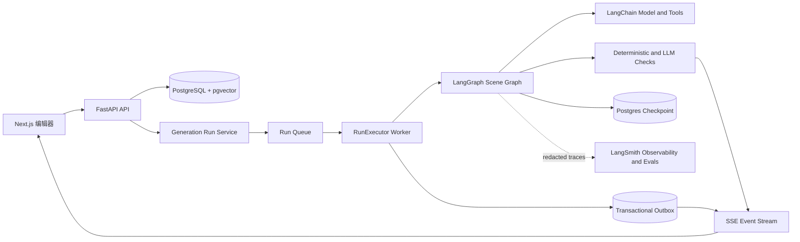
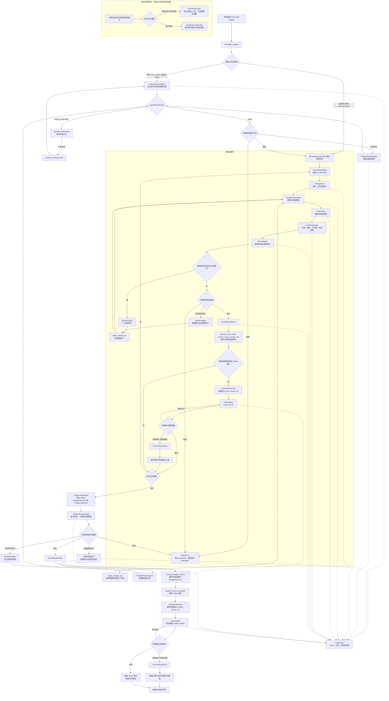

# 连续小说创作工作室 V1 工程交付计划

> **For agentic workers:** REQUIRED SUB-SKILL: Use `superpowers:subagent-driven-development` or `superpowers:executing-plans` to implement this plan task-by-task. Each task ends with an independent test cycle.

**Goal:** 构建一个以章节为作者可见任务、以场景为 Agent 执行单位的小说写作工作台，让作者能够基于已确认设定生成、审校、反馈修改并接受或回滚章节和局部正文。

**Architecture:** 前端提供作品导航、富文本编辑器和建议审阅面板；FastAPI 负责业务 API、版本提交和 SSE 事件；LangGraph 编排一次章节任务，并在内部按场景循环调用专业 Agent。正文版本、Story Bible 和运行记录存入 PostgreSQL，派生摘要和向量索引可重建，不能反向覆盖权威事实。LangSmith 作为 LangChain/LangGraph 的执行观测与评测层，不能替代业务数据库或任务恢复状态。

**Tech Stack:** Python 3.12、FastAPI、Pydantic 2、SQLAlchemy 2、LangChain、LangGraph、LangSmith、PostgreSQL、pgvector、Next.js、TypeScript、Tiptap、pytest、Playwright。 

## Global Constraints

### Domain Invariants

- V1 以章节作为作者可见工作单位，以场景作为 Agent 的执行和校验单位。
- 作品层级固定为 `NovelProject -> Volume -> Chapter -> Scene`。
- `ChapterContract` 定义章节目标、场景顺序、开场状态和结尾状态。
- 每个 `SceneBrief` 必须从章节契约继承目标和约束。
- 下一场景的进入状态必须与上一场景的退出状态兼容；最后一个场景的退出状态必须满足章节契约的结尾状态。
- `CanonFact`、`TimelineEvent` 和 `PlotThread` 只表示作者已确认的正式内容；模型新抽取的信息只能进入对应的 `FactCandidate`、`TimelineEventCandidate` 或 `PlotThreadUpdate`。
- `SceneRevision` 和 `ChapterRevision` 的正文、父版本和来源血缘不可变，禁止直接覆盖正文；`staged|accepted` 只表示可审阅版本的生命周期状态转换。
- 场景接受与章节接受是两个独立层级：`accepted_scene_revision_id` 表示作者已接受该场景版本，可作为局部 Canon 的来源，但不表示章节已接受，也不能更新全局 Canon；`accepted_chapter_revision_id` 只表示作者已接受有序章节聚合版本，只有它才能作为章节级 Canon 的来源。
- 所有正式写入必须通过事务化领域服务完成，并记录来源和作者决策。

### Agent and Workflow Rules

- Agent 只能返回结构化的计划、草稿、审查报告、候选事实或 `ChangeSet`，不能直接写数据库。
- `ChapterPlannerAgent` 负责把 `author_feedback.target=plan` 转为 `ChapterContract` 和有序 `SceneBrief`，不生成正文、不自行补全缺失的章节意图。
- `WritingAgent` 负责场景新写、续写和初次改写；V1 不按题材拆分，通过 `style_profile` 和 `style_requirements` 控制风格；`request_type=review` 不调用它。
- `ContinuityAgent` 负责检查人物、地点、时间线、关系和世界规则一致性，不修改正文。
- `ReviewAgent` 负责场景质量分析和评分，不直接修改正文；V1 固定六个评分维度，额外题材维度暂不单列。
- `RevisionAgent` 负责读取独立的作者反馈、`ContinuityAgent` 报告和 `ReviewAgent` 报告，生成最小修改补丁，不直接提交。
- `ChapterReviewAgent` 负责场景聚合后的章节级目标、节奏、场景衔接和出口状态检查，不替代场景级审校。
- `CanonAgent` 只从作者已接受的章节版本提取章节级候选，或在作者明确触发且场景版本已接受时提取局部候选；局部结果不得直接更新全局 Canon。
- 场景生成分支按 `WritingAgent -> Agent 专属 after Hook -> FactExtractionHook -> RuleEngine -> ContinuityAgent -> ReviewAgent` 执行；修订分支按 `RevisionAgent -> ChangeSetHook -> apply_change_set（临时应用） -> FactExtractionHook -> RuleEngine -> ContinuityAgent -> ReviewAgent` 执行。`FactExtractionHook` 只对 Agent 已返回的候选事实做确定性规范化和去重，不调用模型，候选只有在引用与 ID 检查通过后才由 `FactCandidateService` 幂等保存；全部场景完成后聚合并运行 `ChapterReviewAgent`，作者接受章节版本后才运行章节级 `CanonAgent`。
- `run_scope/request_type/decision_target` 必须显式分发：只有首次章节规划使用 `chapter + new_chapter -> ChapterPlannerAgent`；已有已接受计划的章节 `continue|rewrite` 必须显式携带 `plan_revision_id`，且服务端校验它等于 `accepted_plan_revision_id`，通过后直接进入固定场景队列，不重新调用 Planner；没有已接受场景版本的独立场景首次生成使用 `scene + new_chapter -> WritingAgent(draft)`；已有基线的 `scene + continue|rewrite`、`scene + review` 和 `chapter + review` 只进入各自的独立辅助图；`scene + review + decision_target=canon` 只进入局部 `CanonAgent` 分支；任何审校或 Canon 分支都不得调用 `WritingAgent`。
- 所有 Agent 输出先经过 `AgentResultRouter`；`needs_clarification` 必须写入 `pending_node` 和 `clarification_questions`、保存 checkpoint、发送等待事件并完成观测收尾，作者补充后从同一节点恢复，不得继续下游 Hook、候选持久化、ID 归一化或提交。
- `FactExtractionHook` 不是自治 Agent，只规范化、去重并返回候选载荷；只有规则/领域检查、引用校验和 ID 归一化通过后，运行时才调用 `FactCandidateService` 幂等保存，它不得直接写入 Story Bible 或提升正式事实。
- Canon 决策逐条使用 `confirm|reject|defer`；`canon_scope=scene` 必须绑定 `accepted_scene_revision_id`，只保存场景作用域记录；只有 `canon_scope=chapter` 才能进入全局 Canon 更新事务。Canon 取消只结束确认，不写入候选。
- 计划反馈重新规划，场景反馈生成当前场景补丁，章节反馈先计算影响闭包再处理场景队列，Canon 反馈写入 `canon_feedback`；`ChapterReviewAgent.recommendation=replan` 在场景循环开始前可回到 `ChapterPlannerAgent`，开始后必须创建新的 `ChapterPlanRevision` 和 `generation_run_id`。若原请求是 `request_type=review`，重新规划只保存新计划并结束当前审校运行，后续正文生成必须由新的 `continue|rewrite` 运行触发。
- 系统自动触发的低风险修订每个检查回合最多一次。
- 作者反馈可以触发 `RevisionAgent` 循环，直到作者接受或明确取消；循环必须受运行预算、超时和历史记录约束。
- 所有作者审批节点都支持 `accept`、`feedback`、`cancel`；`feedback` 不能被视为任务终态。
- 初次章节规划请求必须由 `normalize_request` 封装为 `author_feedback.target=plan`；只有 `chapter + new_chapter` 的首次规划要求 `chapter_intent`，缺少章节意图时，`ChapterPlannerAgent` 返回 `needs_clarification`，不得自行补全目标。`chapter + continue|rewrite` 不要求新的章节意图，但必须绑定已接受的 `plan_revision_id`；`decision_target=plan` 的任何请求也必须绑定并校验当前计划版本。
- `ChapterReviewAgent.recommendation=replan` 在已经进入场景循环后必须结束当前运行并创建新的 `generation_run_id` 与 `plan_revision_id`；新运行只能显式引用旧运行的已接受版本，不能复用旧的 `current_scene_index`、场景队列或 checkpoint。
- 章节反馈的 `affected_scene_ids` 必须是从作者显式定位场景沿入口/出口状态依赖计算出的影响闭包；后续场景若入口状态、上下文基线或章节契约不再兼容，必须标记为 `stale` 并加入重跑队列，不能仅因作者未直接定位而沿用旧版本。
- 候选事实、时间线事件和剧情线更新统一使用 `pending|accepted|rejected|deferred|discarded` 生命周期；运行进入 `cancelled|failed|superseded` 任一不可恢复终态时，当前运行产生且尚未被作者决策的候选必须在同一事务中原子转为 `discarded`，Canon 决策不得确认已丢弃候选。

### Version and Runtime Rules

- 场景任务必须绑定 `generation_run_id`，并携带 `base_scene_revision_id` 字段；已有版本时必须填写并校验，首次生成允许为 `null`。
- `WritingAgent` 返回的完整正文先持久化为当前运行的 `SceneDraftArtifact`，不能直接填充 `accepted_scene_revision_id`。作者接受完整草稿时由 `commit_scene_draft` 在同一事务中创建首个或子级 `SceneRevision`；首次生成只有在场景没有已接受版本且草稿基线为 `null` 时才允许创建 `parent_revision_id=null` 的首个版本。
- 首稿尚未接受且作者继续反馈时，运行时必须沿当前 `draft_artifact_id` 重新调用 `WritingAgent` 并替换草稿；不得把没有 `base_scene_revision_id` 的首稿反馈伪装成 `ChangeSet`。`RevisionAgent` 只处理已有场景版本基线的语义补丁。
- 章节聚合和章节提交必须绑定 `generation_run_id`，并携带 `base_chapter_revision_id` 和按场景键控的 `scene_base_revision_ids`；已有版本时必须填写并校验，首次聚合允许为空映射或 `null`。
- 跨章节运行必须显式携带 `preceding_chapter_id` 和 `preceding_accepted_chapter_revision_id`；首章两者均为 `null`，后续章节只能引用紧邻上一章的已接受章节版本，不能用草稿、`staged` 版本或“当前最新版本”静默替代。
- 所有 `ChangeSet` 必须执行版本冲突检查和幂等提交。
- `base_scene_revision_id=null` 只允许两种根草稿来源：`WritingAgent` 的首稿或 `source=author` 的人工空场景编辑；后者必须使用 `ManualChangeSetContext`、空文档基线哈希和 `prosemirror_step`，服务端先物化为 `SceneDraftArtifact`，Agent/Review ChangeSet 永远不得使用空基线。
- Agent/Review `ChangeSet` 必须绑定 `generation_run_id`；作者手工 `ChangeSet` 必须绑定服务端生成的 `manual_command_id`，两者恰好一个非空，不能用 `actor_id`、`Idempotency-Key` 或客户端字段冒充运行身份。
- LangGraph 状态只保存运行所需的轻量 ID、来源引用、摘要、临时补丁、检查结果、作者反馈、决策和路由状态，不保存整本小说或无关正文。
- `ContextPack` 只在运行时存在；持久化只保存 `ContextManifest`。
- checkpoint、正文版本、作者决策和 Story Bible 不依赖 LangSmith 才能正常工作。

### Observability and Privacy

- LangSmith 只用于 Agent 执行 Trace、评测、成本和反馈分析。
- LangSmith 不可用时，写作任务仍必须能够继续、暂停、恢复或提交。
- 生产环境只上传脱敏元数据；完整正文和 Prompt 仅允许在显式授权的开发或评测环境开启。
- PostgreSQL 保存业务审计、作者反馈、版本和回滚记录。
- V1 的部署边界固定为 `DEPLOYMENT_MODE=single_user_private` 的单用户私有部署；API 默认只绑定 loopback，容器部署只能绑定 compose 私有网络且不得发布 API/PostgreSQL 端口，`API_BIND_SCOPE` 不是 `loopback|compose_private` 时 fail-closed。`actor_id` 只从服务端配置解析，客户端不能提交或覆盖。权威正文和审计数据保存在本地 PostgreSQL，不对 V1 作跨地域驻留承诺；临时 `ContextPack`/checkpoint 默认保留 7 天，但仍处于 `waiting_feedback|pending_clarification|paused` 且存在恢复引用的运行不得被清理；到期的可恢复暂停必须原子转为 `failed`、写入 `CHECKPOINT_EXPIRED` 事件并拒绝恢复。运行审计和事件默认保留 30 天，正式版本在作者显式删除前保留。

### Product Assumptions and Engineering Gates

- 本计划将目标作者已经愿意采用“章节规划 -> 场景生成 -> 审校 -> 反馈 -> 接受/回滚 -> Canon”工作流作为已确认前提；V1-M0 至 V1-RC 不以市场试点、留存或采用意愿作为前置门槛。
- V1 是否达到发布门槛只由工程和运行质量决定：权威数据不丢失、不重复提交、不越权写入；运行可暂停、恢复、接管和审计；富文本修改可定位、可比较、可回滚；成本、延迟和错误状态可观测。
- 本计划以完整 V1 工程能力为目标，不以最小可行产品或市场试点为交付目标；V1-M0 至 V1-RC 是可独立验收的内部工程里程碑，用于控制实施风险，不代表逐阶段重新验证产品方向。
- 作者体验仍需提供批量接受、清晰的影响范围和可理解的候选作用域，但这些是已确定工作流的实现质量要求，不是重新评估产品方向的理由。

### Execution and Consistency Rules

- 长运行不得在 FastAPI 请求线程或无租约的后台任务中执行。`GenerationRunService` 只负责校验、创建运行和入队；独立 `RunExecutor` 通过租约领取运行，租约过期后由恢复扫描器重新领取或转为 `failed`。
- `RunLease` 必须携带单调递增的 `fencing_token`（以及仅供审计的 `lease_token`），并提供 `renew`/heartbeat 接口。所有绑定 `generation_run_id` 的写入都必须使用 `RunWriteFence`：Worker 写入从当前有效 `RunLease` 派生，作者对 `waiting_feedback|pending_clarification|paused` 运行提交决策或恢复时，由服务端在幂等 claim 后取得短事务 API command fence。API command fence 不是 Worker 租约，不得填入 `LeaseContext`，也不允许 API 执行 Worker 节点；它只用于把一次人工命令与目标运行的写入串行化。失去写入栅栏的旧 Worker 或旧 API 命令统一返回 `RUN_LEASE_LOST`，不得继续写入。租约接管不能只依赖 `lease_expires_at` 扫描，必须通过 fenced CAS 阻止旧 Worker 的迟到写入。
- V1 运行队列直接使用 PostgreSQL 的事务行锁和 `FOR UPDATE SKIP LOCKED` 实现，不额外引入消息队列；后续替换队列实现不能改变 `RunLease`、幂等键和恢复契约。
- 版本提交、作者决策和 `RunEvent` 追加必须在同一 PostgreSQL 事务或同一事务 outbox 中形成可重放记录；checkpoint 写入必须记录已完成的幂等提交边界，节点重放不得重复创建版本、候选或决策。Outbox 记录必须保存 `outbox_id`、`resource_type`、`resource_id`、可版本化的 `payload_schema`/脱敏 `payload`、`delivery_status=pending|publishing|published|failed`、`attempt_count`、`next_attempt_at`、`last_error`、`producer_command_id` 和可空的 `generation_run_id`；发布者使用行锁/发布租约推进状态，消费者另存 `RunEventConsumerCursor`，人工命令事件通过 `producer_command_id` 关联而不是假设存在运行 ID。每运行事件序号在同一运行行锁内分配，不能由并发 worker 直接取最大值加一。
- 所有运行状态、作者决策和事件序列更新必须使用每运行锁或版本号 CAS；任何写请求必须先对 `(resource_scope, operation, Idempotency-Key)` 原子 claim `CommandIdempotencyRecord`。记录必须有 `processing|completed|failed` 状态、请求指纹、claim 租约/过期时间、首次结果引用、响应信封和失败码；同键同指纹且 `completed` 时重放第一次结果，同键不同指纹返回 `IDEMPOTENCY_KEY_REUSE`，同键同指纹且 `processing` 时等待/重放或返回稳定的处理中响应，claim 过期后只能由恢复者接管。只有 claim 成功的新键才执行 CAS；首请求崩溃不得留下可再次执行的未决副作用，幂等查重也不能替代不同请求之间的并发冲突检测。
- `RunDecision` 是普通 `accept|feedback|cancel` 和 Canon 决策的统一不可变审计记录；决策记录必须绑定 `generation_run_id`、目标、请求快照、幂等键、状态版本和结果引用。
- Agent 语义补丁使用 `text_locator + expected_text_hash`；Tiptap 编辑器使用 ProseMirror Step 或等价的文档操作。两者在 `ChangeSet` 中通过显式 `operation_format` 区分，均必须绑定基线版本和内容哈希，不能把富文本 JSON 当作纯文本偏移直接应用。
- Canon 运行只允许通过专用 `/canon-runs` 入口或其唯一的 `CanonRunService` outbox 消费者创建；通用运行入口拒绝 `target=canon`，避免同一业务出现两套初始化契约。章节接受事务只发布 `chapter_revision.accepted` 事件，CanonRunService 在独立的 `generation_run_id` 中幂等创建 Canon 运行，不在原章节运行或提交事务内直接调用 CanonAgent。Canon 决策仍可复用统一决策记录和候选事务。
- 章节级 Canon 使用专用 `POST /api/chapters/{chapter_id}/canon-runs` 入口，场景级 Canon 使用专用 `POST /api/scenes/{scene_id}/canon-runs` 入口；章节接受事务只产生可重放的 `chapter_revision.accepted` 事件，不隐式启动第二条 Canon 初始化路径。两类入口都必须显式提供对应的已接受版本和 `canon_scope`，并在 `chapter_sync_status=in_sync` 时才入队。

### V1 建设范围

- V1 采用单用户工作区。
- V1 不包含多用户认证和租户隔离；服务启动时必须校验 `DEPLOYMENT_MODE=single_user_private`，不满足时 fail-closed，不得把 `ACTOR_ID` 配置当作通用认证机制。
- 不实现多租户、实时协作、整书一键生成、Neo4j、CRDT、多 Agent 辩论和第三方发布；上述排除项不影响 V1 必须完成单章、多场景、版本恢复和 Canon 闭环。

## Agent Prompt 契约（已纳入本计划）

本计划采用已定稿的 [Agent Prompt v1 契约](../specs/2026-07-31-agent-prompts-v1-draft.md) 作为 Task 4 及后续 Agent 实现的唯一输入契约。计划书不复制 Prompt 正文；字段、枚举、空值语义和示例以该契约为准，代码实现不得另行发明同名字段或状态。

### 已纳入的 Agent 边界

- `ChapterPlannerAgent`：生成章节契约和有序场景计划，不生成正文。
- `WritingAgent`：使用单一通用 Agent 支持 `draft`、`continue`、`rewrite`；题材和文风通过 `style_profile`、`style_requirements` 传入。
- `ContinuityAgent`：检查人物、地点、时间线、关系和世界规则，不改正文。
- `ReviewAgent`：使用固定六维评分（`scene_goal`、`character`、`conflict`、`pacing`、`prose`、`continuity_impact`），不新增未版本化维度。
- `RevisionAgent`：读取独立的作者反馈、Continuity 报告和 Review 报告，输出最小 `ChangeSet`，不直接提交。
- `ChapterReviewAgent`：检查章节目标、节奏、场景衔接和出口状态。
- `CanonAgent`：从作者已接受的章节版本提取候选事实，也可在作者明确触发时处理已接受的单场景版本；局部候选使用 `scope=scene`，不得直接更新全局 Canon。

### 实施时必须保留的输入约束

- 所有 Agent 使用共享输入信封；正式 ID 由系统生成，模型只能引用输入中已有的 ID 或返回 `local_key`、文本定位等临时值。
- `AuthorFeedback` 独立传入，支持自然语言 `text` 和结构化 `operations`；结构化操作不是数据库操作，必须由 `RevisionAgent` 解释为 `ChangeSet`。
- 普通 `AuthorFeedback.target` 只取 `plan|scene|chapter`；Canon 决策和 Canon 结构化操作单独存入 `CanonFeedback`，通过 `decision_target=canon` 与 `canon_scope` 路由，不能混入普通作者反馈。
- Canon 局部确认必须提供 `accepted_scene_revision_id`，并将 `canon_scope` 设为 `scene`；章节级候选使用 `canon_scope=chapter`。
- `context_manifest` 是唯一来源索引；`evidence_refs`、`context_source_refs` 只能引用其中的 `source_id`。
- 所有适用 Agent 可返回 `needs_clarification`；必须同时返回具体 `clarification_questions`。`AgentResultRouter` 写入 `pending_node`、保存 checkpoint、发送等待事件并完成观测收尾后暂停；作者补充后从同一 checkpoint 恢复，恢复入口必须重新经过 `FeedbackHook -> ContextHook -> 对应 Agent 专属 before Hook -> BudgetHook`。

### 契约落地验收

- Pydantic 输入/输出 schema 与 Prompt 契约字段一致，禁止出现未声明变量、旧字段或额外状态。
- Hook 生命周期分为调用前、结果后、提交前和恢复入口四段：调用前为 `ContextHook -> Agent 专属 before Hook -> BudgetHook -> RedactionHook（输入副本） -> TraceHook.start -> Agent`；结果后先经 `SchemaHook -> AgentResultRouter（状态闸门）`，只有 Router 产出允许继续或等待作者的非澄清、非错误结果时，才按 `Agent 专属 after Hook -> FactExtractionHook（仅 WritingAgent/RevisionAgent 且存在 candidate_facts） -> RuleEngine/领域检查 -> ReferenceValidationHook -> IdentityResolutionStep -> FactCandidateService.upsert（仅存在规范化 candidate_facts 时）` 串行执行，随后回到 `AgentResultRouter` 进入状态或路由；`RevisionAgent` 的 `ChangeSet` 在进入修订后的 `FactExtractionHook`/规则检查前，必须先由 `apply_change_set` 临时应用。`needs_clarification` 必须写入待恢复状态、保存 checkpoint、发送等待事件并完成观测收尾，跳过所有下游业务 Hook、候选持久化、ID 归一化和提交。Agent 图正式提交/回滚路径在作者决策后固定为 `规范化业务结果 -> CommitGuardHook -> Domain Service -> 提交结果观测副本`，直接 API 使用 `CommitGuardPort` 完成同一校验；恢复入口为 `FeedbackHook -> ContextHook -> 对应 Agent 专属 before Hook -> BudgetHook -> RedactionHook（输入副本） -> TraceHook.start -> 原 pending_node`。安全校验 fail-closed，Trace fail-open。
- Agent 和 Hook 不直接写正文、Story Bible、时间线或版本；Agent 图适配层的正式提交统一经过 `CommitGuardHook` 和领域服务，直接 HTTP/API 路径使用同一契约的 `CommitGuardPort`，不得把 Hook 当作公共领域入口。
- `AuthorFeedback.operations`、`canon_scope`、`accepted_scene_revision_id`、`accepted_chapter_revision_id`、候选 `scope` 和 `needs_clarification` 均有对应单元测试。

---

## 1. 产品范围

### 1.1 V1 核心用户流程

1. 创建作品，填写题材、目标读者和基础文风。
2. 创建卷和章，输入章节目标、开场状态、结尾状态、视角和必达剧情点。
3. 系统生成章节契约和场景分解；作者可以反复提出意见，直到确认章节计划。
4. 系统按场景循环生成正文；短章可以只包含一个内部场景，作者不需要手动管理场景。
5. 每个场景执行上下文加载、生成、确定性检查和语义审校。
6. 作者可以接受、提出修改意见或取消；提出意见会驱动 AI 重新修改，而不是结束任务。
7. 所有场景完成后，系统执行章节聚合和章级一致性检查，再由作者确认章节版本。
8. 作者确认后将聚合产生的 `staged ChapterRevision` 转为 `accepted`，并选择性确认候选设定、时间线和伏笔状态。

### 1.2 V1 范围外（V2+）

- 多 Agent 互相辩论或 supervisor/council 架构，列为 V2+ 能力。
- 章节并行批量生成和整书自动发布，列为 V2+ 能力。
- Neo4j 知识图谱、CRDT 协作、多模型自动路由，列为 V2+ 能力。
- 封面、营销、排版和第三方发布渠道，列为 V2+ 能力。

### 1.3 产品信息架构与工作台表现

#### 用户可见层级

```text
NovelProject 作品工作区
└── Volume 卷
    └── Chapter 章
        └── Scene 场景
```

- `NovelProject` 是一部小说的长期工作区，包含正文、Story Bible、时间线、伏笔和运行历史。
- `Volume` 管理较大的剧情阶段、卷级主线和时间范围。
- `Chapter` 是作者主要的写作、审批和提交单位。
- `Scene` 是 Agent 内部生成、审校和修改的最小执行单位，不强制作为独立页面。
- 短章可以自动视为一个内部场景；长章由 `ChapterPlannerAgent` 根据章节契约拆分。

#### 工作台交互规则

- 作者从章节页面发起“规划章节、生成场景、续写、改写或审校”任务。
- 作者默认查看章节正文；场景以可折叠区块、锚点和状态标记呈现。
- 场景状态至少包括：`planned`、`generating`、`waiting_feedback`、`pending_clarification`、`accepted`、`cancelled`。
- 章节状态至少包括：`draft`、`planning`、`in_progress`、`reviewing`、`waiting_feedback`、`pending_clarification`、`accepted`、`cancelled`。
- 章节反馈可以定位到一个或多个场景；系统沿入口/出口状态依赖计算影响闭包，闭包内场景重跑或标记 `stale`，闭包外场景重新验证后才能沿用版本。
- 场景重新生成必须遵守章节场景顺序，不能绕过章节契约直接改变章节结构。
- 章节提交展示 `ChapterRevision`；场景提交展示对应的 `SceneRevision` 和 `ChangeSet`。
- 场景接受后可单独打开局部 Canon 确认；该确认显示作用域，不伪装成全局 Story Bible 更新。
- 取消运行与显式版本回滚是两个操作：取消只将运行标记为 `cancelled`，逻辑丢弃未提交的草稿和 `ChangeSet`，并在同一事务中把未决候选标记为 `discarded`；不删除已提交版本、作者决策、审计记录或正式 Canon。无引用的临时数据在终态依赖检查通过后按保留策略归档或清理。回滚必须选择目标父版本并记录作者决策。

#### 页面职责

```text
左侧：作品、卷、章、场景导航
中间：章节正文编辑器，场景作为可折叠区块
右侧：章节契约、当前场景简报、Story Bible、审校问题、作者反馈
底部：规划 -> 写作 -> 检查 -> 审校 -> 反馈 -> 提交的运行进度
```

页面不直接展示 Agent 内部消息作为主要内容；作者看到的是章节计划、正文/补丁、审校报告、候选事实和可操作的反馈入口。

#### V1 信息架构验收标准

- 作者可以从章节页面发起一次章节任务，并查看该章节包含的场景及其状态。
- 作者可以在不离开章节页面的情况下接受、反馈或取消当前场景结果。
- 场景可以单独重新生成，但不会破坏章节顺序和章节契约。
- 章节反馈能够定位到受影响场景，并在重新聚合后再次执行章节级检查。
- 章节反馈产生的下游影响闭包可见；若出口状态改变导致后续场景失效，系统会显示 `stale` 原因并阻止错误聚合，直到闭包处理完成。
- 章节提交后能够查看 `ChapterRevision`，并追溯到各场景的 `SceneRevision` 和 `ChangeSet`。
- 短章不要求作者手动创建场景，长章可以查看系统自动拆分的场景结构。

## 2. 目标架构



业务数据库与图状态必须分离：数据库是作品事实源，checkpoint 只用于恢复一次运行；运行状态由 worker 租约和数据库状态共同决定，不能由 HTTP 请求生命周期决定。版本提交、作者决策和业务事件通过事务 outbox 形成可重放记录，checkpoint 只记录已完成的幂等边界。向量索引、摘要、实体快照属于派生层，删除后可以重建。LangSmith 作为可选外部观测出口，记录 run/node/LLM/tool 的层级轨迹、耗时、token 和评测反馈；它的网络故障、配额耗尽或服务不可用必须被降级为本地结构化日志，不能让业务流程失败。

## 3. 领域模型

### 3.1 权威实体

- `NovelProject`: 题材、目标读者、默认文风、当前卷章指针。
- `Volume`: 卷级目标、主线、时间范围和章节顺序。
- `Chapter`、`Scene`: 正文层级；章节是作者可见的工作单位，场景是 Agent 执行和校验的内部单位。`Chapter.chapter_sync_status` 记录章节接受版本是否仍与各场景接受头一致，枚举为 `null|in_sync|out_of_sync`；`Chapter.entry_handoff_status` 记录当前章节接受版本引用的上游 handoff 链是否仍有效，枚举为 `null|in_sync|stale`；尚无 accepted 章节版本时两者均为 `null`。`Chapter.current_plan_revision_id` 指向最新已物化的不可变计划版本，`Chapter.accepted_plan_revision_id` 指向作者通过 CAS 接受、可进入场景循环的计划版本；二者只能由计划服务在事务中更新，不能通过“最新版本”查询推断。
- `ChapterContract`: 章节主视角、章节开场状态、章节目标、场景顺序、结尾状态、必须发生/禁止发生事项和待回收剧情线。
- `ChapterPlanRevision`: 不可变的章节计划版本，记录父计划、章节契约、场景顺序、由 `client_key` 物化出的正式 `scene_id` 映射和创建原因；进入场景循环后重新规划必须创建新的计划版本和运行，不得覆盖旧计划。计划创建先 CAS 当前指针，作者接受再 CAS `accepted_plan_revision_id`；运行必须携带要使用的 `plan_revision_id`，服务端校验它等于章节当前已接受指针。作者决策通过后必须在同一事务中调用 `materialize_chapter_plan`，建立/复用场景实体并冻结映射。
- `SceneBrief`: 场景标题、目标、POV、地点、故事时间、冲突、必须出现信息、禁止发生事项和预期出口状态；标题只供作者查看，不是正式 ID。
- `SceneRevision`: 不可变的场景正文版本，记录父版本、来源 `ChangeSet` 或 `SceneDraftArtifact`、创建原因和 `staged|accepted` 生命周期状态。
- `ChapterRevision`: 由有序 `SceneRevision` 聚合出的不可变章节版本，记录章节契约版本、创建原因、入口 `entry_handoff_id`、入口来源章节版本和入口 handoff 链哈希，以及 `staged|accepted` 生命周期状态；作者接受只转换状态，不重复创建版本，正文和血缘仍不可变。
- `ChapterRevision` 的 `accepted` 只表示该固定场景版本列表曾被作者接受，不保证当前场景头仍与其一致；场景接受新版本后，旧章节版本保持不可变但所属 `Chapter` 必须转为 `out_of_sync`，直到新的章节聚合再次被作者接受。
- 场景接受不修改 `SceneRevision` 的正文或血缘；由 `Scene` 聚合状态和当前接受版本指针记录。运行中的草稿或未提交 `ChangeSet` 不得填充 `accepted_scene_revision_id`。
- `StoryEntity`: `character`、`location`、`faction`、`item`、`rule` 等类型。
- `CanonFact`: 已确认的属性、关系、事件或规则，带来源版本、有效时间和生效状态。
- `TimelineEvent`: 故事内时间、叙事出现顺序、参与实体、地点和前置/后续关系。
- `PlotThread`: 伏笔、冲突线、开启/推进/回收状态和计划回收位置。

### 3.2 运行与建议实体

- `GenerationRun`: 一次章节任务的请求类型、状态、模型、耗时、token、错误、租约、状态版本和 `generation_run_id`；对外 `run_id`、运行线程 `thread_id` 均为该 ID 的别名，不单独分配。
- `AgentRun`: 一次逻辑 Agent 节点调用，记录 Agent 类型、输入/输出 schema、状态、`agent_attempt_key`、`attempt_no`、耗时和 LangSmith `trace_id`；同一 checkpoint 的技术重试复用 `agent_run_id`/`agent_attempt_key`、递增 `attempt_no`，作者反馈或新节点逻辑调用才创建新的 `agent_run_id`。
- `AuthorFeedback`: 作者针对章节计划、场景结果或章节结果提出的修改意见。
- `RunDecision`: 作者或 Canon 决策的不可变审计记录，保存目标、请求快照、幂等键、状态版本、处理结果和结果引用。
- `CommandIdempotencyRecord`: 所有写命令的幂等 claim/重放记录，保存资源作用域、操作名、`Idempotency-Key`、请求指纹、`processing|completed|failed` 状态、claim 租约、首次结果引用、响应信封、失败码和创建时间；同键同指纹只返回原结果或稳定处理中响应，同键不同指纹返回 `IDEMPOTENCY_KEY_REUSE`。
- `SceneDraftArtifact`: 当前运行或人工命令产生的可审阅完整正文草稿，保存 `draft_artifact_id`、可空的 `generation_run_id`、可空的 `manual_command_id`、可空的 `agent_run_id`、`scene_id`、可空的 `base_scene_revision_id`、正文、内容哈希、来源引用和 `pending|superseded|materialized|discarded` 状态；`generation_run_id` 与 `manual_command_id` 恰好一个非空。它不是 `SceneRevision`，不能作为聚合、Canon 或跨章节 handoff 来源。
- `ContextManifest`: 本次任务实际使用的正文片段、事实、事件、伏笔和规则来源清单。
- `ChangeSet`: 基于 `base_scene_revision_id` 的增删改操作，带 `source=author|agent|review`、`operation_format`、基线内容哈希、冲突检测、作者反馈和提交状态；它还保存可空的 `root_draft_artifact_id`，该字段仅用于人工空场景根编辑的一对一草稿关联。只有人工空场景根编辑允许 `base_scene_revision_id=null` 并以空文档为基线，服务端必须先把它物化为 `SceneDraftArtifact`；语义文本补丁与 ProseMirror Step 必须分别由对应适配器应用，`source` 必须与 `ManualChangeSetContext`/`CommandContext` 的身份互斥规则一致。
- `ReviewIssue`: `local_key`、`severity=low|medium|high|critical`、`dimension`、`text_locator`、`evidence_refs`、`message`、`suggested_fix` 和 `status=pending|accepted|rejected|deferred`；缺少证据或正文定位的问题不得进入自动修订。
- `FactCandidate`: 从新草稿、修改补丁或作者已接受的场景/章节版本中抽取的待确认事实；它不是 `CanonFact`。
- `TimelineEventCandidate`: `CanonAgent` 提取的待确认时间线事件候选；它不是正式 `TimelineEvent`。
- `PlotThreadUpdate`: `CanonAgent` 提取的待确认剧情线变更候选；它不是正式 `PlotThread`。
- 上述三类候选共享 `candidate_id`、`candidate_type`、`local_key`、`status`、`scope`、`evidence_refs`、`source`、`effective_story_time`、`narrative_knowledge` 和 `resolution_action` 字段；`source` 至少包含运行时提供的 `chapter_id`、可空 `scene_id`、`source_id`、`paragraph_ref` 和 `text_locator`。候选还必须在 `source_revision_id`、`source_draft_artifact_id`、`source_change_set_id` 三者中恰有一个非空，并以非空的 `source_identity` 参与唯一约束；唯一键中的可空 `scene_id` 必须归一化为空字符串/专用 `scope_identity`，或使用 `NULLS NOT DISTINCT`，不得依赖 PostgreSQL 对可空列的默认 UNIQUE 语义。`effective_story_time` 使用 `{value, precision}`，`precision` 为 `exact|range|relative|unknown`。`narrative_knowledge` 取 `objective|character_belief|rumor|lie|dream|metaphor|unknown`，`resolution_action` 取 `confirm_existing|propose_update|ignore_duplicate`。`status` 固定为 `pending|accepted|rejected|deferred|discarded`。作者决策使用持久 `candidate_id` 定位，并在当前 Canon 运行内保留 `(candidate_type, local_key)` 兼容别名；候选持久化使用作用域、`source_identity`、`candidate_type` 和规范化 `candidate_fingerprint` 幂等去重。运行取消必须原子地把未决候选标记为 `discarded`。它们都是运行/建议层载荷，不是权威实体。
- `CanonDecision`: 作者针对上述候选做出的逐条 `confirm|reject|defer` 决策，必须带持久 `candidate_id`，并可带 `candidate_type`（`fact|timeline_event|plot_thread`）和当前运行兼容的候选 `local_key`、作用域和来源版本。
- `CanonDecisionRecord`: 持久化的作者决策结果，并保留持久 `candidate_id`、候选类型、`local_key` 兼容别名、候选快照或来源引用；章节级 `confirm` 可在同一事务中生成或更新 `CanonFact`，场景级决策只保留作用域记录。
- `SceneSnapshot`: 与 `SceneRevision` 绑定的派生场景状态快照，记录进入状态、退出状态、摘要和受影响实体；可重建，不是权威事实源。
- `ChapterSnapshot`: 与 `ChapterRevision` 绑定的派生章节快照，记录出口状态、人物状态、时间线和未收束剧情线；可重建，不直接更新 Canon。
- `ChapterHandoff`: 从 `chapter_sync_status=in_sync` 且入口 handoff 链仍有效的已接受 `ChapterRevision` 生成的不可变跨章节承接快照，记录 `source_chapter_revision_id`、入口 `entry_handoff_id`、入口来源版本、上游 handoff 链哈希、出口状态、故事内有效时间、人物/地点/关系/能力/物品状态差量、未收束剧情线、章节约束、来源引用和快照哈希；只能由当前同步且 `entry_handoff_status=in_sync` 的已接受章节版本生成。

`ContextPack` 是运行时临时对象，不作为权威持久化实体；持久化时只保存 `ContextManifest`，以便审计本次任务读取了什么，而不长期保存完整 Prompt 或正文副本。

### 3.3 章节与场景协调机制

章节与场景通过“契约、状态、版本”三层协调：

1. `ChapterPlanRevision` 保存不可变的章节计划；其中的 `ChapterContract` 定义章节开场状态、章节目标、场景顺序、必须/禁止事项、预期结尾状态和待回收剧情线。
2. 每个 `SceneBrief` 从当前计划版本的章节契约继承自己的目标、约束和预期出口状态。
3. 每个场景生成与当前 `SceneRevision` 绑定的派生 `SceneSnapshot`，至少记录进入状态、退出状态、人物变化、时间线事件和受影响伏笔。
4. 下一场景的进入状态必须与上一场景的退出状态兼容；最后一个场景的退出状态必须满足章节契约的结尾状态。
5. 所有场景接受后，`ChapterAggregator` 按场景顺序生成 `staged ChapterRevision` 和派生 `ChapterSnapshot`，再执行章节级检查；作者接受后将该版本幂等转换为 `accepted`。
6. 章节反馈先根据场景入口/出口状态、ContextManifest 和章节契约计算影响闭包；闭包内的场景逐一重跑或标记 `stale`，闭包外的场景才允许沿用原版本。只要存在未解决的 `stale` 或状态不兼容，`ChapterAggregator` 必须阻止提交。
7. `ChapterReviewAgent.recommendation=replan` 在场景循环已经开始时结束当前运行并创建新的 `ChapterPlanRevision`/`generation_run_id`；新计划可以复用已接受的场景版本，但必须重新生成完整的 `scene_base_revision_ids`，不得混用旧 checkpoint。
8. 章节提交后，只有作者确认过的事实、事件和伏笔变化才能更新 Story Bible、Timeline 和 PlotThread；单场景局部确认只能形成带场景作用域的候选或局部确认记录，不能绕过章节接受流程更新全局实体。

### 3.4 业务状态边界与转移

以下规则是业务状态的权威解释，运行时、API、Prompt 和 UI 必须共同遵守：

- **场景接受：** `WritingAgent` 的完整草稿通过场景级检查后，作者 `accept` 触发 `commit_scene_draft`；`RevisionAgent` 或作者手工编辑产生的补丁则通过 `commit_scene_change_set`。两条命令都在同一事务中创建或转换不可变 `SceneRevision` 并更新该场景的 `accepted_scene_revision_id`。首稿只有在没有已接受场景版本时才能以 `parent_revision_id=null` 提交；首稿反馈在接受前只能替换 `SceneDraftArtifact`，不能创建无基线 `ChangeSet`。这只表示该场景版本可作为后续场景/局部 Canon 的明确来源，不表示章节已接受，也不更新全局 Canon。之后若该场景产生新接受版本，旧版本仍保留；绑定旧版本的局部 Canon 记录不自动迁移或升级。任何尚未接受的完整 Writing 草稿必须先以 `source_draft_artifact_id=draft_artifact_id` 绑定候选；任何尚未提交的语义补丁在 `apply_change_set` 后必须以 `source_change_set_id=change_set_id` 绑定候选。`commit_scene_draft` 或 `commit_scene_change_set` 必须在同一事务中把候选来源迁移到新建的 `SceneRevision`，按候选指纹与新来源版本去重；草稿/补丁取消、失败或被替换时，其未决候选必须原子标记为 `discarded`，不能留下无来源 `pending` 候选。接受后的 Canon 提取不得再次生成同一来源的重复候选。
- **章节聚合：** `ChapterAggregator` 只允许在当前计划的每个 `scene_id` 都有对应的已接受 `SceneRevision`，且不存在活动场景运行、未完成 `ChangeSet`、`pending_scene_ids`、`stale_scene_ids`、未解决的状态不兼容、场景级 `critical|high` 问题或 `generating|waiting_feedback|pending_clarification|paused|failed|cancelled` 场景状态时运行。聚合事务必须锁定章节、计划和场景接受版本，并生成固定场景版本列表的 `staged ChapterRevision`；不得读取“当前最新场景指针”隐式重建已接受章节。
- **章节审校与提交：** 非阻断的章节问题可以进入 `ChapterReviewAgent` 的作者审阅；存在 `critical|high` 问题、状态转换失败、基线不匹配或任何未解决 `stale_scene_ids` 时，`commit_chapter_version` 必须阻止提交。作者 `accept` 只将已审阅的 `staged ChapterRevision` 幂等转换为 `accepted`，并在同一事务确认 `chapter_sync_status=in_sync`；首章无上游 handoff 时同时将 `entry_handoff_status` 置为 `in_sync` 并记录空祖先链哈希，后续章节则校验并记录实际入口 handoff 链。只有该精确版本可以作为章节级 Canon 和跨章节承接来源。若章节已有 accepted 版本，场景接受新版本后所属章节的 `chapter_sync_status` 必须转为 `out_of_sync`；章节尚无 accepted 版本时保持 `null`，旧章节版本不能继续作为当前来源。
- **场景循环前的重规划：** 可以在同一 `generation_run_id` 内创建新的不可变 `ChapterPlanRevision`，保留旧计划版本作为历史；作者必须重新确认新计划，场景循环尚未开始时不要求复用场景基线。
- **场景循环中的重规划：** 必须先创建新的计划版本和运行，再将旧运行标记为 `superseded`；新运行必须显式提供 `parent_generation_run_id`、`parent_plan_revision_id`、`base_chapter_revision_id` 和 `scene_base_revision_ids`。同一 `scene_id` 才表示复用候选，且只能复用作者已接受并通过新计划约束校验的版本；新场景的基线为 `null`，被删除的场景只从新计划移除，历史版本保留，不能按标题、位置或“当前最新版本”隐式推断继承。新运行落库后旧运行禁止恢复、决策和提交。
- **跨章节承接：** 第一章的 `entry_handoff_id` 和 `preceding_accepted_chapter_revision_id` 均为 `null`，入口状态必须来自作者章节意图；后续章节必须显式引用紧邻上一章的已接受章节版本和对应 `ChapterHandoff`，`ChapterPlannerAgent` 必须验证 handoff 出口状态与本章 `entry_state` 兼容。时间跳跃、闪回或地点切换等不兼容转换必须由作者在章节意图中显式声明；上一章产生新的 accepted 版本后，依赖旧 handoff 的后续章节运行必须返回 `CHAPTER_HANDOFF_CONFLICT` 并重新验证，不能静默跟随最新版本。

## 4. LangGraph 多 Agent 章节-场景工作流



章节是作者的主要交互单位，场景是执行、上下文和一致性检查的最小单位。主章节创作流程不在 `normalize_request` 后直接按 `run_scope` 分流，而是按“章节规划 → 场景循环 → 章节聚合 → 章节审校 → 作者接受”的顺序推进；其中场景级 `ReviewAgent` 位于每次写作或补丁应用之后，章节级 `ChapterReviewAgent` 位于所有场景聚合之后。图中的 `AUX` 仅表示对已有版本进行局部续写、改写或独立审校的辅助入口，由独立的 `SceneRunGraph` 或 `ChapterReviewGraph` 处理，不复用主章节循环，也不触发主流程的章节聚合。图中的 `C0` 是统一 `AgentResultRouter` 的代表节点，为避免图面重复，其他 Agent 输出后的同一路由未逐一展开；同理，Agent 专属 before/after Hook 只在本节调用点矩阵和统一生命周期中定义，图中不把它们重复画成业务节点。辅助图也必须遵循同一澄清、校验和提交规则。任何 Agent 返回 `needs_clarification` 都必须写入 `pending_node` 并暂停，作者补充后从原节点恢复，不能继续下游 Hook 或提交。章节审校需要重新规划时，若场景循环尚未开始可在当前计划运行内生成新计划；若场景循环已经开始，必须结束当前运行，创建新的 `ChapterPlanRevision` 和 `generation_run_id`，由作者确认新计划后从显式基线重新进入场景循环。场景局部 Canon 必须在 `commit_scene_draft` 或 `commit_scene_change_set` 成功后由 `CanonRunService` 创建独立运行才可触发；章节 Canon 只能由 `chapter_revision.accepted` outbox 消费者幂等创建独立运行，原章节运行不得直接调用 CanonAgent。取消只做逻辑丢弃，并在同一事务中把未决候选标记为 `discarded`；不删除已提交版本或正式业务数据。无引用的临时数据在终态依赖检查通过后才按保留策略归档或清理。回滚必须通过显式的版本回滚操作完成。

`KA` 只在 ReviewAgent 报告完整、没有 `critical|high` 问题、建议可通过一次低风险修订处理且当前场景的 `scene_auto_revision_counts[scene_id]=0` 时进入；自动修订后递增该场景计数并重新检查，同一场景第二次及以后必须等待作者反馈。

主图省略了章节完成后的跨章节入口：创建下一章时，运行时必须从当前章节 `chapter_sync_status=in_sync` 的 `accepted_chapter_revision_id` 生成或读取 `ChapterHandoff`，将其作为下一章规划的显式入口；首章没有 handoff 时由作者提供入口状态。上一章产生新 accepted 版本或进入 `out_of_sync` 后，旧 handoff 只能保留为历史审计，不能继续启动新的后续章节运行。

### 4.1 Agent 职责边界

- `ChapterPlannerAgent`: 生成章节契约、场景顺序、开场/结尾状态和必达剧情，不直接写正文。
- `WritingAgent`: 真正生成新场景、续写内容或初次改写，统一输出模型层的 `DraftArtifact`；运行时将其持久化为 `SceneDraftArtifact`，作者反馈或审查问题只有在存在已接受场景基线时才驱动 `RevisionAgent` 输出 `ChangeSet`。
- `ContinuityAgent`: 检查人物、地点、时间线、关系和世界规则，不负责文学评分。
- `ReviewAgent`: 输出分维度评分、问题定位和修改建议，不直接修改正文。
- `RevisionAgent`: 读取作者反馈和审查问题，在存在已接受场景基线时生成新的正文补丁，之后重新进入一致性检查；首稿未接受时不得被调用。
- `ChapterReviewAgent`: 在场景全部完成后检查章节目标、节奏、场景衔接和章节出口状态。
- `CanonAgent`: 从作者已经接受的正文中提取 `FactCandidate`、`TimelineEventCandidate` 和 `PlotThreadUpdate`，并支持作者明确触发的单场景局部设定确认；局部结果不得直接更新全局 Story Bible。

以下节点使用普通代码或服务，不使用 Agent：`ContextAssembler`、`FactExtractionHook`、`RuleEngine`、`apply_change_set`、版本比较、`commit_*`、回滚、checkpoint、SSE 和索引更新。

### 4.2 Agent Hooks 与一致性配合

每个 Agent 遵循统一生命周期：

```text
ErrorHook（包裹以下全部阶段；异常统一分类）

[调用前阶段]
RunIdentityStep / ContextManifestStep
  -> ContextHook
  -> Agent 专属 before Hook（按 Agent 节点调用点矩阵执行）
  -> BudgetHook（首次调用/重试/恢复前）
  -> RedactionHook（输入副本）
  -> TraceHook.start
  -> Agent 执行

[结果后阶段]
  -> SchemaHook
  -> AgentResultRouter（状态闸门）
       -> needs_clarification:
            写入 pending_node/clarification_questions
            -> 保存 checkpoint、发送等待事件
            -> RedactionHook（观测副本） -> TraceHook.end
            -> 暂停；跳过专属 after Hook、FactExtractionHook、规则/领域检查、引用校验、ID 归一化和提交
        -> Router 允许继续或等待作者的非澄清状态:
            -> Agent 专属 after Hook
            -> FactExtractionHook（仅 WritingAgent/RevisionAgent 且存在 candidate_facts）
            -> RuleEngine / 领域检查
            -> ReferenceValidationHook
            -> IdentityResolutionStep
            -> FactCandidateService.upsert（仅存在规范化 candidate_facts 时）
            -> AgentResultRouter（继续/等待作者/进入提交）
            -> 规范化业务结果进入状态或路由
            -> 若该结果需要正式写入：CommitGuardHook -> Domain Service
            -> RedactionHook（观测副本） -> TraceHook.end

任一阶段失败
  -> ErrorHook（分类 retry/pause/failed）
  -> 按失败类型重试、保存暂停状态或阻止提交
  -> ErrorHook 记录错误观测副本
  -> 若 TraceHook.start 已成功：TraceHook.end

[恢复入口]
作者反馈/澄清补充
  -> RunIdentityStep（恢复同一 generation_run_id，不重新分配）
  -> FeedbackHook（保留原文和 operations）
  -> ContextManifestStep（复用同一运行来源索引）
  -> ContextHook -> 对应 Agent 专属 before Hook -> BudgetHook
  -> RedactionHook（输入副本） -> TraceHook.start
  -> 从 pending_node 恢复原 Agent 节点
```

`RunIdentityStep`、`ContextManifestStep` 和 `IdentityResolutionStep` 是运行时或领域服务步骤，不是 Hook。它们分别负责调用 `IdService` 创建或恢复运行 ID、建立或复用来源索引和把模型返回的 `local_key`/文本定位解析为正式对象 ID；任何一步失败都必须停止当前流程或进入可恢复失败态。`ContextHook` 只注入共享输入信封，不得修改 `author_feedback` 或 `canon_feedback` 原文；随后调用当前 Agent 对应的执行前专属 Hook，最后由 `BudgetHook` 在首次调用、每次重试和反馈恢复前检查已经组装好的输入预算。`SchemaHook` 失败时交给 `ErrorHook` 重试、暂停或失败，并完成错误观测收尾；schema 通过后由 `AgentResultRouter` 先做状态闸门，`needs_clarification` 必须先写入待恢复状态并完成观测收尾，不能继续下游 Hook。只有 Router 产出允许继续或等待作者的非澄清、非错误结果，才按串行顺序执行 Agent 专属 after Hook，再按条件执行 `FactExtractionHook`，然后进行规则/领域检查、引用校验和 ID 归一化；只有这些检查通过后，运行时才调用 `FactCandidateService` 幂等保存规范化候选载荷。`ReferenceValidationHook` 只对已有正式 ID 做存在性、类型、实体归属和运行范围校验；对新 `local_key`、`client_key` 和文本定位只校验当前响应内唯一性、格式和作用域，正式 ID 由后续 `IdentityResolutionStep` 分配。`IdentityResolutionStep` 完成后，规范化业务结果供状态、路由和提交使用；正式提交或回滚前必须经过 `CommitGuardHook -> Domain Service`。`RedactionHook` 的输入阶段只生成外部模型副本，失败时不得调用外部模型；输出阶段只处理观测副本，失败时不得发送未脱敏副本，但不阻断内部安全路由。`TraceHook` 的 start/end 记录失败只能降级；`ErrorHook` 统一把异常分类为 `retry`、`pause` 或 `failed`，其中 `pause` 持久化为可恢复的 `run_status=paused`：临时服务错误可重试，缺少澄清信息、文本定位不明确或预算耗尽可暂停，正式 ID/权限/版本冲突和提交守卫失败必须阻止提交；不可恢复错误进入 `failed`，不得伪造 `pending_node`。`FeedbackHook` 只在作者反馈或澄清恢复入口运行，不改写反馈原文；恢复同一 `generation_run_id` 和来源 manifest 后，重新经过 `ContextHook -> 对应 Agent 专属 before Hook -> BudgetHook`。作者反馈和 Canon 反馈分别保留自然语言 `text` 与结构化 `operations`，二者均原样进入对应 Agent；冲突或缺少定位时由 Agent 返回 `needs_clarification`。

通用 Hook：

- `TraceHook`: 记录 Agent 类型、Prompt 版本、开始/结束、耗时、token、输入 manifest、输出摘要和 LangSmith `trace_id`；生产环境只记录脱敏元数据，完整正文和 Prompt 仅允许在显式授权的开发或评测环境开启。
- `SchemaHook`: 校验 Agent 输出是否符合对应的 Pydantic schema。
- `ReferenceValidationHook`: 对已有正式 ID 检查存在性、类型、实体归属和运行范围；对新 `local_key`、`client_key` 和文本定位只检查当前响应内唯一性、格式和作用域；不创建 ID。
- `FactExtractionHook`: 只接收 WritingAgent/RevisionAgent 已返回的 `candidate_facts`，执行确定性规范化、声明哈希计算、作用域/来源去重和证据合并，不调用模型、不做语义抽取；成功后返回规范化候选载荷，Hook 本身不创建 `candidate_id`、不直接持久化或提升正式事实。仅在 schema、对应 Agent 专属 after Hook 通过、Router 允许继续或等待作者且存在 `candidate_facts` 时触发；`needs_clarification`、`paused`、`failed`、失败或重试未完成时不得触发。随后只有在规则/领域检查、`ReferenceValidationHook` 和 `IdentityResolutionStep` 通过后，运行时才调用 `FactCandidateService` 在独立事务中按非空 `source_identity`、`candidate_type` 和 `candidate_fingerprint` 幂等 upsert；该 Hook 只处理场景生成/修订候选，`scene_id` 必须绑定当前场景。未接受的完整 Writing 草稿统一使用 `source_draft_artifact_id`，`apply_change_set` 后尚未提交的 RevisionAgent/Review 补丁统一使用 `source_change_set_id`；两者分别由 `commit_scene_draft`/`commit_scene_change_set` 在同一事务中迁移到新 `source_revision_id` 并合并重复候选，取消/失败/替换则将未决候选标为 `discarded`。章节级 Canon 候选由 CanonAgent 的 `FactCandidateHook` 处理，不经过本 Hook；Canon 候选只能绑定已接受的 `source_revision_id`。运行 ID 和 Agent 调用 ID 只作为来源审计字段，不作为去重键，持久化服务负责分配或复用 `candidate_id`。正式事实仍只能在作者确认后的 Canon/Fact 事务中创建。
- `BudgetHook`: 在 Agent 首次调用、每次重试和作者反馈恢复前检查 token、重试次数、运行时限和反馈循环预算；超限进入暂停或失败态，不调用 Agent。
- `ErrorHook`: 包裹运行时步骤和 Hook 的异常，统一记录稳定错误码；临时服务错误可 `retry`，缺少澄清信息、文本定位不明确或预算耗尽进入 `pause`（持久化为 `run_status=paused`），正式 ID/权限/版本冲突和提交守卫失败进入阻止提交的 `failed`，不得把安全校验错误静默转换为成功。
- `FeedbackHook`: 只作为作者反馈或澄清恢复的入口步骤接收意见并恢复对应 `pending_node`；同时保留自然语言 `text` 与结构化 `operations`，不得拼接模糊历史对话或改写原文。恢复后必须重新经过 `ContextHook -> 对应 Agent 专属 before Hook -> BudgetHook -> RedactionHook（输入） -> TraceHook.start`，不能直接跳到 Agent 或下游 Hook。
- `RedactionHook`: 输入阶段只生成发送给外部模型的脱敏副本，失败时不得调用外部模型；输出阶段只对 Trace、SSE 观测和日志副本脱敏，失败时不得发送未脱敏副本，但不阻断内部安全路由；不得修改供路由、状态或领域服务使用的规范化业务结果，结构化 ID、定位和引用关系必须保持不变。

Agent 专属 Hook 的调用点固定如下。执行前专属 Hook 位于通用 `ContextHook` 之后、`BudgetHook` 之前；执行后专属 Hook 只在 `SchemaHook` 通过且 `AgentResultRouter` 未将结果归一化为 `pending_clarification` 或 `failed` 后调用。表中的“恢复入口”表示对应 Agent 返回 `needs_clarification` 后，作者补充反馈或澄清时从同一 `pending_node` 重新进入该 Agent 节点；不改变主业务流程，也不允许跳过通用 Hook。

| Agent 节点与调用点 | 执行前 Hook | 执行后 Hook |
| --- | --- | --- |
| `ChapterPlannerAgent`：初次章节规划、作者反馈重规划、章节审校要求重规划；澄清恢复 `pending_node=chapter_plan_clarification` | `ChapterContextHook`：紧随通用 `ContextHook`，在每次进入上述规划节点及其重试/恢复时加载卷级主线、已有章节契约（如有）和前后章状态 | `ChapterPlanHook`：`AgentResultRouter` 允许继续或等待作者之后、作者审阅章节计划之前，检查场景顺序、章节目标、章节开场状态和预期结尾状态 |
| `WritingAgent`：主章节场景循环以及独立 `SceneRunGraph` 的 `draft\|continue\|rewrite`；澄清恢复 `pending_node=scene_draft_review` | `SceneContextHook`：紧随通用 `ContextHook`，在每个场景生成节点及其重试/恢复时加载 `SceneBrief`、人物状态、设定和文风 | `DraftHook`：`AgentResultRouter` 完成状态归一化并允许继续后、`FactExtractionHook`/规则检查之前，校验正文结构和 `context_source_refs`；随后才允许确定性归一化 `candidate_facts`，禁止直接写入 Canon |
| `ContinuityAgent`：场景 `RuleEngine` 之后；澄清恢复 `pending_node=continuity_check` | `ContinuityContextHook`：紧随通用 `ContextHook`，在一致性检查节点及其重试/恢复时加载人物、地点、时间线和规则证据 | `IssueHook`：`AgentResultRouter` 允许继续或等待作者之后、引用校验和 ID 归一化之前，检查 `local_key`、`text_locator`、非空 `evidence_refs`、严重级别和 `affected_scene_keys` |
| `ReviewAgent`：`ContinuityAgent` 之后的场景审校；澄清恢复 `pending_node=scene_review` | `ReviewContextHook`：紧随通用 `ContextHook`，在场景审校节点及其重试/恢复时加载正文、审校问题和评分标准 | `ReviewReportHook`：`AgentResultRouter` 允许继续或等待作者之后、作者审阅场景结果或进入修订分支之前，校验评分维度、问题定位和修改建议；缺少 Continuity 报告时必须将 `continuity_impact` 设为 `null`，并在 `clarification_questions` 中标记 `not_available` |
| `RevisionAgent`：低风险自动修订、场景作者反馈修订、章节反馈定位的受影响场景修订；澄清恢复 `pending_node=revision_generation` | `RevisionContextHook`：紧随通用 `ContextHook`，在每次修订生成及其重试/恢复时加载作者反馈、审查报告和允许修改范围 | `ChangeSetHook`：`AgentResultRouter` 允许继续或等待作者之后、`apply_change_set` 之前，检查补丁最小化、`base_scene_revision_id`、文本定位、`reason/source` 和未修改内容保留；通过后先由 `apply_change_set` 临时应用，再按条件进入 `FactExtractionHook` 统一归一化 `candidate_facts` |
| `ChapterReviewAgent`：所有场景聚合为 `staged ChapterRevision` 后；澄清恢复 `pending_node=chapter_review` | `ChapterContextHook`：紧随通用 `ContextHook`，在章节审校节点及其重试/恢复时加载有序场景版本和章节契约 | `ChapterReviewHook`：`AgentResultRouter` 允许继续或等待作者之后、作者审阅章节结果之前，检查场景衔接、章节目标、出口状态、`affected_scene_keys` 和 `recommendation` |
| `CanonAgent`：场景 `commit_scene_draft`/`commit_scene_change_set` 成功后的局部确认，或章节 `commit_chapter_version` 成功后的章节候选；澄清恢复 `pending_node=canon_confirmation` | `CanonContextHook`：紧随通用 `ContextHook`，仅加载已接受的章节版本，或作者明确选择的已接受场景版本，并标注 `scope=chapter\|scene` | `FactCandidateHook`：`AgentResultRouter` 允许继续或等待作者之后、作者逐条确认/拒绝/暂缓之前，检查 `candidate_type`、`local_key`、来源证据、有效时间、作用域和候选状态；禁止直接写入正式设定 |

`CommitGuardHook` 是 Agent 图适配层中所有正式提交前的统一安全 Hook，只接受已经通过 schema、版本基线、ID 归属、`ChangeSet` 幂等性和作者决策检查的结果；它不创建 ID、不持久化业务实体，也不替代 Domain Service 的提交事务。直接 HTTP/API 路径调用同一职责的 `CommitGuardPort`，不能把 Hook 作为公共领域入口。它失败时必须阻止提交。

`CommitGuardHook` 的 Agent 图调用点固定为：`commit_scene_draft`、`commit_scene_change_set`、`commit_chapter_version`、`apply_canon_decisions`、`rollback_scene_revision` 和 `rollback_chapter_revision` 之前；直接 API/领域服务使用 `CommitGuardPort` 完成同等校验。每个调用都必须携带对应的 `CommandContext` 或 `ManualChangeSetContext`、版本基线、作者决策、来源引用和幂等键。普通 Agent 输出和局部候选生成不经过该 Hook，也不能借此直接提交。提交路径必须明确为 `规范化业务结果 -> CommitGuardHook（Agent 图）或 CommitGuardPort（直接 API） -> Domain Service -> 提交结果观测副本`，不能把 `CommitGuardHook` 当作普通 Agent after Hook。

Hook 失败策略：安全校验使用 fail-closed；日志和 Trace 使用 fail-open。`TraceHook` 或 LangSmith 不可用不能阻止写作任务，也不应触发业务重试；输入 `RedactionHook` 失败时不得调用外部模型，交给 `ErrorHook` 暂停或失败；输出 `RedactionHook` 失败时不得发送未脱敏观测副本，但内部规范化业务结果仍可安全路由。`ContextHook`、Agent 专属 before/after Hook、`BudgetHook`、`SchemaHook`、`ReferenceValidationHook`、`FactExtractionHook` 或 `CommitGuardHook` 失败时必须经 `ErrorHook` 重试、暂停或阻止提交，不能静默放行；其中正式 ID/权限/版本冲突和提交守卫失败不得自动降级为成功。`RunIdentityStep`、`ContextManifestStep` 或 `IdentityResolutionStep` 失败时必须停止当前流程或进入可恢复失败态，不能静默继续。

Hook 只能负责输入准备、输出校验、记录和路由；Agent 负责语义理解和生成；`RuleEngine` 负责确定性校验；`IdService` 由运行时步骤和领域服务调用；Domain Service 负责正式写入、版本和回滚。Hook 不得创建 ID、实现另一套 ID 算法或绕过 Domain Service 直接写库。每个 Agent 使用运行时 Tool Allowlist；写作、审查、Canon 和修订 Agent 不拥有正文、Story Bible、时间线或版本的正式写入工具。

工作流接口约定：

```python
from typing import Literal, Protocol, TypedDict

class ChapterRunState(TypedDict):
    generation_run_id: str
    parent_generation_run_id: str | None
    supersedes_run_id: str | None
    parent_plan_revision_id: str | None
    project_id: str
    chapter_id: str
    preceding_chapter_id: str | None
    preceding_accepted_chapter_revision_id: str | None
    entry_handoff_id: str | None
    entry_source_chapter_revision_id: str | None
    entry_handoff_chain_hash: str | None
    plan_revision_id: str | None
    run_version: int
    scene_id: str | None
    scene_ids: list[str]
    affected_scene_ids: list[str]
    base_scene_revision_id: str | None
    base_chapter_revision_id: str | None
    accepted_scene_revision_id: str | None
    draft_artifact_id: str | None
    accepted_scene_revision_ids: dict[str, str | None]
    staged_chapter_revision_id: str | None
    accepted_chapter_revision_id: str | None
    chapter_sync_status: Literal["in_sync", "out_of_sync"] | None
    entry_handoff_status: Literal["in_sync", "stale"] | None
    canon_scope: Literal["chapter", "scene"] | None
    run_scope: Literal["chapter", "scene"]
    request_type: Literal["new_chapter", "continue", "rewrite", "review"]
    context_manifest: list[dict]
    chapter_contract: dict | None
    scene_plan: dict | None
    change_set_id: str | None
    fact_candidates: list[dict]
    timeline_event_candidates: list[dict]
    plot_thread_updates: list[dict]
    review_issues: list[dict]
    canon_decisions: list[dict]
    canon_feedback: dict | None
    pending_scene_ids: list[str]
    stale_scene_ids: list[str]
    current_scene_index: int
    scene_base_revision_ids: dict[str, str | None]
    retry_count: int
    revision_count: int
    auto_revision_count: int
    scene_auto_revision_counts: dict[str, int]
    author_decision: Literal["accept", "feedback", "cancel"] | None
    decision_target: Literal["plan", "scene", "chapter", "canon"] | None
    author_feedback: dict | None
    run_status: Literal["running", "waiting_feedback", "pending_clarification", "paused", "accepted", "cancelled", "superseded", "failed"]
    pending_node: str | None
    clarification_questions: list[str]
    pause_reason: Literal["budget_exhausted", "runtime_timeout", "dependency_unavailable", "manual"] | None
    last_error_code: str | None
```

**运行身份与上下文**

- `thread_id` 是 `generation_run_id` 的别名：一次可恢复运行只创建一个 `generation_run_id`，checkpoint 使用同一个值，不为 `thread_id` 单独调用 `IdService`。`agent_run_id` 仍记录每次 Agent 调用，不能与 `thread_id` 混用。
- 跨章节信息不是永久复制到图状态中。运行到具体章节或场景时，`ContextAssembler` 从数据库按需读取必要的版本、设定、时间线和前文摘要，组装临时 `ContextPack`；`ContextManifest` 只记录来源索引、版本和定位，`ChapterRunState` 只保存恢复所需的轻量 ID、摘要和路由数据。
- `preceding_chapter_id`、`preceding_accepted_chapter_revision_id`、`entry_handoff_id` 和 `entry_source_chapter_revision_id` 只描述当前章节的跨章节入口；它们不等同于当前章节的 `accepted_chapter_revision_id` 或 `base_chapter_revision_id`。首章全部为 `None`，后续章节必须由运行时从紧邻上一章的已接受版本生成并校验 `ChapterHandoff`。

**`ChapterRunState` 的职责与字段**

- `ChapterRunState` 是 checkpoint 使用的运行时状态，不是 Agent 输出 schema。章节规划阶段允许 `scene_id=None`，`scene_ids` 和 `affected_scene_ids` 可以为空；状态必须同时保存当前 `plan_revision_id`，进入场景循环后，场景 ID 必须由运行时解析并固定。
- `parent_generation_run_id`、`supersedes_run_id` 和 `parent_plan_revision_id` 只用于重规划血缘；`scene_base_revision_ids` 在重规划新运行中同时承担显式场景继承映射，键是新计划场景 ID，值只能是对应旧运行中作者已接受的场景版本 ID 或新场景的 `None`。
- Agent 返回的 `client_key`、`affected_scene_keys` 等局部键先保留在节点结果中；只有 schema 和领域检查通过后，`IdentityResolutionStep` 才把它们映射为正式的 `scene_id`、`issue_id`、`anchor_id` 或 `change_set_id`。
- `accepted_scene_revision_id` 表示当前场景已接受的版本；`accepted_scene_revision_ids` 保存本次章节运行中各场景的已接受版本；`staged_chapter_revision_id` 和 `accepted_chapter_revision_id` 分别表示聚合后的待审章节版本和作者接受后的章节版本。
- `draft_artifact_id` 只保存当前可审阅草稿的正式引用；Prompt 输入中的 `draft_text` 由 `ContextAssembler` 按该 ID 临时加载，不写入 `ChapterRunState` 或 checkpoint，也不能被当作已接受正文。
- `accepted_scene_revision_id` 是场景级工作头，只能支持局部 Canon 和场景级版本追溯；`accepted_chapter_revision_id` 是固定场景版本列表的章节级工作头，只有它才能支持章节 Canon 和跨章节 `ChapterHandoff`。
- `chapter_sync_status` 在章节尚无 accepted 版本时为 `None`；`in_sync` 表示当前章节接受版本捕获的场景版本与各场景接受头完全一致；任一场景产生新接受版本后必须转为 `out_of_sync`，旧章节版本仍保留但不能继续作为当前章节 Canon 或跨章节 handoff 来源。
- `entry_handoff_status` 在章节尚无 accepted 版本时为 `None`；`in_sync` 表示当前接受章节版本的入口 handoff 及其祖先链仍与上游当前 accepted 版本一致，`stale` 表示上游任一章节版本变化或回滚已使入口链失效。`entry_handoff_status=stale` 时不得生成新的 handoff、Canon 或后续章节运行。
- `entry_handoff_id` 必须指向由 `entry_source_chapter_revision_id` 生成的不可变 `ChapterHandoff`；当前章节的 `chapter_contract.entry_state` 必须与 handoff 的出口状态兼容，且 `entry_handoff_chain_hash` 必须与上游当前链哈希相等。
- 章节级反馈先把作者显式定位转换为入口/出口状态依赖闭包，写入 `affected_scene_ids` 和 `pending_scene_ids`；按照 `current_scene_index` 和 `scene_base_revision_ids` 逐一应用、检查和提交，闭包外场景只有在重新验证通过后才能沿用原版本。
- `stale_scene_ids` 记录因上游出口状态、计划版本或上下文基线变化而失效的场景；存在未解决的 `stale_scene_ids` 时禁止聚合或提交章节版本。
- `ChapterAggregationEligibility` 是聚合前的统一检查结果；它必须同时检查全部场景接受版本、活动运行/ChangeSet、`pending_scene_ids`、`stale_scene_ids`、场景快照、基线哈希、场景顺序、计划版本、入口/出口状态和场景级 `critical|high` 问题。检查失败返回稳定错误码 `SCENE_NOT_ACCEPTED`、`SCENE_ACTIVE_RUN`、`SCENE_STALE`、`SCENE_PLAN_MISMATCH` 或 `SCENE_STATE_INCOMPATIBLE`，不得只返回无语义的通用冲突。
- Canon 候选分别保存在 `fact_candidates`、`timeline_event_candidates` 和 `plot_thread_updates` 中，作者决策通过持久 `candidate_id` 定位；`candidate_type + local_key` 仅作为当前 Canon 运行内的兼容别名。场景级 Canon 只有在 `canon_scope=scene` 且 `scene_id`、`accepted_scene_revision_id` 都非空时才允许进入。

术语约定：`Scene` 表示单个场景实体；`scene_id` 表示单个场景 ID；`scene_ids` 表示按章节顺序排列的场景 ID 列表；`affected_scene_ids` 表示本次运行受影响的场景子集；`scenes` 仅用于 API 集合路径，不是额外的状态字段或 ID 类型。

**Agent 输出与路由**

- Agent 原始 `status` 保留各 Agent 的领域语义，不要求所有 Agent 都返回 `ready`。结果先由 `AgentResultEnvelope` 保存原始状态、业务 payload、`clarification_questions` 和 `evidence_refs`。
- `AgentResultRouter` 只负责把 Agent 状态归一化为运行路由：`ContinuityAgent` 的 `pass|issues` 继续进入 `ReviewAgent`，`needs_author_confirmation` 进入作者等待；`ChapterReviewAgent` 的 `pass|issues|author_review` 进入章节作者审阅；其他 Agent 的 `ready` 按节点专属规则进入作者决策、后续检查或提交。
- `needs_clarification` 统一归一化为 `pending_clarification`，写入 `pending_node` 和 `clarification_questions`，保存 checkpoint 并暂停；不得继续执行后专属 Hook、候选持久化、ID 归一化或提交。
- 运行时异常不由 Agent 状态表示：`ErrorHook` 的决策动作是 `retry|pause|failed`，其中 `pause` 持久化为可恢复的 `run_status=paused`，不可恢复时持久化为 `run_status=failed`；`RouterOutcome` 只保存 `AgentResultRouter` 的归一化结果。上述类型必须在 `backend/app/agents/` 中定义，不能由各节点自行解释状态。

状态不变量固定如下：

**场景与版本**

- `run_scope=scene` 时 `scene_id` 必须非空；`run_scope=chapter` 的章节规划阶段允许 `scene_id=None`。
- 首章的 `preceding_chapter_id`、`preceding_accepted_chapter_revision_id`、`entry_handoff_id` 和 `entry_source_chapter_revision_id` 必须全部为 `None`；非首章四者必须同时非空，且来源章节必须是当前卷中紧邻上一章。
- `entry_handoff_id` 必须由 `entry_source_chapter_revision_id` 生成，`entry_source_chapter_revision_id` 必须是上一章当前已接受的章节版本；staged 章节、单场景版本和未确认候选不能作为跨章节来源。
- `run_scope=scene` 时 `scene_ids` 必须为 `[scene_id]`，`affected_scene_ids` 必须是它的子集；进入场景循环后，`scene_ids` 不得再被重排。
- 章节计划通过并进入场景循环后，`accepted_scene_revision_ids` 和 `scene_base_revision_ids` 的键必须与当前 `plan_revision_id` 的 `scene_ids` 完全一致；`pending_scene_ids` 必须是 `affected_scene_ids` 的去重子集，`stale_scene_ids` 必须是 `scene_ids` 的子集。
- `current_scene_index` 采用从零开始的“下一个待处理场景”索引，必须满足 `0 <= current_scene_index <= len(scene_ids)`。
- `accepted_scene_revision_ids` 的键必须来自 `scene_ids`；值只能是该场景当前已接受的版本 ID，首次生成且尚无接受版本时才为 `None`，不得用草稿或未提交版本填充。
- `draft_artifact_id` 只有在当前场景存在未接受的 `SceneDraftArtifact` 时才允许非空；它必须属于当前 `generation_run_id` 和 `scene_id`，且不得写入 `accepted_scene_revision_ids`、`scene_base_revision_ids` 或任何 Canon 来源。
- 章节聚合前，`accepted_scene_revision_ids` 的每个值必须非空且与本次 `ChapterPlanRevision`、`scene_base_revision_ids`、`SceneSnapshot` 和状态转换校验一致；任一场景不满足时只能停留在运行/等待状态，不能创建 `staged_chapter_revision_id`。
- `accepted_scene_revision_id` 只有 `commit_scene_draft` 或 `commit_scene_change_set` 成功后才可填写，并且必须等于当前 `scene_id` 在 `accepted_scene_revision_ids` 中的值；当 `scene_id=None` 时必须为 `None`。
- `staged_chapter_revision_id` 只有 `ChapterAggregator` 成功后才可填写；`accepted_chapter_revision_id` 只有 `commit_chapter_version` 成功后才可填写。
- `chapter_sync_status` 在没有 `accepted_chapter_revision_id` 时必须为 `None`；只有在 `commit_chapter_version` 事务锁定并验证全部场景版本一致后才能置为 `in_sync`；场景接受新版本的同一事务必须将其置为 `out_of_sync`。`entry_handoff_status` 同时必须为 `in_sync` 才能生成 `ChapterHandoff`；上游章节接受新版本或回滚时，事务必须沿已接受章节的入口血缘将下游 `entry_handoff_status` 标记为 `stale`，并让旧 handoff 失效。
- `plan_revision_id` 只有 `ChapterPlannerAgent` 生成并通过作者确认后才能进入场景循环；场景循环中的重新规划必须使用新的 `generation_run_id` 和新的 `plan_revision_id`。
- 重规划新运行必须保存 `parent_generation_run_id`、`supersedes_run_id`、`parent_plan_revision_id` 和显式继承结果；`scene_base_revision_ids` 的键必须等于新计划的 `scene_ids`，同一 `scene_id` 才能复用旧的已接受版本，新增场景使用 `null` 基线，删除场景不从历史数据中删除。

**Canon 来源**

- `canon_scope=scene` 时必须同时提供 `scene_id` 和 `accepted_scene_revision_id`；`canon_scope=chapter` 时不得把场景接受版本当作章节来源。
- `canon_scope=chapter` 进入 `CanonAgent` 前必须有非空的 `accepted_chapter_revision_id`，章节候选的来源只能是该已接受章节版本。
- 章节级 Canon 和 `ChapterHandoff` 还必须校验 `chapter_sync_status=in_sync` 且 `entry_handoff_status=in_sync`；任一状态不满足时分别返回 `CHAPTER_OUT_OF_SYNC` 或 `CHAPTER_HANDOFF_CONFLICT`，不得读取旧章节版本继续处理。
- `canon_scope=scene` 的局部 Canon 只能使用当前 `accepted_scene_revision_id`；场景产生新接受版本后，旧局部 Canon 记录仍绑定旧来源，不自动迁移到新版本。

**暂停、等待与恢复**

- `run_status=pending_clarification` 时 `pending_node` 非空且 `clarification_questions` 非空；作者澄清恢复后清除本次问题并从同一 `pending_node` 继续。
- `run_status=paused` 只表示可恢复暂停，必须有 `pause_reason`、`last_error_code` 和可恢复的 `pending_node`；不可恢复的错误直接进入 `failed`，不要求伪造 `pending_node`。恢复或转为失败后清除 `pause_reason`，错误码保留在运行审计记录中。
- `run_status=superseded` 只表示场景循环中的重新规划已创建新的 `plan_revision_id` 和 `generation_run_id`；旧运行进入终态后不得再接受决策、恢复或提交，旧版本只能作为显式基线或审计来源。
- API 请求的 `target` 规范化后写入 `decision_target`。`run_status=waiting_feedback` 时 `decision_target` 非空；`decision_target=canon` 使用 `canon_feedback`，其他目标使用 `author_feedback`。
- `decision_target` 只在等待作者决策期间保留；决策被消费、取消或恢复进入目标节点后必须清空，不能把上一节点的目标带入下一轮。
- `run_version` 每次持久化运行状态或消费作者决策时单调递增；所有恢复、决策和提交命令必须携带期望版本并通过 CAS，冲突时不得静默覆盖 checkpoint。

**预算与自动修订**

- `scene_auto_revision_counts` 的键必须来自 `scene_ids`，值为非负整数；每个场景每个检查回合最多自动修订一次，`auto_revision_count` 仅作为本次运行的累计预算/审计计数。
- `run_status` 恢复时，`FeedbackHook` 先读取并锁定原 `pending_node` 作为恢复目标，再清空 `pending_node` 和 `clarification_questions`，随后从该目标重新经过完整通用 Hook 生命周期；进入终态后这两个字段也必须为空。
- `retry_count` 记录本次运行累计的技术重试次数；单节点重试上限、运行时限和反馈循环预算由 `BudgetHook` 从 `GenerationRun`/`RunContext` 读取，不能与 `revision_count` 或 `auto_revision_count` 混用。

**Checkpoint 序列化边界**

接口代码块中的 `dict` 只表示 checkpoint 的 JSON 序列化形式，不代表运行时允许任意结构。运行时使用固定类型，写入 checkpoint 时才转换为 JSON：`chapter_contract` 使用 `ChapterContract`，`scene_plan` 使用 `SceneBrief`，`fact_candidates`、`timeline_event_candidates` 和 `plot_thread_updates` 使用对应候选类型，`review_issues` 使用 `ReviewIssue`，`canon_decisions` 使用 `CanonDecision`，`author_feedback` 使用 `AuthorFeedback`，`canon_feedback` 使用 `CanonFeedback`；`context_manifest` 的每个条目必须遵循 `ContextManifest` 契约。

**结果路由与恢复契约**

所有 Agent 输出先封装为 `AgentResultEnvelope`，再交给 `AgentResultRouter` 生成 `RouterOutcome`。`status=needs_clarification` 时写入 `run_status=pending_clarification`、`pending_node` 和 `clarification_questions`，发送 SSE 等待事件并暂停图；作者补充反馈后，`FeedbackHook` 从同一 checkpoint 读取恢复目标、清理旧的待恢复字段，再重新进入该目标，不能继续下游 Hook 或提交。`request_type=review` 不经过 `WritingAgent`；`run_scope=scene` 时按请求和目标分流：`continue|rewrite` 进入独立 `SceneRunGraph` 并调用 `WritingAgent`，`review + decision_target=canon` 进入局部 `CanonAgent` 分支，其他 `review` 进入独立审校图；章节级 `review` 同样只进入审校分支。

`pending_node` 的稳定恢复入口映射固定为：`ChapterPlannerAgent -> chapter_plan_clarification`、`WritingAgent -> scene_draft_review`、`ContinuityAgent -> continuity_check`、`ReviewAgent -> scene_review`、`RevisionAgent -> revision_generation`、`ChapterReviewAgent -> chapter_review`、`CanonAgent -> canon_confirmation`。这些值是 checkpoint 恢复标记，不是新的业务节点或业务 ID。恢复时只重放对应 Agent 及其后续检查，不重跑无关场景。

**类型归属**

`ChapterRunState` 是运行时 checkpoint 状态，定义在 `backend/app/agents/state.py`；`AgentStatus`、`AgentResultEnvelope` 和各 Agent 节点输出 schema 是模型输入/输出契约，定义在 `backend/app/agents/schemas.py`；`RouterOutcome`、状态映射和恢复路由定义在 `backend/app/agents/result_router.py`；`TextOperation`、`ChapterContract`、`SceneBrief`、`SceneRevision`、`SceneDraftArtifact`、`ChapterRevision`、`ChapterHandoff`、`ChangeSet`、`ChangeSetRequest`、`ReviewIssue`、`FactCandidate`、`TimelineEventCandidate`、`PlotThreadUpdate`、`CanonDecision`、`CanonDecisionRecord`、`AuthorFeedback`、`CanonFeedback`、`CandidateDecision`、`CommandContext`、`ManualChangeSetContext` 和 `ResourceCommandContext` 是领域类型，定义在 `backend/app/domain/`；`SceneRequest`、`ContextPack` 和 `ContextManifest` 定义在 `backend/app/context/`；`RunEvent` 和 `RunEventEmitter` 定义在 `backend/app/runtime/run_events.py`；`RunContext`、`NodeEvent`、`ErrorEvent`、`RunEndEvent`、`RunFeedback` 和 `TracePort` 定义在 `backend/app/observability/events.py`。实现和测试不得为这些名称另建不兼容的结构。

`ChapterPlanRevision`、`RunDecision`、`RunWriteFence`、`RunWriteFencePort`、`RunLease` 和 `RunOutboxRecord` 分别属于 `backend/app/domain/` 或 `backend/app/runtime/` 的固定类型：计划版本、决策记录和写入栅栏端口属于领域类型，Worker 租约和事务 outbox 记录属于运行时类型。`ContextManifestPort` 属于 `backend/app/context/manifest.py`。实现和测试不得为这些名称另建不兼容的结构。

### ID 管理与 Agent 执行包装层

主章节业务流程保持不变。所有 Agent 调用都在同一个可复用的运行时包装层中执行：

```mermaid
flowchart LR
    R[RunIdentityStep<br/>创建或恢复 generation_run_id 和 agent_run_id<br/>thread_id 为 generation_run_id 的别名]
    M[ContextManifestStep<br/>按运行复用或分配 source_id]
    C[ContextHook / ContextAssembler<br/>注入当前 ContextPack]
    B[Agent 专属 before Hook<br/>BudgetHook / RedactionHook / TraceHook.start]
    A[业务 Agent]
    S[SchemaHook]
    O[AgentResultRouter<br/>前置状态闸门]
    F[Agent 专属 after Hook<br/>FactExtractionHook / RuleEngine]
    V[ReferenceValidationHook]
    I[IdentityResolutionStep<br/>local_key/text_locator -> scene/issue/anchor/change_set ID]
    N[规范化业务结果]
    U[FactCandidateService.upsert<br/>候选幂等持久化]
    O2[AgentResultRouter<br/>最终路由]
    G[CommitGuardHook<br/>提交前安全校验]
    D[Domain Service<br/>版本/正式 Canon ID 与提交]
    E[ErrorHook<br/>retry / pause / failed]
    Q[checkpoint + pending_clarification]
    Z[run_status=failed]
    W[继续后续节点或等待作者]
    R --> M --> C --> B --> A --> S --> O
    O -->|允许继续或等待且非澄清/错误| F --> V --> I --> N
    N -->|存在规范化候选| U --> O2
    N -->|无候选| O2
    O -->|needs_clarification| Q
    O -->|运行时异常| E
    E -->|retry：回到对应步骤| C
    E -->|pause| Q
    E -->|failed| Z
    O2 -->|继续/等待作者| W
    O2 -->|作者接受/正式提交| G --> D
```



上图是核心 ID 子流程的折叠表示：`ErrorHook` 实际包裹所有运行时步骤和 Hook，图中以统一异常出口表示；重试必须回到对应步骤的完整包装生命周期，暂停进入可恢复 checkpoint，失败进入终态。`O` 和 `O2` 是同一个 `AgentResultRouter` 在前置状态闸门和规范化结果后的最终路由两个调用阶段，不是两个业务节点或两套状态解释。`needs_clarification` 在 `O` 处直接进入 `Q`，不能继续执行 after Hook、候选持久化、ID 归一化或提交。该图不是新的业务节点，也不改变主流程、场景循环、作者决策或 Canon 路由。`ContextManifestStep` 负责运行级来源索引，场景级 `ContextAssembler` 只组装当前上下文；同一运行内相同来源必须复用 `source_id`。模型只能返回 `client_key`、`local_key` 或文本定位等临时值，`IdentityResolutionStep` 将其归一化为场景、问题、定位或变更集等运行结果 ID；`CommitGuardHook` 只负责提交前校验，版本和正式 Canon ID 仍由领域服务在事务中创建。

#### ID 生命周期与清理规则

- ID 分配与清理是两个独立职责。`IdService` 按对象类型和幂等键分配 ID；重试必须返回同一 ID，清理任务不得删除后重新复用旧 ID。
- 长期业务身份（`project_id`、`volume_id`、`chapter_id`、`scene_id`、`scene_revision_id`、`chapter_revision_id` 和已接受正式事实 ID）作为版本血缘和跨章节引用的权威数据，永久保留。
- 条件审计身份（`generation_run_id`、作者可见或未解决的 `issue_id`、已提交变更引用的 `anchor_id`、`change_set_id`）在反馈、审计、回滚或版本追溯仍需要时保留；依赖解除后才按保留期限归档或删除。`run_id`、`thread_id` 只是 `generation_run_id` 的别名，不单独存储或清理。
- 运行临时身份（`client_key`、`local_key`、未被持久化结果引用的 `source_id`、原始 checkpoint 和未被审计引用的 Agent 调用明细）只在运行进入不可恢复终态后清理。若 `CanonDecisionRecord` 或候选快照已经复制了 `local_key` 作为审计文字，只删除运行时映射，不删除该持久化快照。
- 清理前必须确认运行已接受、明确取消或终态失败，且没有待处理反馈、重试、恢复 checkpoint 或未完成提交；仍被报告、候选、版本或审计记录引用的 `source_id` 必须先映射为实体 ID、版本 ID、`anchor_id` 或 `excerpt_hash`。持久化 `ContextManifest` 和运行摘要只按审计引用保留，待清理的是未持久化/无引用的临时副本和原始 `ContextPack`。
- 清理由幂等后台任务执行，发现引用仍存在就跳过，禁止级联删除正文、版本、正式事实、作者决策或审计记录。取消只逻辑丢弃未提交草稿和 `ChangeSet`，并把未决候选标记为 `discarded`，不改变已提交数据。

## 5. 实施任务

### 5.0 任务依赖与交付切片

实施按可独立测试的交付切片推进，不把“完成整个 Task”作为唯一出口：

| 切片 | 交付内容 | 前置条件 | 出口证据 |
| --- | --- | --- | --- |
| `Task 1` | 本地工程、依赖锁定、迁移工具入口、统一错误信封、健康检查和空闲 worker 拓扑 | 无 | 空目录可启动前后端和空闲 worker，错误信封测试通过 |
| `Task 2` | 权威实体 schema、不可变版本、`SceneDraftArtifact`、作者/Agent ChangeSet、`CommandIdempotencyRecord`、章节同步字段和候选持久化原语 | `Task 1` | 首次迁移、首稿物化、人工命令审计、幂等重放和版本冲突测试通过 |
| `Task 3` | 带运行作用域的 Context Pack、Manifest、由 Task 2 提供的 handoff 读取端口和检索边界 | `Task 2`（含最小 handoff read port/fixture） | 同一运行复用 `source_id`，跨运行引用被拒绝，旧 handoff 冲突可见 |
| `Task 4A` | 单场景图、最小确定性规则、Hook/Router、worker 租约、运行事件端口和 checkpoint | `Task 2`、`Task 3` | Fake model 下完成一次场景生成/审校/补丁闭环，worker 中断后可接管 |
| `Task 5A` | 资源 CRUD、作者手工 ChangeSet、版本比较/回滚 API | `Task 2`（使用 `CommitGuardPort`，不依赖 4A Hook） | 空库创建层级并完成手工编辑、比较、回滚 |
| `Task 7A` | 不依赖 Agent 运行的编辑器、导航和版本 UI | `Task 5A` | Playwright 完成手工编辑和回滚 |
| `Task 4B` | 章节计划版本、场景队列、首稿/补丁接受路由、影响闭包、ChapterAggregationEligibility、章节聚合、章节审校、ChapterHandoff、重规划继承和反馈恢复 | `Task 4A`、`Task 5A` | 首稿可接受为根版本，重规划新运行、显式继承映射、受影响闭包正确重跑，`stale`/不兼容场景阻止错误聚合 |
| `Task 5B` | 运行 API、队列入队、计划/场景/章节决策、SSE 持久事件和断线重放 | `Task 4A`、`Task 4B` | `Last-Event-ID` 重连后事件无缺失、决策 CAS/幂等和 outbox 重放通过 |
| `Task 7B` | Agent 运行进度、反馈和澄清 UI | `Task 5B` | Playwright 完成场景补丁审阅和反馈恢复 |
| `Task 4C` | 三类 Canon 候选、场景/章节作用域和正式更新路由 | `Task 4B` | 场景确认不更新全局 Canon，章节确认事务幂等 |
| `Task 5C` | 局部 Canon 启动、Canon 决策 API 和候选决策持久化适配 | `Task 4C`、`Task 5B` | 三类候选逐条决策幂等，API 不调用 WritingAgent |
| `Task 7C` | 三类 Canon 候选、作用域和逐条决策 UI | `Task 5C` | Playwright 完成场景/章节候选决策 |
| `Task 6`、`Task 8` | 完整一致性规则、观测 sink、评测基线和质量门槛 | `Task 4C`、`Task 5B`、`Task 5C` | 规则、脱敏、降级和评测报告达到里程碑阈值 |
| `Task 9` | 从空库的可重复验收、重启恢复和回滚演练 | `Task 1`-`Task 8` | 验收清单、迁移/API 冻结产物和 smoke 输出齐全 |

`Task 4A` 只依赖事件/观测端口，不依赖 Task 5 的 HTTP/SSE 实现或 Task 8 的 LangSmith sink；`Task 6` 扩展 Task 4A 提供的规则契约，不再延后其最小接口。每个切片结束时都必须运行该切片列出的测试，后续切片不得以未记录的 seed 数据或手工数据库修改作为前置条件。

### Task 1: 工程骨架与本地运行契约

**Files:**
- Create: `backend/pyproject.toml`
- Create: `backend/requirements.lock`
- Create: `backend/Dockerfile`
- Create: `backend/alembic.ini`
- Create: `backend/app/main.py`
- Create: `backend/app/worker_main.py`
- Create: `backend/app/config.py`
- Create: `backend/app/errors.py`
- Create: `backend/tests/test_health.py`
- Test: `backend/tests/test_error_envelope.py`
- Create: `backend/tests/fixtures/fake_model.py`
- Create: `frontend/tsconfig.json`
- Create: `frontend/next.config.mjs`
- Create: `frontend/Dockerfile`
- Create: `frontend/package-lock.json`
- Create: `frontend/src/app/page.tsx`
- Create: `frontend/src/app/layout.tsx`
- Create: `frontend/src/app/globals.css`
- Create: `frontend/package.json`
- Create: `.env.example`
- Create: `docker-compose.yml`

**文件职责与边界：**

| 文件 | 职责 |
|---|---|
| `backend/pyproject.toml` | 定义 Python 项目元数据、运行依赖、开发工具和测试命令。 |
| `backend/requirements.lock` | 锁定解析后的 Python 依赖版本，不在此文件中定义应用行为。 |
| `backend/Dockerfile` | 使用固定的 Python 3.12 运行时和后端锁定依赖构建 API/Worker 共用镜像；不得在镜像中写入密钥或运行时业务数据。 |
| `backend/alembic.ini` | 提供 Alembic 迁移入口和数据库连接配置接口；Task 1 不创建业务迁移。 |
| `backend/app/main.py` | 创建 FastAPI 应用，注册 `GET /health`、`GET /ready` 和全局异常处理，并暴露应用入口。`/health` 只表示进程存活，`/ready` 检查数据库等启动依赖是否可用。 |
| `backend/app/worker_main.py` | 启动空闲 Worker，执行健康检查并保持进程运行，输出 `worker_ready` 后等待后续的 `RunExecutor`；Task 1 不得领取或执行 `GenerationRun`。 |
| `backend/app/config.py` | 只从环境变量读取配置，并执行部署模式、监听范围、Actor 身份和正文采集等 fail-closed 校验。 |
| `backend/app/errors.py` | 定义稳定错误码、`ErrorEnvelope` 和 HTTP 错误映射；路由和 Agent 不得自行创建同义错误格式。 |
| `backend/tests/test_health.py` | 验证 API 健康检查接口和最小应用启动契约。 |
| `backend/tests/test_error_envelope.py` | 验证稳定错误码、HTTP 映射、可重试语义和 `run_id` 规则。 |
| `backend/tests/fixtures/fake_model.py` | 提供基于 fixture 的确定性模型结果和可注入的失败场景；生产环境不得默认启用。 |
| `frontend/tsconfig.json` | 配置 Next.js 前端的 TypeScript 检查。 |
| `frontend/next.config.mjs` | 配置最小 Next.js 运行环境和服务端 API 代理边界；不得向宿主机发布 API 端口。 |
| `frontend/Dockerfile` | 使用固定的 Node.js 运行时安装锁定依赖并构建 Next.js 前端镜像；不得使用 `latest` 或把 API 密钥写入构建产物。 |
| `frontend/package.json` | 定义前端依赖以及类型检查、构建脚本。 |
| `frontend/package-lock.json` | 锁定解析后的前端依赖版本。 |
| `frontend/src/app/page.tsx` | 提供最小启动页面和可验证健康状态的前端界面；不实现写作工作流。 |
| `frontend/src/app/layout.tsx` | 提供 Next.js 根布局和页面元数据。 |
| `frontend/src/app/globals.css` | 只提供启动页面所需的最小全局样式。 |
| `.env.example` | 记录带安全占位值的配置项；不得写入真实 API Key 或密码。 |
| `docker-compose.yml` | 定义本地 `api`、空闲 `worker`、`frontend` 和 `pgvector/pgvector:pg16` 服务、私有网络及数据库持久化存储；`api` 和 `worker` 使用 `backend/Dockerfile`，`frontend` 使用 `frontend/Dockerfile`，Compose 模式下数据库不发布宿主机端口。 |

Task 1 不创建业务表或首个领域迁移，不实现 Agent 或 `RunExecutor` 执行，不处理真实写作运行，也不要求真实 LangSmith API Key。后续任务只能在此处建立的契约上扩展这些文件，并必须保留健康检查、配置、错误信封和服务边界契约。

**Steps:**

- [ ] 建立 FastAPI 和 Next.js 最小启动入口，提供 `GET /health` 和 `GET /ready`。`/health` 是存活检查，只要 API 进程正常运行就返回 `200`；`/ready` 执行最小数据库连接检查（例如 `SELECT 1`），依赖不可用时返回 `503`，不得把数据库故障伪装成就绪。两个接口都使用固定响应结构，并在响应中提供 `service`、`status` 和 `request_id`；它们不返回正文、Prompt、密钥或业务数据。
- [ ] 在本地 compose 中分离 `api`、空闲 `worker`、`frontend` 和 `pgvector/pgvector:pg16` PostgreSQL 服务；`api` 和 `worker` 使用 `backend/Dockerfile`，`frontend` 使用 `frontend/Dockerfile`，两个 Dockerfile 必须使用固定版本运行时和锁定依赖，不得使用 `latest`。PostgreSQL 使用命名 volume 持久化且不发布宿主机端口，数据库必须配置容器内健康检查，`api`、`worker` 和 `frontend` 只能在数据库健康后启动。Task 1 的 worker 启动后保持进程运行，完成基础配置校验并输出一次 `worker_ready`，随后等待 Task 4A 提供的 `RunExecutor`；在本任务中不得连接运行队列、领取或执行 `GenerationRun`，没有 `RunExecutor` 不是启动失败条件。支持两种明确拓扑：本机进程使用 `API_BIND_SCOPE=loopback`，前端直接访问同机 API，API 使用本机安装的 PostgreSQL；compose 使用 `API_BIND_SCOPE=compose_private`，API 只监听 compose 私有网卡，API/Worker 通过 Compose 内部主机名访问 PostgreSQL，Next.js server-side proxy 通过 `INTERNAL_API_BASE_URL=http://api:8000` 转发 `/api/*`，其中 `/api/health` 映射到后端 `/health`、`/api/ready` 映射到后端 `/ready`，浏览器只访问 frontend。Compose 模式只向宿主机发布 frontend 端口，API 和 PostgreSQL 端口均不得发布；本机进程模式不启动 Compose 内的 API/前端副本，避免端口和数据库连接混用。
- [ ] 固定 Python/Node 依赖和迁移工具入口：后端使用 `pyproject.toml`、`requirements.lock`、`alembic.ini`，前端使用 npm、`package-lock.json`、`tsconfig.json` 和 Next 配置；迁移版本目录由 Task 2 创建，Task 1 只验证命令入口可被调用。
- [ ] 配置 PostgreSQL 连接、LLM base URL、模型名和默认 token 预算；密钥只从环境变量读取。
- [ ] 在 `.env.example` 中声明 `APP_ENV`、`DATABASE_URL`、`LLM_BASE_URL`、`LLM_API_KEY`、`MODEL_NAME`、`DEFAULT_TOKEN_BUDGET`、`DEPLOYMENT_MODE`、`API_BIND_SCOPE`、`INTERNAL_API_BASE_URL`、`ACTOR_ID`、`AUDIT_RETENTION_DAYS`、`CHECKPOINT_RETENTION_DAYS`、`LANGSMITH_TRACING`、`LANGSMITH_API_KEY`、`LANGSMITH_PROJECT` 和 `LANGSMITH_CAPTURE_CONTENT`；`APP_ENV` 只取 `development|evaluation|production`，`DEPLOYMENT_MODE` 默认必须为 `single_user_private`，`API_BIND_SCOPE` 默认必须为 `loopback`，本机进程的 `INTERNAL_API_BASE_URL` 指向 loopback API，compose profile 覆盖为 `http://api:8000`，审计/事件保留默认 30 天、checkpoint 默认 7 天，生产示例默认关闭正文采集。
- [ ] 启动时 fail-closed 校验 `APP_ENV`、`DEPLOYMENT_MODE=single_user_private`、`API_BIND_SCOPE=loopback|compose_private`、`INTERNAL_API_BASE_URL` 与拓扑匹配、`ACTOR_ID` 非空且客户端不能覆盖 actor；`LANGSMITH_CAPTURE_CONTENT=true` 仅允许在显式 `APP_ENV=development|evaluation` 时启用，其他环境即使开关为真也拒绝启动。V1 不提供多用户认证或租户隔离，任何公开 API 端口或非私有部署不得标记为 V1-RC 可交付。Next.js proxy 不把 API 端口发布给宿主机，CORS 只允许同一 frontend origin。
- [ ] 定义统一错误信封；资源接口的 `run_id` 固定为 `null`，运行接口返回实际 `generation_run_id` 别名，禁止用不存在的运行 ID 表示资源错误。

```python
from typing import TypedDict

class ErrorEnvelope(TypedDict):
    code: str
    message: str
    retryable: bool
    run_id: str | None
    request_id: str
    details: dict | None
```

- 稳定错误码至少包括：`RUN_STATE_CONFLICT`、`RUN_LEASE_LOST`、`IDEMPOTENCY_KEY_REUSE`、`IDEMPOTENCY_IN_PROGRESS`、`ACTOR_OVERRIDE_FORBIDDEN`、`CHECKPOINT_EXPIRED`、`COMMAND_CONTEXT_MISMATCH`、`CONTEXT_BUDGET_EXCEEDED`、`CONTEXT_MANIFEST_MISMATCH`、`CONTEXT_SOURCE_UNAVAILABLE`、`PLAN_REVISION_CONFLICT`、`PLAN_NOT_ACCEPTED`、`CANON_NOT_ENABLED`、`CANON_USE_DEDICATED_ENDPOINT`、`CHAPTER_HANDOFF_CONFLICT`、`CHAPTER_OUT_OF_SYNC`、`SCENE_NOT_ACCEPTED`、`SCENE_ACTIVE_RUN`、`SCENE_STALE`、`SCENE_PLAN_MISMATCH` 和 `SCENE_STATE_INCOMPATIBLE`。同一错误码的 HTTP 状态、`retryable` 语义和 `details` 字段结构必须固定，不能由 Agent 或单个 API 路由临时发明同义码。
- [ ] 统一异常处理器将 HTTP 状态映射为稳定错误码，禁止把完整 Prompt、正文或密钥放入 `message`/`details`。
- [ ] 提供只用于测试的确定性 `FakeModelProvider`：按 fixture 返回固定结构化 Agent 结果，支持注入澄清、版本冲突、预算耗尽和依赖不可用错误；生产配置不得默认启用它。
- [ ] 为稳定错误码建立集中枚举/注册表和 `ErrorEnvelope` 映射测试；新增业务路由不得自定义同义错误码。
- [ ] 添加 `pytest`、TypeScript 检查和前端构建脚本。
- [ ] 验证：`pytest backend/tests/test_health.py backend/tests/test_error_envelope.py -q`、worker bootstrap smoke、`npm run typecheck`、`npm run build` 均通过；测试 `/health` 在数据库不可用时仍返回 `200`，测试 `/ready` 在数据库可用时返回 `200`、不可用时返回 `503`。另执行 compose smoke，验证两个 Dockerfile 可构建、数据库健康检查、frontend proxy 可访问 API 健康检查、Worker 输出 `worker_ready` 且不领取运行、宿主机只发布 frontend 端口、API/PostgreSQL 端口未发布，且 `pgvector` 镜像可启动；另验证本机进程模式使用本机 PostgreSQL 时连接配置正确。Task 2 完成首个迁移后再执行数据库迁移验证。

### Task 2: 正文版本和 Story Bible 持久化

**Files:**
- Create: `backend/app/db/session.py`
- Create: `backend/app/db/models.py`
- Create: `backend/app/db/migrations/`
- Create: `backend/app/domain/commit_guard.py`
- Create: `backend/app/domain/lease.py`
- Create: `backend/app/domain/idempotency.py`
- Create: `backend/app/domain/drafts.py`
- Create: `backend/app/services/id_service.py`
- Create: `backend/app/services/id_cleanup_service.py`
- Create: `backend/app/services/fact_candidate_service.py`
- Create: `backend/app/services/canon_candidate_service.py`
- Create: `backend/app/services/run_decision_service.py`
- Create: `backend/app/domain/manuscript.py`
- Create: `backend/app/domain/chapters.py`
- Create: `backend/app/domain/handoff.py`
- Create: `backend/app/domain/story_bible.py`
- Test: `backend/tests/domain/test_versioning.py`
- Test: `backend/tests/domain/test_scene_drafts.py`
- Test: `backend/tests/domain/test_canon_candidates.py`
- Test: `backend/tests/domain/test_chapter_handoff.py`
- Test: `backend/tests/domain/test_commit_guard.py`
- Test: `backend/tests/domain/test_idempotency.py`
- Test: `backend/tests/domain/test_lease_fencing.py`
- Test: `backend/tests/domain/test_outbox.py`
- Test: `backend/tests/services/test_id_service.py`
- Test: `backend/tests/services/test_fact_candidate_service.py`
- Test: `backend/tests/services/test_id_cleanup_service.py`
- Test: `backend/tests/db/test_migrations.py`

**文件职责与边界：**

| 文件 | 职责 |
|---|---|
| `backend/app/db/session.py` | 创建 SQLAlchemy 数据库引擎、会话和事务边界；提供统一的数据库访问入口，不在这里实现业务规则。 |
| `backend/app/db/models.py` | 定义 Task 2 所需的持久化模型、字段、外键、索引和数据库约束，覆盖版本、草稿、候选、运行、事件、幂等和 handoff 等结构。 |
| `backend/app/db/migrations/` | 保存 Alembic 迁移脚本；创建首个业务迁移，启用 `vector` 扩展并建立 Task 2 的 schema、索引和检查约束。 |
| `backend/app/domain/commit_guard.py` | 定义并实现最小 `CommitGuardPort`，校验 actor、基线版本、来源作用域、幂等键和提交身份；不得被 Agent 绕过。 |
| `backend/app/domain/lease.py` | 定义运行写入所需的 `LeaseContext` 和 fencing token 校验原语；只有持有当前有效租约的 Worker 才能写入运行相关数据。 |
| `backend/app/domain/idempotency.py` | 实现 `CommandIdempotencyRecord` 的原子 claim、请求指纹校验、处理中接管、结果重放和同键不同请求拒绝。 |
| `backend/app/domain/drafts.py` | 实现 `SceneDraftArtifact`、作者/Agent/Review ChangeSet 的来源校验、草稿持久化、首稿物化和提交前的幂等原语。 |
| `backend/app/services/id_service.py` | 按对象类型和幂等键分配正式 ID，保证重试复用同一 ID，并拒绝跨运行引用或由 Agent/Hook 直接创建正式 ID。 |
| `backend/app/services/id_cleanup_service.py` | 清理无待办且已进入不可恢复终态的运行及无引用派生数据；先完成来源 ID 映射，发现审计或版本引用时必须跳过。 |
| `backend/app/services/fact_candidate_service.py` | 持久化和更新 `FactCandidate`、`TimelineEventCandidate`、`PlotThreadUpdate` 的候选状态、来源唯一性和指纹去重；不直接写入正式 Canon。 |
| `backend/app/services/canon_candidate_service.py` | 提供 Canon 决策事务端口、候选锁定和来源版本校验；正式 Canon 更新路由由 Task 4C 实现。 |
| `backend/app/services/run_decision_service.py` | 以不可变记录保存作者和 Canon 决策，并通过幂等键和运行版本防止重复或并发覆盖。 |
| `backend/app/domain/manuscript.py` | 定义场景正文版本、ChangeSet、父版本、来源血缘、基线哈希、提交和回滚原语；私有版本创建函数不得成为公共入口。 |
| `backend/app/domain/chapters.py` | 定义作品层级、章节计划版本、章节契约、场景简报和章节版本的基础领域操作；只实现 Task 2 的版本/CAS 原语，不实现完整聚合流程。 |
| `backend/app/domain/handoff.py` | 定义 `ChapterHandoffReadPort`、handoff schema 和最小内存读取 fixture；只读取有效且链哈希匹配的入口，不实现 Task 4B 的创建和失效计算。 |
| `backend/app/domain/story_bible.py` | 定义实体、正式事实、时间线、伏笔、候选和 Canon 决策记录的持久化边界；候选只能经过作者决策和事务端口进入正式数据。 |
| `backend/tests/domain/test_versioning.py` | 验证场景/章节版本父链、过期基线冲突、提交、回滚和作者手工 ChangeSet 规则。 |
| `backend/tests/domain/test_scene_drafts.py` | 验证首稿草稿持久化、作者接受物化、反馈替换、取消、重复接受和空场景根编辑。 |
| `backend/tests/domain/test_canon_candidates.py` | 验证候选来源恰一约束、状态迁移、指纹去重、锁定和已丢弃候选拒绝。 |
| `backend/tests/domain/test_chapter_handoff.py` | 验证最小 handoff 读取端口只接受已接受、同步且祖先链哈希匹配的版本。 |
| `backend/tests/domain/test_commit_guard.py` | 验证提交守卫拒绝非法 actor、错误来源、过期基线、重复命令和缺失租约。 |
| `backend/tests/domain/test_idempotency.py` | 验证并发 claim、同键重放、同键不同指纹拒绝和过期 claim 接管。 |
| `backend/tests/domain/test_lease_fencing.py` | 验证旧 fencing token 无法写入版本、事件、候选和决策，当前 token 才能通过校验。 |
| `backend/tests/domain/test_outbox.py` | 验证 outbox 唯一性、重复发布去重、发布失败不回滚业务事务和游标推进规则。 |
| `backend/tests/services/test_id_service.py` | 验证正式 ID 的幂等分配、重试复用、跨运行引用拒绝和权限边界。 |
| `backend/tests/services/test_fact_candidate_service.py` | 验证候选创建、来源映射、状态变化、取消运行竞争和重复执行幂等。 |
| `backend/tests/services/test_id_cleanup_service.py` | 验证清理任务只处理符合终态和保留期限的数据，并跳过仍被审计或版本引用的数据。 |
| `backend/tests/db/test_migrations.py` | 验证首个迁移可从空库执行，`vector` 扩展、外键、检查约束和唯一索引均实际存在。 |

Task 2 只负责权威持久化 schema、版本/草稿/候选/幂等原语和最小读取端口；不实现 LangGraph 编排、真实 Agent 调用、完整章节聚合、handoff 创建与失效计算，或三类正式 Canon 更新路由。Checkpoint 是 LangGraph 用于恢复未完成运行的中间状态快照，不是正文或 Canon 的权威数据；Task 2 只定义其未来写入必须遵守的租约/fencing 契约，实际 checkpoint 适配器由 Task 4A 实现。所有正式版本和 Canon 写入必须经过本任务定义的事务、来源和幂等边界。

**Interfaces:**

```python
from typing import Literal, Protocol, TypedDict

class LeaseContext(TypedDict):
    worker_id: str
    fencing_token: int

class RunWriteFence(TypedDict):
    generation_run_id: str
    owner_kind: Literal["worker", "api_command"]
    owner_id: str
    fencing_token: int

class CommandContext(TypedDict):
    lease_context: LeaseContext | None
    write_fence: RunWriteFence | None
    generation_run_id: str | None
    agent_run_id: str | None
    manual_command_id: str | None
    source: Literal["author", "agent", "review"] | None
    parent_generation_run_id: str | None
    supersedes_run_id: str | None
    parent_plan_revision_id: str | None
    actor_id: str
    preceding_chapter_id: str | None
    preceding_accepted_chapter_revision_id: str | None
    entry_handoff_id: str | None
    entry_source_chapter_revision_id: str | None
    entry_handoff_chain_hash: str | None
    base_scene_revision_id: str | None
    base_chapter_revision_id: str | None
    accepted_scene_revision_id: str | None
    accepted_chapter_revision_id: str | None
    plan_revision_id: str | None
    canon_scope: Literal["chapter", "scene"] | None
    decision_target: Literal["plan", "scene", "chapter", "canon"] | None
    context_source_refs: list[str]
    author_decision: Literal["accept", "feedback", "cancel"] | None
    idempotency_key: str
    expected_run_version: int | None

class ResourceCommandContext(TypedDict):
    actor_id: str
    idempotency_key: str

class ManualChangeSetContext(TypedDict):
    generation_run_id: None
    write_fence: None
    manual_command_id: str
    source: Literal["author"]
    actor_id: str
    idempotency_key: str
    expected_run_version: None

ChangeSetCommandContext = CommandContext | ManualChangeSetContext

class CommitGuardPort(Protocol):
    def validate(self, operation: str, actor_id: str, base_revision_id: str | None, idempotency_key: str, source_refs: list[str], generation_run_id: str | None = None, manual_command_id: str | None = None, expected_run_version: int | None = None, operation_format: str | None = None, base_content_hash: str | None = None, lease_context: LeaseContext | None = None, write_fence: RunWriteFence | None = None) -> None: ...

class RunWriteFencePort(Protocol):
    def claim_api_command(self, generation_run_id: str, manual_command_id: str, expected_run_version: int) -> RunWriteFence: ...
    def validate(self, write_fence: RunWriteFence) -> None: ...

class ChapterHandoffReadPort(Protocol):
    def get_valid_entry(self, chapter_id: str, handoff_id: str | None, source_chapter_revision_id: str | None, expected_chain_hash: str | None) -> ChapterHandoff | None: ...

def create_project(name: str, genre: str, target_reader: str, default_style: str, ctx: ResourceCommandContext) -> NovelProject: ...
def create_volume(project_id: str, name: str, goal: str, mainline: str, time_range: str, ctx: ResourceCommandContext) -> Volume: ...
def create_chapter(volume_id: str, title: str, pov: str, chapter_intent: ChapterContract, ctx: ResourceCommandContext) -> Chapter: ...
def create_scene(chapter_id: str, title: str, scene_brief: SceneBrief, ctx: ResourceCommandContext) -> Scene: ...
def create_chapter_plan_revision(chapter_id: str, parent_plan_revision_id: str | None, chapter_contract: ChapterContract, reason: str, ctx: CommandContext) -> ChapterPlanRevision: ...
def accept_chapter_plan_revision(chapter_id: str, plan_revision_id: str, expected_current_plan_revision_id: str, expected_plan_version: int, ctx: CommandContext) -> ChapterPlanRevision: ...
def materialize_chapter_plan(chapter_id: str, plan_revision_id: str, scene_specs: list[dict], ctx: CommandContext) -> dict[str, str]: ...
def get_chapter_handoff(chapter_id: str, handoff_id: str | None, source_chapter_revision_id: str | None, expected_chain_hash: str | None, ctx: CommandContext) -> ChapterHandoff | None: ...

def _create_scene_revision(scene_id: str, parent_revision_id: str | None, content: str, reason: str, source_ref: str, ctx: CommandContext) -> SceneRevision: ...
def persist_scene_draft(scene_id: str, content: str, base_scene_revision_id: str | None, source_refs: list[str], ctx: ChangeSetCommandContext) -> SceneDraftArtifact: ...
def commit_scene_draft(draft_artifact_id: str, ctx: ChangeSetCommandContext) -> SceneRevision: ...
def create_change_set(scene_id: str, base_scene_revision_id: str | None, operation_format: Literal["semantic_text", "prosemirror_step"], operations: list[TextOperation], base_content_hash: str, source: Literal["author", "agent", "review"], ctx: ChangeSetCommandContext) -> ChangeSet: ...
def commit_scene_change_set(change_set_id: str, ctx: ChangeSetCommandContext) -> SceneRevision: ...
def rollback_scene_revision(scene_id: str, target_revision_id: str, ctx: CommandContext) -> SceneRevision: ...
def aggregate_chapter_revision(chapter_id: str, scene_revision_ids: list[str], reason: str, ctx: CommandContext) -> ChapterRevision: ...
def commit_chapter_version(chapter_revision_id: str, ctx: CommandContext) -> ChapterRevision: ...
def rollback_chapter_revision(chapter_id: str, target_revision_id: str, ctx: CommandContext) -> ChapterRevision: ...
def create_chapter_handoff(chapter_revision_id: str, ctx: CommandContext) -> ChapterHandoff: ...
def upsert_canon_candidates(
    generation_run_id: str,
    candidates: list[FactCandidate | TimelineEventCandidate | PlotThreadUpdate],
    ctx: CommandContext,
) -> list[FactCandidate | TimelineEventCandidate | PlotThreadUpdate]: ...
def apply_canon_decisions(candidate_decisions: list[CanonDecision], ctx: CommandContext) -> list[CanonDecisionRecord]: ...
def append_run_decision(run_id: str, target: str, request_snapshot: dict, ctx: CommandContext) -> RunDecision: ...
```

**接口字段与行为约定：**

`CommandContext` 是所有可能改变权威状态的领域命令上下文，字段不能由客户端随意拼接或覆盖。除特别标明可为空的字段外，服务端必须在进入事务前完成校验。Task 2 不接入或执行真实 Agent；`generation_run_id`/`agent_run_id` 只作为后续 Task 4A 的运行身份持久化契约，并由 Fake context 做结构和校验测试。作者对已有运行提交决策、接受草稿或恢复暂停时，仍使用 `source=author` 和服务端生成的 `manual_command_id`；目标运行 ID 不填入 `generation_run_id`，而是放在 `write_fence.generation_run_id`，避免把人工命令伪装成自动运行。

| 字段 | 语义与约束 |
|---|---|
| `lease_context` | 运行相关写入的租约身份；包含 `worker_id` 和当前 `fencing_token`，必须在写入前与数据库中的有效租约比较。资源命令和人工根编辑可以为 `None`。 |
| `write_fence` | 目标运行的写入栅栏。Worker 命令必须使用由 `lease_context` 派生的 `owner_kind=worker`、`owner_id=worker_id` 栅栏；作者对已有运行的决策、草稿接受或暂停恢复必须使用服务端在幂等 claim 后取得的 `owner_kind=api_command`、`owner_id=manual_command_id` 栅栏。它不是 Worker 租约，也不能由客户端提交；无运行目标的资源命令和普通人工根编辑必须为 `None`。 |
| `generation_run_id` | Agent、Review 或运行内命令的身份；用于关联一次可恢复的自动运行，`source=author` 的人工命令必须为 `None`。 |
| `agent_run_id` | 一次具体 Agent/Review 节点调用的身份；用于区分同一 `generation_run_id` 内的不同调用，Task 2 只保存和校验该字段，不负责创建真实 Agent 调用。 |
| `manual_command_id` | 服务端为一次人工命令生成的不可变身份；用于审计和重放，只有 `source=author` 时使用，不能用 `generation_run_id` 冒充。 |
| `source` | 命令来源，只能是 `author`、`agent` 或 `review`；它决定允许的身份字段、租约要求和操作格式。 |
| `parent_generation_run_id` / `supersedes_run_id` | 分别表示运行的父运行和被当前运行替代的旧运行；重规划创建新运行时必须显式记录，不能复用旧运行身份。 |
| `parent_plan_revision_id` / `plan_revision_id` | 计划版本血缘和当前引用的计划版本；接受、物化或继续运行前必须校验当前指针和版本状态。 |
| `actor_id` | 服务端解析出的作者身份；客户端不能覆盖，Task 1 的单用户模式也必须非空。 |
| `preceding_chapter_id` / `preceding_accepted_chapter_revision_id` | 跨章节运行的紧邻上一章及其已接受版本；首章两者必须为 `None`，后续章节不能使用草稿或“最新版本”替代。 |
| `entry_handoff_id` / `entry_source_chapter_revision_id` / `entry_handoff_chain_hash` | 跨章节入口 handoff 及其来源版本和祖先链哈希；三者必须共同校验，任一不匹配都拒绝读取。 |
| `base_scene_revision_id` / `base_chapter_revision_id` | 本次修改或聚合所依据的基线版本；已有版本时不能为空，提交前必须执行版本冲突检查。 |
| `accepted_scene_revision_id` / `accepted_chapter_revision_id` | 作者已接受的场景/章节版本，不等于当前最新的 staged 版本；只能引用已接受版本。 |
| `canon_scope` / `decision_target` | 分别表示 Canon 作用域和决策对象；`scene` 作用域不能触发全局 Canon 更新，非法组合必须拒绝。 |
| `context_source_refs` | 当前运行 `ContextManifest` 中已解析的来源引用；不得接受跨运行或未登记的来源 ID。 |
| `author_decision` | 作者决策，只能是 `accept`、`feedback` 或 `cancel`；`feedback` 不是终态，也不能被当作接受。 |
| `idempotency_key` | 同一资源和操作范围内的请求幂等键；同键同指纹必须重放或等待，同键不同指纹必须返回 `IDEMPOTENCY_KEY_REUSE`。 |
| `expected_run_version` | 并发控制的预期运行版本；不匹配时必须拒绝写入并返回稳定冲突错误，不能静默采用最新版本。 |

`RunWriteFence` 的字段语义如下：

| 字段 | 语义与约束 |
|---|---|
| `generation_run_id` | 本次写入栅栏保护的目标运行；作者命令也通过它指向正在被决策或恢复的运行，但不因此成为该自动运行的产生者。 |
| `owner_kind` | 栅栏持有者类型，只能为 `worker` 或 `api_command`；`worker` 只能由有效 `RunLease` 派生，`api_command` 只能由服务端幂等 claim 产生。 |
| `owner_id` | `worker` 时必须等于 `LeaseContext.worker_id`；`api_command` 时必须等于首次 claim 生成的 `manual_command_id`，客户端不能指定或替换。 |
| `fencing_token` | 目标运行内单调递增的写入令牌；数据库事务必须同时校验目标运行、持有者和当前令牌，旧令牌即使请求仍在处理也不得写入。 |

`RunWriteFencePort.claim_api_command` 只在同一数据库事务中、幂等 claim 成功后调用；它通过运行行锁和 CAS 取得新的单调令牌，并将其与当前 `manual_command_id` 绑定。业务事务提交后该命令的 fence 不再重复使用；幂等重放直接返回首次结果，不重新 claim。API command fence 失效时返回 `RUN_LEASE_LOST`，不能退化为使用当前 Worker 的 `LeaseContext` 或跳过 fencing 校验。

**身份字段互斥规则：**

| 场景 | 必须满足的条件 | 原因 |
|---|---|---|
| 作者人工命令（资源/人工根编辑） | `source=author`、`generation_run_id=None`、`agent_run_id=None`、`manual_command_id` 非空、`lease_context=None`、`write_fence=None` | 人工操作不是 Worker 运行，必须用独立的 `manual_command_id` 审计和重放。 |
| 作者命令（决策/接受运行草稿/恢复） | `source=author`、`generation_run_id=None`、`agent_run_id=None`、`manual_command_id` 非空、`lease_context=None`、`write_fence` 非空且 `owner_kind=api_command`、`owner_id=manual_command_id` | 人工命令仍不是 Worker；内部 fence 只保护目标运行的状态、版本、事件和 outbox 写入，避免与旧 Worker 或并发 API 命令交叉写入。 |
| Agent 自动命令 | `source=agent`、`generation_run_id` 非空、`agent_run_id` 非空、`manual_command_id=None`、`lease_context` 非空 | Agent 操作必须绑定具体运行和节点调用，并由 fencing token 防止旧 Worker 写入。 |
| Review 自动命令 | `source=review`、`generation_run_id` 非空、`agent_run_id` 非空、`manual_command_id=None`、`lease_context` 非空 | Review 结果同样属于运行内写入，不能伪装成人工命令。 |
| 无运行身份的领域读取或内部准备 | 不使用 `ChangeSetCommandContext`；改用专用读取接口或 `ResourceCommandContext` | 不允许用两个 ID 都为空的写入上下文绕过身份检查。 |

`generation_run_id` 表示“哪一次自动运行产生了这次操作”，用于恢复、运行审计和关联 Agent/Review 结果；`agent_run_id` 表示“该运行中的哪一次 Agent/Review 节点调用”；`manual_command_id` 表示“哪一次作者主动发起的命令”，用于人工编辑审计和幂等重放。它们代表不同的信任边界，不能互换，也不能同时存在。

该身份互斥规则必须由服务端在命令进入事务前执行，而不能只依赖类型声明：

```text
source=author
=> generation_run_id is null
   agent_run_id is null
   manual_command_id is not null
   lease_context is null

source=agent or source=review
=> generation_run_id is not null
   agent_run_id is not null
   manual_command_id is null
   lease_context is not null
```

以下情况必须拒绝，并返回稳定的身份或权限错误：运行 ID 和人工命令 ID 同时为空、两者同时存在、`source=author` 携带 `agent_run_id` 或 Worker 租约、资源/人工根编辑携带 `write_fence`、`source=author` 的运行命令缺少匹配的 API command fence、`source=agent|review` 缺少 `generation_run_id`/`agent_run_id` 或携带 `manual_command_id`，以及 `write_fence` 的目标运行、持有者或令牌与上下文不一致。重放请求必须复用首次成功 claim 生成的原 ID，不能重新生成另一个身份。

`ResourceCommandContext` 只用于创建项目、卷、章、场景等资源命令，必须包含服务端解析的 `actor_id` 和幂等键，但不携带运行身份或 `write_fence`。`ManualChangeSetContext` 只用于作者手工编辑：`generation_run_id` 和 `agent_run_id` 必须为 `None`，`manual_command_id` 必须由服务端首次 claim 时生成并在重放时复用，`write_fence` 必须为 `None`，不能伪装成 Agent 命令。作者接受 Agent 产生的草稿/ChangeSet、提交计划/章节决策或恢复运行时，使用相同的作者身份规则，但额外取得目标运行的 API command `write_fence`。

| 接口/函数 | 行为约定 |
|---|---|
| `CommitGuardPort.validate` | 必须在版本、草稿、ChangeSet、回滚和 Canon 事务写入前调用；只做身份、来源、基线、幂等、权限和 fencing token 校验，不直接创建版本。校验失败必须阻止事务提交。 |
| `ChapterHandoffReadPort.get_valid_entry` / `get_chapter_handoff` | 只读取已接受、`entry_handoff_status=in_sync` 且祖先链哈希匹配的 handoff；找不到或版本失效时返回 `None` 或稳定冲突错误，不回退到当前最新版本。 |
| `create_*` 资源和计划函数 | 必须在资源归属、幂等键和父级关系校验后写入；重复请求返回原记录，不能创建第二个资源。计划接受和场景物化必须在同一事务中完成。 |
| `persist_scene_draft` / `commit_scene_draft` | 草稿持久化和正式版本物化是两个阶段；只有作者 `accept` 且基线仍有效时才能物化为 `SceneRevision`，取消、失败或被替换的草稿不得继续提交。 |
| `create_change_set` / `commit_scene_change_set` | 必须绑定正确的基线哈希和来源身份；作者使用 `ManualChangeSetContext` 与 `prosemirror_step`，Agent/Review 使用运行身份与语义补丁格式，基线冲突时拒绝提交。 |
| `rollback_*` | 必须显式指定目标版本并记录作者决策；回滚本身创建可追溯的新版本或状态记录，不删除原版本，也不补偿已经提交的场景。 |
| `aggregate_chapter_revision` / `commit_chapter_version` | Task 2 只提供持久化和最小版本原语；完整聚合资格、入口/出口校验和 handoff 创建由 Task 4B 实现，不能在此处提前隐式完成。 |
| `upsert_canon_candidates` / `apply_canon_decisions` | 候选必须保留来源版本并按指纹幂等合并；决策前锁定候选并拒绝 `discarded` 或来源已失效的候选，正式 Canon 更新路由由 Task 4C 接入。 |
| `append_run_decision` | 以不可变记录保存作者或 Canon 决策；相同运行、目标和幂等键只能产生一个结果，重复请求重放原决策。 |

**重复身份参数与事务边界：**

`create_change_set` 的 `source` 必须等于 `ctx.source`；`upsert_canon_candidates` 的 `generation_run_id` 必须等于自动命令 `ctx.generation_run_id`；`append_run_decision` 对 `source=agent|review` 必须要求 `run_id == ctx.generation_run_id`，对作者运行命令则必须要求 `ctx.generation_run_id is None` 且 `run_id == ctx.write_fence.generation_run_id`，同时 fence 持有者必须是该 `manual_command_id`。这些参数保留是为了让调用点明确表达操作对象，但不能形成第二套身份来源。任一参数与上下文或 `write_fence` 不一致时，必须在开启业务写事务前返回 `COMMAND_CONTEXT_MISMATCH`，不得创建草稿、候选、版本、决策或事件。

所有写入命令统一使用以下事务顺序：

```text
API/Worker 原子 claim 幂等键并创建事务（已有运行的作者命令随后取得 API command fence）
    -> 解析 CommandContext / ManualChangeSetContext
    -> 校验身份、actor、RunWriteFence、基线版本和来源
    -> Domain Service 写入业务表、RunDecision、RunEvent 和 RunOutboxRecord
    -> 同一事务统一提交
    -> 提交成功后由 Outbox/SSE/Trace 异步发布观测或通知
```

Domain Service 不自行开启或提交外层业务事务；API/Worker 负责事务生命周期，Domain Service 只在当前事务中执行校验和写入。Trace 或 LangSmith 发布失败不能回滚已经提交的业务事务。

**关键持久化字段语义：**

以下字段不是普通展示字段，而是事件重放、并发控制、幂等和来源追溯所需的契约字段。实现时必须保持其语义，不能因为字段名称相近而合并或互换。

| 字段 | 语义与使用规则 |
|---|---|
| `event_id` | 单个 `RunEvent` 的稳定唯一身份；事件重放和消费者去重使用它，不能每次发布时重新生成。 |
| `sequence` | 同一个 `generation_run_id` 内单调递增的事件序号；必须在运行行锁内分配，不能由并发 Worker 直接读取最大值后加一。 |
| `event_type` | 事件的稳定类型标识；消费者依赖它路由处理，不能用自由文本描述替代。 |
| `consumer_name` / `stream_key` | `RunEventConsumerCursor` 的游标作用域；前者区分消费者，后者区分该消费者订阅的运行或事件流，二者共同决定唯一游标。 |
| `outbox_id` | 单条 `RunOutboxRecord` 的稳定唯一身份；发布重试必须复用它，不能为每次尝试创建新记录。 |
| `producer_command_id` | 产生该 Outbox 记录的命令身份，用于把发布记录关联回原子业务命令；不能用 Worker ID 或 Trace ID 代替。 |
| `resource_type` / `resource_id` | Outbox 事件对应的业务资源类型和身份，例如场景版本、运行或作者决策；用于发布去重和消费路由。 |
| `payload_schema` | 脱敏 payload 的版本化结构标识；消费者必须按 schema 解析，不得假设所有 payload 永远使用同一格式。 |
| `delivery_status` | Outbox 发布状态，只能使用计划定义的状态机，例如 `pending\|publishing\|published\|failed`；业务事务提交成功后，发布失败不能回滚业务数据。 |
| `attempt_count` / `next_attempt_at` / `last_error` | 发布重试次数、下一次可重试时间和最近失败原因；必须由发布者原子更新，不能由多个发布 Worker 无锁覆盖。 |
| `lease_token` / `fencing_token` | `lease_token` 只用于审计和定位租约；`fencing_token` 是单调递增的写入栅栏，数据库事务必须校验它，旧 token 即使租约时间尚未清理也不能写入。 |
| `lease_owner` / `lease_expires_at` | 当前运行租约持有者和租约有效期；只用于判断租约状态，不能替代数据库条件更新和 `fencing_token` 校验。 |
| `write_owner_kind` / `write_owner_id` / `write_fencing_token` | `GenerationRun` 当前写入栅栏的持有者和令牌；Worker 由有效租约写入，作者运行命令由 `manual_command_id` 写入。三者用于校验 `RunWriteFence`，不能由客户端直接指定。 |
| `last_durable_node` | 运行最后一个已完成并成功写入业务事务的恢复节点；只能在对应事务提交成功后推进，不能在节点开始时提前更新。 |
| `run_version` | `GenerationRun` 的状态版本号，用于作者决策、暂停/恢复和 Worker 接管的 CAS；每次状态变更必须原子递增。 |
| `source_identity` | 候选来源的规范化唯一身份，由 `source_revision_id`、`source_draft_artifact_id` 或 `source_change_set_id` 中唯一一个非空来源归一得到；不能使用临时局部 ID。 |
| `candidate_fingerprint` | 候选内容和作用域的稳定去重指纹；相同来源、类型和指纹应幂等合并，不能用模型返回顺序作为去重依据。 |
| `scope_identity` | 候选作用域的规范化身份，用于正确处理场景级和章节级候选的唯一性；不能依赖 PostgreSQL 普通可空列 `UNIQUE` 的行为。 |
| `local_key` | 候选在一次运行或一次结果中的兼容引用键，只用于关联和展示；正式持久化和决策必须使用 `candidate_id`。 |
| `root_draft_artifact_id` | 根 ChangeSet 与首稿 `SceneDraftArtifact` 的一对一关联；只有空场景人工根编辑使用，不能把它当作普通版本 ID。 |
| `source_id` / `ContextManifest` 映射 | 运行上下文中的临时来源引用及其到正式版本/资源的映射；只能在当前 `generation_run_id` 的 manifest 中解析，不能跨运行复用。 |
| `request_snapshot` | `RunDecision` 对作者请求和决策输入的脱敏不可变快照，用于审计和重放；不能保存完整密钥、未授权正文或未脱敏 Prompt。 |

除返回类型明确表示读取外，上述写入函数都必须在调用方提供的数据库事务中执行；发生版本冲突、来源失效、幂等键复用、身份不符或租约失效时，必须返回计划中定义的稳定错误码，不能部分写入。

`_create_scene_revision` 是仅供 `commit_scene_draft`/`commit_scene_change_set` 在已通过 `CommitGuardPort` 的事务内部调用的私有原语；不得作为 API、Agent 工具或普通领域服务公开入口，也不得绕过草稿/ChangeSet 来源校验。

**Steps:**

- [ ] 建立项目、卷、章、场景、章节计划版本、章节契约、场景简报、场景版本、`SceneDraftArtifact`、章节版本、实体、正式事实、`FactCandidate`、`TimelineEventCandidate`、`PlotThreadUpdate`、`RunEvent`、`RunEventConsumerCursor`、伏笔、修改集、`GenerationRun`、`AgentRun`、`RunDecision`、`CommandIdempotencyRecord`、`ContextManifest`、`SceneSnapshot`、`ChapterSnapshot`、`ChapterHandoff`、`AuthorFeedback` 和 `CanonDecisionRecord` 表；本任务只负责持久化 schema、索引、外键和领域原语，不实现 LangGraph 编排。首个迁移必须使用 `pgvector/pgvector:pg16` 对应 PostgreSQL，并显式执行 `CREATE EXTENSION IF NOT EXISTS vector`；为 `CommandIdempotencyRecord`、候选来源和计划/章节入口血缘建立可执行检查约束及唯一索引。
- [ ] 定义最小 `CommitGuardPort`：领域服务在创建/提交/回滚版本和 Canon 事务前调用它校验 actor、基线、幂等键、来源作用域和权限；Task 4A 的 `CommitGuardHook` 只作为 Agent 图适配层扩展该端口，直接 API 不依赖完整 Agent 图。
- [ ] 对所有运行相关写入统一使用 `RunWriteFence`：`source=agent|review` 的 `CommandContext` 必须携带当前 `LeaseContext`，并由服务端核对 `owner_kind=worker`、`owner_id=worker_id` 和当前 `fencing_token`；作者对已有运行的决策、草稿/ChangeSet 接受或恢复必须在幂等 claim 后取得 `owner_kind=api_command`、`owner_id=manual_command_id` 的短事务 fence，不能填入 `LeaseContext`。旧 token、过期租约、租约所有者或 API command 所有者不匹配时统一返回 `RUN_LEASE_LOST`，不得写入版本、事件、候选或决策。
- [ ] 提供最小 `ChapterHandoffReadPort.get_valid_entry`/`get_chapter_handoff` 读取端口和可构造的内存 fixture：只读取已接受版本、`entry_handoff_status=in_sync` 且祖先链哈希匹配的 handoff，不在本任务创建或校验完整聚合流程；Task 3 只能依赖该端口，Task 4B 再接管 handoff 创建和完整失效计算。
- [ ] 增加 `RunEvent` 持久化表，至少保存 `event_id`、`generation_run_id`、单调递增 `sequence`、`event_type`、脱敏 payload 和创建时间，用于 SSE 重放；对 `(generation_run_id, sequence)` 建立唯一约束，观测 Trace 不替代业务事件存储。增加 `RunEventConsumerCursor`，按 `consumer_name + stream_key` 保存最后确认的 `sequence/event_id`，消费者必须先持久化成功游标再确认 outbox，不能用内存游标代替。
- [ ] 增加 `RunOutboxRecord` 和 `RunLease` 持久化结构：Task 2 只负责表结构、唯一约束、`RunWriteFence`/fencing 校验原语和事务写入边界。`GenerationRun` 保存当前 `write_owner_kind`、`write_owner_id` 和单调递增的 `write_fencing_token`；Worker 领取时与 `RunLease` 的 `worker_id`/`fencing_token` 原子绑定，作者运行命令在幂等 claim 后通过运行行锁取得 API command fence。`RunLease` 保存 `worker_id`、单调递增 `fencing_token`、仅供审计的 `lease_token`、`lease_expires_at`、续租时间和状态；`RunOutboxRecord` 保存 `outbox_id`、`resource_type`、`resource_id`、`payload_schema`、脱敏 payload、`delivery_status`、`attempt_count`、`next_attempt_at`、`last_error`、`producer_command_id` 和可空 `generation_run_id`，并配套独立的 `RunEventConsumerCursor` 与发布租约。所有 checkpoint、`RunEvent`、候选、版本和决策写入必须携带并校验 `RunWriteFence`，失去栅栏返回 `RUN_LEASE_LOST`，不得继续写入；每运行事件序号在同一运行行锁内分配。Task 4A 负责 Worker 按租约领取、`renew/heartbeat`、过期租约 fenced CAS 接管以及 checkpoint 实际读写；Task 5B 负责 outbox 发布、SSE 游标推进和事件重放。outbox 发布失败不得回滚已提交正文，重复发布由事件/资源唯一键幂等去重。
- [ ] 明确持久化边界：`ContextManifest` 保留来源索引和版本映射，`GenerationRun`/`AgentRun` 保留运行摘要与 Trace 引用，快照可重建但保留版本血缘，`CanonDecisionRecord` 保留持久 `candidate_id`、候选类型、`local_key` 兼容别名、候选快照/来源引用和作者逐条决策；终态清理不得删除仍被审计或版本引用的来源。
- [ ] 为 `GenerationRun` 增加 `run_version`、`lease_owner`、`lease_expires_at`、`write_owner_kind`、`write_owner_id`、`write_fencing_token` 和 `last_durable_node`；为作者/Canon 决策增加不可变 `RunDecision`，并对 `(generation_run_id, target, idempotency_key)` 建立唯一约束。`write_fencing_token` 必须与 `RunLease`/API command fence 的当前持有者原子更新，不能只在内存中递增。
- [ ] 实现幂等的 `IdCleanupService`/后台清理任务：只处理无待办且已进入不可恢复终态的运行，先完成 `source_id` 到持久化来源映射的转换，再按保留期限归档或删除无引用的 checkpoint、`ContextPack`、局部键、来源副本和 Agent 调用明细；发现外键、审计或版本引用时跳过，禁止级联删除正式业务数据，并测试取消、失败、恢复竞争和重复执行场景。
- [ ] 实现 `IdService` 的按对象类型和幂等键分配规则；测试重试返回同一 ID、跨运行引用被拒绝，且 Agent/Hook 不拥有创建正式 ID 的权限。
- [ ] 实现 `CommandIdempotencyRecord`：以资源作用域、操作名和 `Idempotency-Key` 原子 claim 并保存规范化请求指纹、`processing|completed|failed` 状态、claim 租约/过期时间、首次响应和结果引用；同键同指纹的并发请求必须等待/重放或返回 `IDEMPOTENCY_IN_PROGRESS`，首请求崩溃后只能由过期 claim 恢复者接管，同键不同指纹返回 `IDEMPOTENCY_KEY_REUSE`，手工命令的 `manual_command_id` 只能在首次 claim 落库时生成并在重放时复用。
- [ ] 实现候选状态迁移 `pending -> accepted|rejected|deferred|discarded`；候选必须有持久 `candidate_id`，且 `source_revision_id`、`source_draft_artifact_id`、`source_change_set_id` 恰有一个非空并归一为非空 `source_identity`。数据库必须使用 `CHECK ((source_revision_id IS NOT NULL)::int + (source_draft_artifact_id IS NOT NULL)::int + (source_change_set_id IS NOT NULL)::int = 1)`、`source_identity NOT NULL` 和 `(project_id, chapter_id, scene_id, scope, source_identity, candidate_type, candidate_fingerprint)` 唯一约束；其中 `scene_id` 要么先归一为非空 `scope_identity`，要么由 PostgreSQL 16 的 `UNIQUE NULLS NOT DISTINCT`/等价 `COALESCE` 表达式索引处理，不能依赖普通可空列 `UNIQUE`。取消运行与候选状态更新使用同一事务，Canon 确认必须锁定候选并拒绝已 `discarded` 的记录。
- [ ] 为 `SceneRevision` 和 `ChapterRevision` 增加父版本、来源 `ChangeSet` 和唯一约束，拒绝基于过期场景版本提交修改集。
- [ ] 在场景接受新版本的事务中比较当前 `ChapterRevision` 固定的场景版本列表；若章节已有 `accepted_chapter_revision_id` 且任一场景头发生变化，就将所属 `Chapter.chapter_sync_status` 置为 `out_of_sync`，不修改旧章节版本；章节尚无 accepted 版本时保持 `null`。章节 Canon/handoff 服务必须拒绝 `out_of_sync` 章节并返回 `CHAPTER_OUT_OF_SYNC`。
- [ ] 复用 `create_change_set` 承载作者手工编辑：`source=author` 时使用 `ManualChangeSetContext`、`manual_command_id` 和 `operation_format=prosemirror_step` 保存 Tiptap/ProseMirror 操作和基线内容哈希；空场景根编辑允许以空文档为显式基线并先生成 `SceneDraftArtifact`，`ChangeSet.root_draft_artifact_id` 必须是唯一 FK 且与该草稿一对一，提交接口再调用 `commit_scene_draft`；Agent/Review 补丁使用 `CommandContext`、`generation_run_id`、`operation_format=semantic_text` 和 `text_locator/expected_text_hash`，两种格式分别通过适配器临时应用；不允许 UI 直接更新正文列，也不允许人工编辑伪造 `generation_run_id`。
- [ ] 实现 `SceneDraftArtifact` 的持久化原语：自动运行的 `persist_scene_draft` 按 `generation_run_id + agent_run_id + idempotency_key` 幂等保存完整草稿；作者空场景根编辑按 `manual_command_id + idempotency_key` 幂等保存，并保持 `ChangeSet.root_draft_artifact_id` 一对一。Task 2 只使用 Fake context 验证两种身份组合，不调用真实 Agent。`commit_scene_draft` 只在作者 `accept` 时将草稿物化为 `SceneRevision`；当草稿来自自动运行时，作者提交上下文的 `generation_run_id` 仍为 `None`，但必须通过该草稿关联运行的 API command `RunWriteFence`；首稿基线为 `null` 时必须锁定场景并确认没有已接受版本，取消、失败或被新草稿替换时不得留下可提交草稿。
- [ ] 仅实现 `ChapterRevision` 的 `staged -> accepted` 状态转换原语和 `ChapterAggregationEligibility`/`ChapterHandoff` 的 schema、索引与领域端口；`ChapterAggregator`、聚合资格计算、入口/出口转换校验和 handoff 创建全部由 Task 4B 实现，Task 2 不重复实现这些运行流程。
- [ ] 定义 `CanonDecision`/`apply_canon_decisions` 的事务端口、候选锁定和来源版本校验；三类正式 Canon 更新的运行时实现由 Task 4C 完成，Task 2 不把 Canon 路由或正式更新作为 M1 的前置实现。
- [ ] 固定三类正式更新函数只能作为事务内部私有步骤存在（不得出现在 Agent、普通正文节点或公共服务接口中）；Task 4C 实现时必须同时校验作者决策、候选来源版本、作用域、幂等键和章节基线。
- [ ] 编写场景版本回滚、过期版本冲突、人工 `ManualChangeSetContext`、首稿草稿物化、候选来源检查和最小 handoff read fixture 测试；聚合、重规划、影响闭包和完整 handoff 失效行为测试放在 Task 4B/Task 9。
- [ ] 为 `CommitGuardPort`、`CommandIdempotencyRecord`、`LeaseContext`/`RunWriteFence`、`RunOutboxRecord`、`IdCleanupService` 和首个 Alembic migration 分别编写可执行测试：覆盖非法身份、作者 API command fence 不得伪装 Worker、同键并发 claim、过期 claim 接管、旧 token 拒绝写入、重复发布去重、发布失败不回滚业务事务、引用保护清理以及空库迁移后的真实约束检查。
- [ ] 测试 `create_chapter_plan_revision`/`accept_chapter_plan_revision` 的当前指针 CAS、作者接受幂等、旧计划不可进入场景循环，以及 `materialize_chapter_plan` 将稳定 `client_key` 一对一映射为正式 `scene_id`、重试复用映射、同一 key 不得指向另一场景；计划接受和物化必须在同一事务内完成。
- [ ] 测试未接受完整草稿候选从 `source_draft_artifact_id` 到新 `source_revision_id` 的同事务迁移、未提交补丁候选从 `source_change_set_id` 到新 `source_revision_id` 的同事务迁移、指纹合并和来源恰一约束；草稿/补丁丢弃或替换时未决候选必须转为 `discarded`。
- [ ] 测试首稿反馈替换、首稿取消、首稿重复接受、作者接受自动草稿时使用 API command fence 且不携带 Worker `LeaseContext`、空场景人工根编辑及 `ChangeSet.root_draft_artifact_id` 一对一 FK/提交解析、已接受版本后的 `ChangeSet` 冲突，以及 `manual_command_id` 与 `generation_run_id` 不能互相冒充。
- [ ] 明确取消运行与版本回滚的边界：取消不补偿已提交场景；`rollback_scene_revision` 和 `rollback_chapter_revision` 必须显式指定目标父版本并记录作者决策。
- [ ] 验证：执行首个 Alembic migration，并运行 `pytest backend/tests/db backend/tests/domain backend/tests/services -q`；重复提交、过期基线、首稿物化、作者手工 ChangeSet、手工命令审计和取消/回滚竞争场景均必须有断言。

### Task 3: Context Pack 与检索边界

**Files:**
- Create: `backend/app/context/models.py`
- Create: `backend/app/context/composer.py`
- Create: `backend/app/context/manifest.py`
- Create: `backend/app/context/retrievers.py`
- Create: `backend/tests/context/test_composer.py`
- Test: `backend/tests/context/test_manifest.py`
- Test: `backend/tests/context/test_retrievers.py`
- Test: `backend/tests/context/test_context_contracts.py`

**文件职责与边界：**

| 文件 | 职责 |
|---|---|
| `backend/app/context/models.py` | 定义 `SceneRequest`、`ContextItem`、`ContextPack`、`ContextManifest` 和 manifest 条目 schema；只定义数据契约，不读取数据库或调用模型。 |
| `backend/app/context/composer.py` | 按固定优先级组装上下文、执行预算和截断规则，返回确定性的 `ContextPack`；不得写入 Canon 或正文版本。 |
| `backend/app/context/manifest.py` | 创建、读取和校验当前 `generation_run_id` 的来源 manifest；保证来源 ID、版本映射和请求指纹可重放。 |
| `backend/app/context/retrievers.py` | 定义元数据检索和 pgvector 补充检索端口、过滤条件、排序和降级行为；具体数据库适配不能改变返回契约。 |
| `backend/tests/context/test_composer.py` | 验证固定优先级、预算分配、必需上下文和截断结果。 |
| `backend/tests/context/test_manifest.py` | 验证 manifest 幂等、来源版本映射、跨运行引用拒绝和 handoff 来源校验。 |
| `backend/tests/context/test_retrievers.py` | 验证元数据过滤、向量补充、稳定排序、无结果和向量服务不可用时的降级。 |
| `backend/tests/context/test_context_contracts.py` | 验证 `SceneRequest`/`ContextPack`/`ContextManifest` schema、脱敏字段和非法预算拒绝。 |

Task 3 只负责读取、筛选、组装和来源登记，不创建 `GenerationRun`、不执行 Agent、不生成 embedding、不写入 `CanonFact`、正文版本或候选。Task 4 的 `ContextManifestStep` 只负责把本任务的 manifest 端口接入运行图，不得重新定义一套 manifest 格式。

**Interface:**

```python
def compose_context(
    project_id: str,
    scene_id: str,
    request: SceneRequest,
    token_budget: int,
    generation_run_id: str,
    manifest: ContextManifest | None,
    entry_handoff_id: str | None,
    entry_source_chapter_revision_id: str | None,
    entry_handoff_chain_hash: str | None,
    base_scene_revision_id: str | None,
    base_chapter_revision_id: str | None,
) -> ContextPack: ...
```

```python
from datetime import datetime
from typing import Literal, Protocol, TypedDict

class SceneRequest(TypedDict):
    request_type: Literal["new_chapter", "continue", "rewrite", "review"]
    decision_target: Literal["plan", "scene", "chapter", "canon", None]
    scene_id: str
    base_scene_revision_id: str | None
    base_chapter_revision_id: str | None

class ContextItem(TypedDict):
    source_id: str
    source_type: Literal["scene", "revision", "canon", "entity", "timeline", "plot_thread", "handoff", "style"]
    source_revision_id: str | None
    priority: int
    content: str
    token_estimate: int
    truncation_reason: str | None
    metadata: dict

class ContextManifestEntry(TypedDict):
    source_id: str
    source_type: str
    source_revision_id: str | None
    resolved_at: datetime

class ContextManifest(TypedDict):
    manifest_id: str
    generation_run_id: str
    request_fingerprint: str
    entries: list[ContextManifestEntry]
    entry_handoff_id: str | None
    entry_source_chapter_revision_id: str | None
    entry_handoff_chain_hash: str | None

class ContextManifestPort(Protocol):
    def create_or_reuse(
        self,
        generation_run_id: str,
        request_fingerprint: str,
        entries: list[ContextManifestEntry],
        entry_handoff_id: str | None,
        entry_source_chapter_revision_id: str | None,
        entry_handoff_chain_hash: str | None,
    ) -> ContextManifest: ...

    def validate_replay(
        self,
        generation_run_id: str,
        manifest: ContextManifest,
        request_fingerprint: str,
    ) -> None: ...

class ContextPack(TypedDict):
    generation_run_id: str
    scene_id: str
    items: list[ContextItem]
    total_token_estimate: int
    omitted_source_ids: list[str]
    manifest_id: str

class MetadataRetriever(Protocol):
    def retrieve(self, request: SceneRequest, source_revision_ids: list[str]) -> list[ContextItem]: ...

class VectorRetriever(Protocol):
    def retrieve(self, query: str, allowed_source_ids: list[str], limit: int) -> list[ContextItem]: ...
```

`ContextPack` 中的 `items` 必须按 `(priority, source_type, source_id, source_revision_id)` 稳定排序；`token_estimate` 使用固定 tokenizer/估算器，同一输入不能因数据库返回顺序不同而产生不同上下文。

**接口、函数和关键字段说明：**

| 名称 | 类型/参数 | 说明 |
|---|---|---|
| `compose_context` | `project_id`、`scene_id`、`request`、`token_budget`、`generation_run_id`、可选 `manifest`、入口 handoff 和场景/章节基线 | 读取并组装一次运行所需的上下文；只返回 `ContextPack`，不创建运行、不写正文或 Canon。`generation_run_id` 用于绑定来源清单，基线和 handoff 参数用于防止读取错误版本。 |
| `SceneRequest.request_type` | `new_chapter \| continue \| rewrite \| review` | 说明本次上下文服务于哪种请求；它影响允许读取的来源和必需的基线，不能被模型输出覆盖。 |
| `SceneRequest.decision_target` | `plan \| scene \| chapter \| canon \| None` | 说明当前请求最终要等待哪类作者决策；上下文层只记录和校验，不执行决策。 |
| `ContextItem` | `source_id`、`source_type`、`source_revision_id`、`priority`、`content`、`token_estimate`、`metadata` | 表示一条可放入 Prompt 的来源材料；`source_revision_id` 为空只表示该来源没有版本，不表示可以跳过来源校验。`truncation_reason` 记录被截断或省略的原因。 |
| `ContextManifestEntry` | `source_id`、`source_type`、`source_revision_id`、`resolved_at` | 表示 manifest 中的一条已解析来源；它是重放和审计索引，不是正文副本。 |
| `ContextManifest` | `manifest_id`、`generation_run_id`、`request_fingerprint`、`entries`、入口 handoff 字段 | 固定一次运行实际使用过的来源和版本映射。`request_fingerprint` 用于拒绝同一运行中请求参数被替换，入口字段用于校验跨章节承接。 |
| `ContextManifestPort.create_or_reuse` | 运行 ID、请求指纹、来源条目和入口 handoff | 首次创建 manifest，或在请求指纹、来源顺序和版本映射一致时返回已有 manifest；不允许静默覆盖已有清单。 |
| `ContextManifestPort.validate_replay` | 运行 ID、已有 manifest、请求指纹 | 恢复或重试前校验 manifest 属于当前运行且请求指纹一致；不通过时返回 `CONTEXT_MANIFEST_MISMATCH`。 |
| `ContextPack` | `items`、`total_token_estimate`、`omitted_source_ids`、`manifest_id` | 返回给 Agent 的最终上下文包；`items` 必须稳定排序，`omitted_source_ids` 让预算截断可审计。 |
| `MetadataRetriever.retrieve` | 请求和允许的 `source_revision_ids` | 按结构化元数据过滤已接受来源；不能把检索范围扩大到项目外或当前最新 staged 版本。 |
| `VectorRetriever.retrieve` | 查询文本、允许的来源 ID、结果上限 | 只在元数据白名单内补充向量结果；不可用时由调用方记录降级并跳过，不得改变必需上下文。 |

**Steps:**

- [ ] 按以下固定优先级加载上下文：`P0` 当前场景契约/已接受基线与硬规则，`P1` 已校验的章节 handoff，`P2` 已接受的相关 Canon 事实/时间线/活跃剧情线，`P3` 相邻已接受场景正文和相关实体，`P4` 文风摘要及 pgvector 补充片段；禁止使用“当前最新 staged 版本”替代已接受版本。
- [ ] 先用项目、章节、场景、版本、有效故事时间和实体关系做元数据过滤，再使用 pgvector 查找补充片段；向量结果只能来自已允许的 `source_id` 集合，不能扩大到整本作品。
- [ ] `token_budget` 必须为正数；先保留所有 P0 必需项，再按优先级和稳定排序加入可选项。必需项超过预算时返回 `CONTEXT_BUDGET_EXCEEDED`；可选项被截断或省略时必须记录 `truncation_reason` 和 `omitted_source_ids`，不能静默丢弃。
- [ ] 为每项上下文保留来源 ID、版本号、来源类型、截断原因和 token 估算；不得把候选事实、草稿或派生摘要标记为正式 Canon 来源。
- [ ] 由 `ContextManifestPort` 为本次运行建立唯一来源索引；Task 4 的 `ContextManifestStep` 只调用该端口。`compose_context` 必须接收并复用同一 `generation_run_id` 和已有 `manifest`，`source_id` 只在当前 manifest 中解析；请求指纹、基线版本或 handoff 引用不一致时返回 `CONTEXT_MANIFEST_MISMATCH`，跨运行来源引用必须拒绝。
- [ ] Manifest 首次创建后必须复用同一个 `manifest_id`、来源顺序和版本映射；`resolved_at` 只用于审计，不参与请求/内容语义哈希，重放不能因为时间变化生成不同的 `ContextPack`。
- [ ] 跨章节运行必须通过 Task 2 的 `ChapterHandoffReadPort` 以 `entry_handoff_id`、`entry_source_chapter_revision_id` 和 `entry_handoff_chain_hash` 读取已接受上一章的 `ChapterHandoff`，将其出口状态、有效时间、状态差量和未收束剧情线加入当前 manifest；入口状态必须为 `entry_handoff_status=in_sync`，首章允许为空，不能用上一章“当前最新版本”或完整前文正文隐式替代 handoff。
- [ ] 元数据查询失败或必需来源不可用时返回 `CONTEXT_SOURCE_UNAVAILABLE`；没有相关可选结果是合法的空结果；pgvector/embedding 不可用时跳过 P4 向量补充并继续使用已通过元数据过滤的结果，同时记录降级原因。
- [ ] 保证派生摘要、向量结果和 ContextPack 不能写回 `CanonFact`、`SceneRevision` 或 `ChapterRevision`。
- [ ] 测试固定优先级、预算超过、必需项保留、可选项截断、版本隔离、稳定排序、无相关事实、向量降级、manifest 重放、跨运行来源拒绝、首章、顺序承接、handoff 来源版本冲突和上一章回滚后的跨章节失效。

### Task 4: LangGraph 章节-场景图与可恢复运行

**Files:**
- Create: `backend/app/agents/state.py`
- Create: `backend/app/agents/graph.py`
- Create: `backend/app/agents/nodes.py`
- Create: `backend/app/agents/schemas.py`
- Create: `backend/app/agents/hooks.py`
- Create: `backend/app/agents/hook_registry.py`
- Create: `backend/app/agents/result_router.py`
- Create: `backend/app/agents/chapter_planner.py`
- Create: `backend/app/agents/writing_agent.py`
- Create: `backend/app/agents/continuity_agent.py`
- Create: `backend/app/agents/review_agent.py`
- Create: `backend/app/agents/chapter_review_agent.py`
- Create: `backend/app/agents/revision_agent.py`
- Create: `backend/app/agents/canon_agent.py`
- Create: `backend/app/runtime/run_identity.py`
- Create: `backend/app/runtime/context_manifest_step.py`
- Create: `backend/app/runtime/identity_resolution.py`
- Create: `backend/app/runtime/run_events.py`
- Create: `backend/app/runtime/executor.py`
- Create: `backend/app/runtime/leases.py`
- Create: `backend/app/runtime/outbox.py`
- Create: `backend/app/agents/apply_change_set.py`
- Create: `backend/app/agents/chapter_aggregator.py`
- Create: `backend/app/consistency/rules.py`
- Create: `backend/app/consistency/schemas.py`
- Create: `backend/app/observability/events.py`
- Create: `backend/tests/agents/test_chapter_scene_graph.py`
- Test: `backend/tests/agents/test_agent_contracts.py`
- Test: `backend/tests/agents/test_agent_hooks.py`
- Test: `backend/tests/runtime/test_identity_steps.py`
- Test: `backend/tests/runtime/test_run_events.py`
- Test: `backend/tests/runtime/test_executor_recovery.py`
- Test: `backend/tests/runtime/test_outbox_boundaries.py`
- Test: `backend/tests/consistency/test_contract_rules.py`

**文件职责与边界：**

| 文件 | 职责与限制 |
|---|---|
| `backend/app/agents/state.py` | 定义 `ChapterRunState` checkpoint 状态；保存可恢复的运行字段，不保存未脱敏 Prompt 或权威正文副本。 |
| `backend/app/agents/graph.py` | 注册章节/场景图节点和边；只负责编排，正式写入必须委托领域服务。 |
| `backend/app/agents/nodes.py` | 提供通用节点适配器、输入准备、Router 调用和中断恢复；不得自行解释 Agent 状态或直接写库。 |
| `backend/app/agents/schemas.py` | 定义 Agent 输入、输出、澄清问题、补丁、候选和路由结果 schema；字段必须与 Prompt v1 契约一致。 |
| `backend/app/agents/hooks.py` | 定义通用生命周期 Hook、`CommitGuardHook` 和 Agent 专属 Hook 端口；Hook 只能校验、记录和路由，不能创建正式 ID。 |
| `backend/app/agents/hook_registry.py` | 按 Agent 类型注册和选择 Hook；不得因为某个 Agent 缺少 Hook 而绕过公共提交守卫。 |
| `backend/app/agents/result_router.py` | 将 Agent 输出归一为 `RouterOutcome`，处理继续、等待澄清、反馈、取消和失败；不把技术异常伪装成业务状态。 |
| `backend/app/agents/chapter_planner.py` | Task 4B 生成和修订章节计划；只产生计划候选，计划接受和场景物化调用 Task 2/5A 事务。 |
| `backend/app/agents/writing_agent.py` | 生成 `draft`、`continue`、`rewrite` 场景草稿；只返回结构化草稿，不直接提交 `SceneRevision`。 |
| `backend/app/agents/continuity_agent.py` | 根据固定上下文和规则结果检查连续性并输出问题/候选；不写正式 Story Bible。 |
| `backend/app/agents/review_agent.py` | 执行场景级审校并返回结构化 `ReviewIssue`；不得调用 `WritingAgent` 或直接改正文。 |
| `backend/app/agents/chapter_review_agent.py` | Task 4B 执行章节聚合后的章节审校；只在章节版本和聚合资格满足条件后运行。 |
| `backend/app/agents/revision_agent.py` | 根据作者反馈和审校报告生成 `ChangeSet`；不得在没有有效场景基线时创建 Agent 补丁。 |
| `backend/app/agents/canon_agent.py` | Task 4C 从已接受版本提取三类 Canon 候选并提出决策建议；正式更新必须调用 Task 2 事务端口。 |
| `backend/app/runtime/run_identity.py` | 归一化 `generation_run_id`、`agent_run_id`、`agent_attempt_key` 和父/替代运行关系；拒绝跨运行混用身份。 |
| `backend/app/runtime/context_manifest_step.py` | 在图中调用 Task 3 的 `ContextManifestPort`；不重新实现来源解析或 manifest schema。 |
| `backend/app/runtime/identity_resolution.py` | 将 `local_key`、文本定位和来源引用解析为正式 ID、`anchor_id` 和哈希；不允许模型直接分配正式 ID。 |
| `backend/app/runtime/run_events.py` | 定义运行事件端口和事件类型；Task 4A 冻结端口，持久化、outbox 和 SSE 适配由 Task 5B 完成。 |
| `backend/app/runtime/executor.py` | 定义/实现运行领取、执行、恢复和接管边界；只由 Worker 使用，不在 HTTP 请求线程执行图。 |
| `backend/app/runtime/leases.py` | 实现租约、续租、heartbeat、fencing token 和过期接管原语；旧 token 必须拒绝写入。 |
| `backend/app/runtime/outbox.py` | 定义运行 outbox 和发布租约端口；Task 4A 不实现 SSE 发布，Task 5B 负责持久化发布适配。 |
| `backend/app/agents/apply_change_set.py` | 在固定基线快照上临时应用语义补丁或富文本操作；失败时返回冲突，不直接更新 accepted 正文。 |
| `backend/app/agents/chapter_aggregator.py` | Task 4B 按场景 accepted 版本组装 staged 章节版本并计算聚合资格；不绕过章节同步和 handoff 校验。 |
| `backend/app/consistency/rules.py` | 定义 Task 4A 的最小确定性规则输入/输出端口；Task 6 在此基础上扩展规则。 |
| `backend/app/consistency/schemas.py` | 定义规则快照、问题和结果的稳定 schema；后续只能向后兼容追加字段。 |
| `backend/app/observability/events.py` | 定义 `RunContext`、节点、错误和结束事件类型；观测失败不能改变业务结果。 |
| `backend/tests/agents/test_chapter_scene_graph.py` | 验证章节/场景图路由、节点顺序、中断恢复和不调用错误 Agent。 |
| `backend/tests/agents/test_agent_contracts.py` | 验证各 Agent 输入输出字段、状态枚举、Prompt 契约和禁止的正式写入能力。 |
| `backend/tests/agents/test_agent_hooks.py` | 验证 Hook 顺序、提交守卫、Hook 失败阻断和 Trace 失败放行。 |
| `backend/tests/runtime/test_identity_steps.py` | 验证运行身份、临时 key、正式 ID、定位哈希和跨运行引用拒绝。 |
| `backend/tests/runtime/test_run_events.py` | 验证事件类型、必填 fencing token、序号分配和事件脱敏边界。 |
| `backend/tests/runtime/test_executor_recovery.py` | 验证租约续期、Worker 中断、过期接管、checkpoint 恢复和旧 Worker 拒绝写入。 |
| `backend/tests/runtime/test_outbox_boundaries.py` | 验证 4A 只依赖 outbox 端口，不提前依赖 Task 5B 的发布器或 SSE 游标。 |
| `backend/tests/consistency/test_contract_rules.py` | 验证最小规则契约稳定、输入输出可序列化且不产生正式 Canon 写入。 |

**Ports:**

```python
from datetime import datetime
from typing import Protocol, TypedDict

class RunLease(TypedDict):
    generation_run_id: str
    worker_id: str
    fencing_token: int
    lease_token: str
    lease_expires_at: datetime

class RunEventEmitter(Protocol):
    def emit(self, generation_run_id: str, event_type: str, payload: dict, fencing_token: int, producer_command_id: str | None = None) -> None: ...

class RunExecutor(Protocol):
    def claim(self, generation_run_id: str, worker_id: str) -> RunLease: ...
    def renew(self, generation_run_id: str, worker_id: str, fencing_token: int, lease_token: str) -> RunLease: ...
    def heartbeat(self, generation_run_id: str, worker_id: str, fencing_token: int, lease_token: str) -> None: ...
    def execute(self, generation_run_id: str, worker_id: str, fencing_token: int, lease_token: str) -> None: ...
    def reclaim_expired(self, now: datetime) -> int: ...

class TracePort(Protocol):
    def start(self, generation_run_id: str, agent_run_id: str, metadata: dict) -> None: ...
    def end(self, generation_run_id: str, agent_run_id: str, summary: dict) -> None: ...
```

`Task 4A` 只依赖运行事件、执行器和 Trace 端口；`RunEventEmitter` 的 Postgres/outbox/SSE 实现由 Task 5B 提供，`RunExecutor` 的 worker/租约实现由 Task 4A 提供，`TracePort` 的 LangSmith 和本地 sink 由 Task 8 提供。端口失败策略必须与全局约束一致：业务事件、安全校验和租约状态 fail-closed，Trace fail-open。

**接口、函数和关键字段说明：**

| 名称 | 说明 |
|---|---|
| `RunLease.generation_run_id` | 被当前 Worker 领取的运行 ID；所有运行写入必须绑定它。 |
| `RunLease.worker_id` | 当前租约所有者；只能由服务端从 Worker 身份取得，不能由模型或客户端正文提供。 |
| `RunLease.fencing_token` | 单调递增的写入栅栏版本；只有数据库中的当前 token 能写入运行、版本、事件、候选和决策。 |
| `RunLease.lease_token` | 仅供租约审计和续租校验的 opaque token，不替代 `fencing_token`。 |
| `RunLease.lease_expires_at` | 租约过期时间；过期后必须通过 fenced CAS 接管，不能只依赖时间扫描。 |
| `RunEventEmitter.emit` | 在当前事务边界内写入或转发运行事件；`fencing_token` 必填，payload 必须脱敏，不能用 `None` 绕过运行写栅栏。 |
| `RunExecutor.claim` | 领取指定运行并返回当前租约；成功后才能执行 Worker 节点。 |
| `RunExecutor.renew` | 使用当前 Worker、token 和 lease token 续租；旧 token 或所有者不匹配时返回 `RUN_LEASE_LOST`。 |
| `RunExecutor.heartbeat` | 在长模型调用期间证明 Worker 仍持有租约；不能改变业务状态或伪造提交。 |
| `RunExecutor.execute` | 使用已验证租约执行 checkpoint 中的图；API 请求不得调用此方法。 |
| `RunExecutor.reclaim_expired` | 扫描过期租约并通过 fenced CAS 接管；返回实际接管数量。 |
| `TracePort.start/end` | 记录 Agent 运行开始和摘要；Trace 只用于观测，失败时 fail-open，不能代替 `RunEvent` 或领域事务。 |
| `ChapterRunState` | 图的可恢复状态；`pending_node`、`run_version`、manifest 和基线字段必须可重建，正式版本 ID 只能引用已提交结果。 |
| `interrupt()` | 将章节计划、场景结果或章节结果持久化为等待状态；恢复时只能接受契约允许的 `accept`、`feedback` 或 `cancel`。 |
| `AgentResultRouter` | 统一把 Agent 结果路由到下游节点或等待状态；`needs_clarification` 必须保存 `pending_node` 和问题，不能继续下游 Hook。 |
| `persist_scene_draft` / `commit_scene_draft` | 前者保存可替换草稿，后者只在作者接受时物化正文版本；两者都必须使用 Task 2 的幂等和提交守卫。 |
| `apply_change_set` | 只做临时补丁应用和冲突检查；应用后必须重新运行事实提取、规则、连续性和审校。 |

**4A/4B/4C 文件归属：**

| 切片 | 负责创建或主导修改 | 共享文件修改规则 |
|---|---|---|
| `Task 4A` | `state.py`、`schemas.py`、`hooks.py`、`hook_registry.py`、`result_router.py`、`run_identity.py`、`identity_resolution.py`、`executor.py`、`leases.py`、`context_manifest_step.py`、`runtime/run_events.py` 的端口定义、`runtime/outbox.py` 的运行时端口、`consistency/rules.py`/`schemas.py` 的最小稳定契约、`observability/events.py` 的事件类型 | 冻结基础状态、事件、规则、观测和 outbox 端口字段；后续切片只能向后兼容地增加字段或分支，不能重命名、删除或改变已有字段语义。 |
| `Task 4B` | `chapter_planner.py`、`chapter_review_agent.py`、`chapter_aggregator.py` 及章节分支注册 | 只能追加章节节点、章节状态和对应 schema；不得改写 4A 的单场景状态、Router 终态或运行身份字段。 |
| `Task 4C` | `canon_agent.py` 及 Canon 分支注册 | 只能追加 Canon 输出和决策分支；正式 Canon 写入必须调用 Task 2 的事务端口，不得直接修改数据库模型或绕过提交守卫。 |
| `Task 5B` | `runtime/run_events.py` 的 Postgres/outbox/SSE 适配、`runtime/outbox.py` 的发布实现、`api/runs.py` 和 `generation_runs.py` | 只能实现 4A 已冻结的事件/outbox 端口和 schema；不得在 API 层重新定义运行状态、事件序号、写入栅栏或租约语义。 |
| `Task 6` / `Task 8` | 分别扩展 `consistency/rules.py`/`schemas.py` 和 `observability/events.py` 的兼容字段 | 扩展前必须通过已有契约测试；禁止删除、重命名或改变 4A 已消费字段。 |

`RunEventEmitter.emit` 的 `fencing_token` 对所有运行事件均为必填；Worker 事件使用当前 `RunLease` 派生的 `RunWriteFence`，作者命令产生的运行事件使用同一事务取得的 API command `RunWriteFence`，不能通过 `None` 或读取当前 Worker 租约绕过 fencing。仅不属于任何 `generation_run_id` 的进程健康日志和 Trace 降级日志可以使用本地结构化日志，不得写入 `RunEvent`。

**Steps:**

- [ ] 按 `Task 4A/4B/4C` 三个切片实现并分别验收：4A 只提供单场景图和运行端口；4B 增加章节规划、聚合和反馈队列；4C 接入 Canon 候选和正式更新路由。4A 不等待章节聚合、LangSmith 或 HTTP SSE 实现完成。
- [ ] 以“Agent Prompt 契约（已纳入本计划）”章节和 [Agent Prompt v1 契约](../specs/2026-07-31-agent-prompts-v1-draft.md) 为实现基线；任何 schema、Prompt 或 Hook 变更必须同步更新两处并重新做契约检查。
- [ ] 实现 `ChapterRunState`、请求规范化和节点输入/输出 Pydantic schema。
- [ ] 实现 `RunIdentityStep`、`ContextManifestStep` 和 `IdentityResolutionStep`；测试 `local_key` 到正式 ID、文本定位到 `anchor_id`/hash 的归一化，以及跨运行引用拒绝。
- [ ] 实现 `RunExecutor`、租约领取、续租/heartbeat、fenced 写入、过期接管和启动恢复扫描；所有运行节点从当前 Worker `LeaseContext` 构造 `owner_kind=worker` 的 `RunWriteFence` 并传给领域写入，作者 API 决策不在 Worker 节点中伪造或复用人工身份；API 只入队，不在请求线程执行 LangGraph；测试长模型调用期间续租、worker 进程中断后由新 worker 接管、旧 worker 迟到写入被 `RUN_LEASE_LOST` 拒绝且不重复提交。
- [ ] 按切片实现显式输入/输出契约：`Task 4A` 先实现 `WritingAgent`、`ContinuityAgent`、`ReviewAgent`、`RevisionAgent` 和共享 Router schema；`Task 4B` 增加 `ChapterPlannerAgent`、`ChapterReviewAgent`；`Task 4C` 增加 `CanonAgent`，所有契约仍以本计划和 Prompt 规范为共同基线。
- [ ] 实现通用生命周期 Hook、Agent Hook 注册表和按 Agent 类型选择 Hook 的配置。
- [ ] 为每个 Agent 实现专属的上下文、输出、问题、补丁、章节聚合或候选事实 Hook。
- [ ] 让 `WritingAgent` 支持 `draft`、`continue`、`rewrite` 三种模式；让 `RevisionAgent` 只根据作者反馈和审查报告生成 `ChangeSet`。
- [ ] 在 `Task 4A` 实现最小确定性规则接口、单场景候选事实提取、语义审校和 `commit_scene_draft`/`commit_scene_change_set` 节点；规则实现必须只依赖 `backend/app/consistency/rules.py` 中的稳定输入/输出 schema，Task 6 只能扩展规则，不得改变节点契约。
- [ ] 在 `Task 4B` 实现章节计划版本、场景分解、场景队列、`ChapterAggregator`、章节审校和影响闭包队列；场景循环开始后 `replan` 必须创建新运行，不得在旧 checkpoint 中改写 `scene_ids`。
- [ ] 在场景节点处理 `WritingAgent` 的完整正文：先调用 `persist_scene_draft` 保存 `SceneDraftArtifact`；作者 `accept` 时调用 `commit_scene_draft`，首稿基线为 `null` 时创建根 `SceneRevision`，已有基线时创建子版本。作者在首稿接受前反馈时，必须回到 `WritingAgent` 替换草稿，不得调用 `RevisionAgent` 或创建无基线 `ChangeSet`；取消或新草稿替换时将旧 artifact 标记为 `discarded` 或 `superseded`，并原子丢弃其未决候选。
- [ ] 在 `ErrorHook`/运行终态处理器中统一处理 `cancelled|failed|superseded`：将当前运行未决候选转为 `discarded`，将未接受 `SceneDraftArtifact` 转为 `discarded` 或 `superseded`，并让候选查询、Canon 决策和恢复接口拒绝这些终态来源。
- [ ] 为场景循环中的重规划保存 `parent_generation_run_id`、`supersedes_run_id`、`parent_plan_revision_id` 和显式场景继承结果；`scene_base_revision_ids` 作为新计划场景到旧已接受版本的 `inheritance_map`，只继承仍满足新计划约束的版本，新增场景使用 `null` 基线，旧运行和旧 staged 章节版本不得继续提交。
- [ ] 实现 `apply_change_set` 临时应用步骤；补丁应用后必须重新经过 FactExtractionHook、RuleEngine、ContinuityAgent 和 ReviewAgent，不能直接跳过检查。
- [ ] 每个场景的自动低风险修订最多递增一次 `scene_auto_revision_counts[scene_id]`；超过一次或出现高风险问题必须转入作者反馈，不得自动循环；`auto_revision_count` 只记录本次运行累计次数。
- [ ] 规定 `FactExtractionHook` 是候选事实的唯一规范化入口：对 WritingAgent/RevisionAgent 的候选提示做合并和去重，`FactCandidateService` 使用幂等键持久化；测试同一场景重复运行不会生成重复候选。
- [ ] 为章节计划、场景结果和章节结果分别添加 `interrupt()`；每个中断恢复时支持 `accept`、`feedback` 和 `cancel`。
- [ ] 为所有 Agent 输出接入 `AgentResultRouter`：`needs_clarification` 写入 `pending_node`/`clarification_questions`，通过 `RunEventEmitter` 端口发送等待事件并暂停；Task 5B 负责把该端口适配为可重放 SSE，作者补充后从同一 checkpoint 恢复，不得继续下游节点。
- [ ] 将作者反馈带回对应节点：章节反馈先计算入口/出口状态依赖闭包，再重新规划或生成受影响场景补丁；场景反馈重新生成当前场景补丁，审校反馈重新执行检查。
- [ ] 章节级反馈使用 `pending_scene_ids` 队列和每场景 `scene_base_revision_ids`，逐一应用、检查并提交影响闭包内的场景；闭包外场景必须重新验证入口状态，验证失败时写入 `stale_scene_ids` 并阻止聚合。
- [ ] 在 `Task 4C` 实现 `CanonDecision` 的逐条确认/拒绝/暂缓路由；`canon_scope=scene` 只保存带场景作用域的确认记录，`canon_scope=chapter` 才允许进入三类全局 Canon 更新事务。
- [ ] 在 `Task 4B` 将 `ChapterAggregationEligibility` 接入聚合节点，明确区分“可以生成 staged 章节版本”和“可以提交 accepted 章节版本”；聚合/提交失败必须返回稳定阻断码和可见原因。
- [ ] 在 `Task 4B` 实现 `ChapterHandoff` 创建和入口校验：只有 `chapter_sync_status=in_sync` 且 `entry_handoff_status=in_sync` 的已接受 `ChapterRevision` 能生成 handoff；上一章版本变化或回滚后旧 handoff 必须失效并沿入口祖先链将下游章节递归标记为 `entry_handoff_status=stale`，返回 `CHAPTER_HANDOFF_CONFLICT`，不能读取“当前最新版本”替代。
- [ ] 在 `Task 4B` 验证至少 C1 -> C2 -> C3 的传递性失效：C1 accepted 版本变化或回滚后，C2 的入口链先标记 stale，C3 不能继续使用旧 C2 handoff；读取、创建 handoff、Canon 和新章节运行均必须阻断，直到重新接受有效链。
- [ ] 增加场景出口状态到下一场景入口状态、最后一个场景出口到章节契约结尾状态的转换校验。
- [ ] 在所有 Agent 图正式提交节点前执行 `CommitGuardHook`，并测试 Hook 失败时阻止提交、Trace 端口失败时业务继续；直接 API 的同等测试调用 `CommitGuardPort`，LangSmith 具体 sink 由 Task 8 接入。
- [ ] 配置 Postgres checkpointer，确保同一 `generation_run_id` 可恢复；每个正式提交节点先写领域事务和 outbox，再记录 `last_durable_node`，重放不得重复创建版本、候选或决策。
- [ ] 测试首稿生成/反馈替换/接受根版本、场景级审校不调用 WritingAgent、作者反馈循环、作者取消、章节级影响闭包、重规划新运行、`needs_clarification` 暂停恢复、技术 `paused` 恢复/转 `failed`、并发决策 CAS、worker 接管和进程中断恢复路径；4A 仅用 fake `RunEventEmitter`/`RunExecutor` 验证端口边界、fencing token 失效写入和人工命令重放，不依赖 Postgres outbox 消费者游标；真实 outbox 发布重试、游标和 SSE 重放测试归 Task 5B。测试必须使用 Fake model 和独立 checkpoint。

### Task 5: 运行 API 与 SSE 事件

**Files:**
- Create: `backend/app/api/projects.py`
- Create: `backend/app/api/volumes.py`
- Create: `backend/app/api/chapters.py`
- Create: `backend/app/api/scenes.py`
- Create: `backend/app/api/runs.py`
- Create: `backend/app/api/schemas.py`
- Create: `backend/app/services/generation_runs.py`
- Test: `backend/tests/api/test_scene_runs.py`
- Test: `backend/tests/api/test_resource_hierarchy.py`
- Test: `backend/tests/api/test_sse_replay.py`
- Test: `backend/tests/api/test_manual_changesets.py`
- Test: `backend/tests/api/test_chapter_handoff.py`
- Create (Task 5C): `backend/app/api/canon.py`
- Create (Task 5C): `backend/app/services/canon_runs.py`
- Test (Task 5C): `backend/tests/api/test_canon_runs.py`

**文件职责与切片边界：**

| 文件 | 负责切片 | 职责与限制 |
|---|---|---|
| `backend/app/api/projects.py` | `Task 5A` | 项目创建和读取、归属校验、资源错误信封；不创建运行。 |
| `backend/app/api/volumes.py` | `Task 5A` | 卷创建和读取、项目归属校验；不创建运行。 |
| `backend/app/api/chapters.py` | `Task 5A` | 章创建/读取、章节版本和 handoff 读取、作者计划接受适配；不执行 LangGraph。 |
| `backend/app/api/scenes.py` | `Task 5A` | 场景创建/读取、版本读取、作者 ChangeSet、提交和回滚；不调用 Agent。 |
| `backend/app/api/schemas.py` | `Task 5A` 主责，`Task 5B/5C` 追加 | 5A 先冻结资源和 ChangeSet schema；5B 只能追加运行/决策/SSE schema，5C 只能追加 Canon schema，不得修改已冻结字段的含义或删除字段。 |
| `backend/app/api/runs.py` | `Task 5B` | 运行查询、决策、resume 和 SSE 读取；只调用已定义的运行/领域端口。 |
| `backend/app/services/generation_runs.py` | `Task 5B` | 运行创建、幂等 claim、入队和运行状态读取；不在 HTTP 请求中执行 LangGraph。 |
| `backend/app/api/canon.py` | `Task 5C` | 唯一的章节/场景 Canon 运行入口；不得把 Canon 请求路由到普通写作入口。 |
| `backend/app/services/canon_runs.py` | `Task 5C` | Canon 运行初始化、候选决策校验和幂等入队；正式 Canon 更新仍必须经过 Task 2 事务端口。 |

**函数、接口和调用边界说明：**

| 函数/接口 | 所属切片 | 说明 |
|---|---|---|
| `create_project` / `create_volume` / `create_chapter` / `create_scene` | `Task 5A` | 创建层级资源并校验父级归属、顺序和 `Idempotency-Key`；只返回资源，不启动运行。 |
| `get_project` / `list_project_volumes` / `list_volume_chapters` / `list_chapter_scenes` | `Task 5A` | 读取资源和当前明确版本指针；不能以“数据库最新行”替代 accepted 指针。 |
| `create_scene_changeset` | `Task 5A` | 接收作者或 Agent/Review 的 ChangeSet，校验来源身份、基线内容哈希和操作格式；作者首稿必须先创建 `SceneDraftArtifact`。 |
| `commit_change_set` / `commit_chapter_revision` | `Task 5A` | 在提交守卫、版本 CAS 和幂等事务内物化版本；不得直接更新正文列或绕过领域服务。 |
| `rollback_scene` / `rollback_chapter` | `Task 5A` | 按作者显式指定的目标父版本创建新的回滚血缘记录，不删除历史版本。 |
| `start_generation_run` | `Task 5B` | 原子 claim 幂等键后创建 `GenerationRun` 和入队 outbox；HTTP 请求不执行 LangGraph。 |
| `submit_run_decision` | `Task 5B` | 先 claim 命令，再取得 API command fence，最后按 `expected_run_version` CAS 并写入 `RunDecision`、事件和 outbox；不能使用 Worker `LeaseContext`。 |
| `resume_paused_run` | `Task 5B` | 只恢复 `paused` 运行，校验暂停原因和运行版本后恢复原 checkpoint；`pending_clarification` 必须走决策接口。 |
| `get_run` / `stream_run_events` | `Task 5B` | 返回运行快照或按 `Last-Event-ID` 重放脱敏事件；不把中间事件当作 accepted 版本。 |
| `start_canon_run` | `Task 5C` | 只由专用 Canon 路由创建场景/章节 Canon 运行；普通写作运行入口不得代替它。 |
| `submit_canon_decisions` | `Task 5C` | 按持久 `candidate_id` 逐条校验确认/拒绝/暂缓，并委托 Task 2 Canon 事务端口；不能由 API 直接写正式 Canon。 |
| `claim_command` / `complete_command` | `Task 5A/5B/5C` | 统一封装 `CommandIdempotencyRecord` 的 claim、结果保存和重放；同键不同指纹返回 `IDEMPOTENCY_KEY_REUSE`。 |

**API contract:**

```text
POST /api/projects
POST /api/projects/{project_id}/volumes
POST /api/volumes/{volume_id}/chapters
POST /api/chapters/{chapter_id}/scenes
GET  /api/projects/{project_id}
GET  /api/projects/{project_id}/volumes
GET  /api/projects/{project_id}/story-bible
GET  /api/volumes/{volume_id}/chapters
GET  /api/chapters/{chapter_id}
GET  /api/chapters/{chapter_id}/scenes
GET  /api/chapters/{chapter_id}/revisions
GET  /api/chapters/{chapter_id}/handoff
GET  /api/scenes/{scene_id}/revisions
POST /api/chapters/{chapter_id}/runs
POST /api/scenes/{scene_id}/runs
POST /api/chapters/{chapter_id}/canon-runs
POST /api/scenes/{scene_id}/canon-runs
GET  /api/runs/{run_id}
GET  /api/runs/{run_id}/events
POST /api/runs/{run_id}/decisions
POST /api/runs/{run_id}/resume
POST /api/scenes/{scene_id}/changesets
POST /api/changesets/{change_set_id}/commit
POST /api/chapter-revisions/{chapter_revision_id}/commit
POST /api/scenes/{scene_id}/rollback
POST /api/chapters/{chapter_id}/rollback
```

除 `GET` 外的所有请求必须携带 `Idempotency-Key`；服务端规范化请求体计算 `request_fingerprint`，先在 `(resource_scope, operation, Idempotency-Key)` 上原子 claim `CommandIdempotencyRecord`。同一资源、同一操作和同一键同指纹且已 `completed` 的重复请求必须返回第一次结果，`processing` 请求等待/重放或返回 `IDEMPOTENCY_IN_PROGRESS`，同键不同指纹返回 `IDEMPOTENCY_KEY_REUSE`；claim 过期后只能由恢复者接管，不能让两个请求并行执行副作用。单用户 V1 的 `actor_id` 由配置解析，但所有领域命令仍必须接收该字段，不能由 Agent 或客户端正文伪造。

除资源创建响应外，运行 API 也使用固定的 `RunSnapshot` 响应结构。下面是一个真实可解析的场景运行快照示例；枚举允许值在代码块之后单独说明，不把枚举说明写进 JSON 值：

```json
{
  "run_id": "generation-run-id",
  "thread_id": "generation-run-id",
  "project_id": "project-id",
  "target_id": "scene-id",
  "run_scope": "scene",
  "request_type": "continue",
  "status": "queued",
  "run_version": 0,
  "current_scene_id": null,
  "current_node": null,
  "pending_node": null,
  "pause_reason": null,
  "clarification_questions": [],
  "last_error_code": null,
  "last_event_sequence": 0,
  "created_at": "...",
  "updated_at": "..."
}
```

`RunSnapshot` 的 `status` 必须是单个值：`queued|running|waiting_feedback|pending_clarification|paused|accepted|cancelled|failed|superseded`；`completed` 只属于 `CommandIdempotencyRecord`，不能作为运行状态。`target_id` 是不可变的运行目标：`run_scope=chapter` 时为 `chapter_id`，`run_scope=scene` 时为 `scene_id`；`current_scene_id` 是章节运行的执行游标，运行尚未进入场景时允许为 `null`。`current_node` 在 Worker 尚未开始执行时为 `null`，之后使用稳定节点名；`pending_node` 只在等待澄清、作者反馈或技术暂停时有值。`clarification_questions` 无问题时返回空数组，`pause_reason` 和 `last_error_code` 无对应状态时返回 `null`。

`thread_id` 只是 `generation_run_id` 的对外别名，由服务端从 `run_id` 派生，不单独分配、持久化或接受客户端覆盖。`last_event_sequence` 表示当前已持久化的 `RunEvent` 最大序号，不是某个 SSE 客户端的消费游标；没有事件时为 `0`。时间字段使用 UTC ISO-8601 格式。

`POST /api/runs/{run_id}/decisions` 和 `POST /api/runs/{run_id}/resume` 成功时返回 `{ "run": <RunSnapshot>, "decision_id": "...", "command_id": "..." }`；不产生决策 ID 的普通查询仍直接返回 `RunSnapshot`。重复请求必须返回完全相同的业务结果。`pending_clarification` 响应必须返回结构化的 `clarification_questions`，不能只把问题拼在普通文本中。SSE 使用独立的 `RunEventEnvelope`，其 `id`、`sequence`、`type`、`run_id`、`created_at` 和脱敏 `payload` 均为必填，事件类型和 payload schema 必须登记在 Task 4A 冻结的事件表中。

资源创建请求和响应固定为以下最小契约：

```text
POST /api/projects
{ "name": "...", "genre": "...", "target_reader": "...", "default_style": "..." }

POST /api/projects/{project_id}/volumes
{ "name": "...", "goal": "...", "mainline": "...", "time_range": "..." }

POST /api/volumes/{volume_id}/chapters
{ "title": "...", "pov": "...", "chapter_intent": { "text": "...", "entry_state": [], "required_beats": [], "forbidden_beats": [], "expected_exit_state": [] } }

POST /api/chapters/{chapter_id}/scenes
{ "title": "...", "pov": "...", "location": "...", "story_time": "...", "goal": "...", "entry_state": [], "required_beats": [], "forbidden_beats": [], "expected_exit_state": [] }
```

成功响应使用 `201` 和 `{ "id": "...", "type": "...", "parent_id": "...", "version": 1, "created_at": "..." }`；`400/404/409/422/500` 均返回 Task 1 定义的 `ErrorEnvelope`，资源请求的 `run_id` 必须为 `null`。资源归属、章节/场景顺序和 `pov` 必须在服务端校验，不能依赖前端传入的父级路径。

`POST /api/chapters/{chapter_id}/runs` 和 `POST /api/scenes/{scene_id}/runs` 共用以下请求契约；路由分别强制 `run_scope=chapter` 或 `run_scope=scene`，不允许客户端用 body 绕过资源边界。

```json
{
  "run_scope": "chapter | scene",
  "request_type": "new_chapter | continue | rewrite | review",
  "decision_target": "plan | scene | chapter | null",
  "plan_revision_id": null,
  "scene_id": null,
  "preceding_chapter_id": null,
  "preceding_accepted_chapter_revision_id": null,
  "entry_handoff_id": null,
  "entry_source_chapter_revision_id": null,
  "entry_handoff_chain_hash": null,
  "base_scene_revision_id": null,
  "base_chapter_revision_id": null,
  "scene_base_revision_ids": {},
  "chapter_intent": null,
  "author_feedback": null
}
```

通用章节/场景运行入口只接受 `decision_target=plan|scene|chapter` 的普通创作或审校请求；请求必须显式携带 `plan_revision_id`：只有首次 `run_scope=chapter` 且 `request_type=new_chapter` 的规划允许为 `null`，其余章节或场景运行（包括 `chapter + continue|rewrite` 和独立场景生成）必须等于所属章节当前 `accepted_plan_revision_id`，否则返回 `PLAN_REVISION_CONFLICT` 或 `PLAN_NOT_ACCEPTED`。首次 `new_chapter` 才提供 `chapter_intent` 对象并由服务端规范化；`continue|rewrite` 不要求新的章节意图。普通入口不得携带 `target=canon`、`canon_scope` 或 `accepted_scene_revision_id`。任何 Canon 创建请求统一使用专用 `/api/chapters/{chapter_id}/canon-runs` 或 `/api/scenes/{scene_id}/canon-runs` 入口，通用入口返回稳定错误码 `CANON_USE_DEDICATED_ENDPOINT`，避免两套初始化状态契约。

只有 `request_type=new_chapter` 的首次章节规划才必须将 `chapter_intent` 转为共享输入的 `author_feedback={text,target:"plan",selection:null,operations:[]}`，并把 `chapter_intent.pov` 写入 `output_constraints.pov` 和 `ChapterContract`；该场景下缺少 `chapter_intent.text` 或 `pov` 才进入 `pending_clarification`。`chapter + continue|rewrite` 必须使用已接受计划并直接进入场景队列，不调用 `ChapterPlannerAgent`；普通 `review` 不要求新的章节意图。Canon 运行只通过专用 `/canon-runs` 入口初始化，`run_scope=scene` 仍必须提供 `scene_id`，任何审校/Canon 分支都不得调用 WritingAgent。

非首章的 `new_chapter` 或章节级 `continue|rewrite|review` 必须显式提供 `preceding_chapter_id`、`preceding_accepted_chapter_revision_id`、`entry_handoff_id`、`entry_source_chapter_revision_id` 和 `entry_handoff_chain_hash`；服务端校验来源章节是当前卷中紧邻上一章、来源版本已接受且 handoff 的来源版本和祖先链哈希完全一致。首章五个字段必须全部为 `null`。缺失、来源不匹配、祖先链哈希变化或上一章已回滚导致 handoff 过期时返回稳定错误码 `CHAPTER_HANDOFF_CONFLICT`，不得静默读取“上一章最新版本”。`ChapterPlannerAgent` 只能把已校验的 handoff 作为本章入口上下文，时间跳跃/闪回等不兼容转换必须由作者意图显式声明。

`run_scope=scene` 的独立场景请求不得自行指定跨章节入口字段；运行时必须从所属章节当前有效的 `ChapterHandoff` 解析并校验，首章所属章节解析为 `null`。客户端若提供这些字段，必须与章节当前入口完全一致，否则返回 `CHAPTER_HANDOFF_CONFLICT`。

`run_scope=scene` 的 `continue|rewrite` 只有在场景已有已接受版本时才允许，必须携带并校验 `base_scene_revision_id`；没有已接受版本的独立场景首次生成必须使用 `request_type=new_chapter`，基线为 `null`，并按 `WritingAgent(draft) -> SceneDraftArtifact` 路由。章节聚合或章节级重规划必须携带并校验 `base_chapter_revision_id`，并在 `scene_base_revision_ids` 中为每个受影响场景提供基线。服务端不得用“当前最新版本”静默替代调用方基线；章节运行进入场景循环后，映射键必须与 `scene_ids` 完全一致。

作者审批计划只有一个公开 HTTP 入口：`POST /api/runs/{run_id}/decisions` 使用 `target=plan`、`decision=accept` 和 `plan_revision_id`；服务端在同一事务内调用 `accept_chapter_plan_revision`，再调用 `materialize_chapter_plan` 完成当前指针 CAS、作者接受、场景实体物化和幂等记录。旧的 `/api/chapters/{chapter_id}/plan-revisions/{plan_revision_id}/accept` 仅可作为内部领域调用适配，不属于公共 API 清单；任何实现不得再提供第二个作者审批入口。

`POST /api/chapters/{chapter_id}/canon-runs` 是已接受章节的章节级 Canon 入口，请求固定为 `{ "accepted_chapter_revision_id": "...", "canon_scope": "chapter" }`；`POST /api/scenes/{scene_id}/canon-runs` 是已接受场景的独立局部 Canon 入口，请求固定为 `{ "accepted_scene_revision_id": "...", "canon_scope": "scene" }`。两者都只调用 `CanonAgent`，不经过 `WritingAgent`；章节入口必须同时校验 `chapter_sync_status=in_sync` 和 `entry_handoff_status=in_sync`，并按 `(chapter_id, accepted_chapter_revision_id)` 幂等创建运行。`commit_chapter_version` 只写 `chapter_revision.accepted` outbox 事件，不在事务内隐式启动第二条 Canon 初始化路径；事件消费者可调用同一 CanonRunService 自动入队，显式 endpoint 只用于重放/补偿。

`GET /api/chapters/{chapter_id}/handoff` 只返回同时满足 `chapter_sync_status=in_sync`、`entry_handoff_status=in_sync` 且入口祖先链哈希仍匹配的当前 `ChapterHandoff`；章节尚无 accepted 版本时返回稳定的空结果，章节为 `out_of_sync` 或入口链为 `stale` 时分别返回 `CHAPTER_OUT_OF_SYNC` 或 `CHAPTER_HANDOFF_CONFLICT`，不得返回旧 handoff 作为当前承接入口。历史 handoff 仍可通过其显式 ID 追溯，但不能用于创建新的后续章节运行。

该入口在共享状态中使用 `request_type=review`、`decision_target=canon` 和 `run_scope=scene`，由 Router 优先进入 `CanonAgent` 分支；不新增第二套 `request_type` 枚举，也不把局部 Canon 误路由到普通场景审校。

`POST /api/scenes/{scene_id}/changesets` 使用 `ChangeSetRequest`：通常必须提供当前 `base_scene_revision_id`、`operation_format=prosemirror_step|semantic_text`、有序 `operations`、`source=author|agent|review`、基线内容哈希和对应定位；服务端先按场景、操作和 `Idempotency-Key` 原子 claim `CommandIdempotencyRecord` 并校验请求指纹，命中则重放第一次响应并复用原 `manual_command_id`。新请求中，`source=author` 使用 `prosemirror_step` 保存 Tiptap 手工编辑，服务端从 `DEPLOYMENT_MODE=single_user_private` 的配置填充 actor，并生成 `manual_command_id`，`generation_run_id` 固定为 `null`；当场景没有已接受版本且 `base_scene_revision_id=null` 时，只允许把操作应用到规范化的空 ProseMirror 文档 `{ "type": "doc", "content": [] }`，以稳定 UTF-8 JSON（键按字典序、无额外空白）计算 SHA-256 基线哈希，先生成一对一关联的 `SceneDraftArtifact`，响应同时返回 `change_set_id` 和 `draft_artifact_id`，随后由 `/api/changesets/{change_set_id}/commit` 解析 `root_draft_artifact_id` 并调用 `commit_scene_draft` 创建根版本。非根 ChangeSet 的提交调用 `commit_scene_change_set`；若根关联不存在、草稿已被替换/丢弃或 ChangeSet 与草稿不匹配，返回稳定冲突码。`source=agent|review` 使用 `semantic_text` 保存文本补丁，必须由活动 `generation_run_id` 发起且 `base_scene_revision_id` 非空。直接 API 通过 `CommitGuardPort`，Agent 图适配层才使用 `CommitGuardHook`；人工请求不得伪造运行 ID。

两个 rollback endpoint 都必须提供目标父版本 ID、作者决策和幂等键；回滚生成新的版本血缘记录，不删除历史版本。

当运行处于 `pending_clarification` 时，决策接口只接受针对 `pending_node` 的 `feedback`/`text` 或结构化补充，服务端写入 `author_feedback` 或 `canon_feedback` 后恢复原 checkpoint；`accept` 不能跳过澄清问题，`cancel` 才能结束该运行。场景仍只有 `draft_artifact_id` 且没有 `accepted_scene_revision_id` 时，`feedback` 必须回到 `WritingAgent` 替换当前草稿，`accept` 必须调用 `commit_scene_draft`；该路径不生成无基线 `ChangeSet`。

`POST /api/runs/{run_id}/decisions` 的请求体固定为：

```json
{
  "idempotency_key": "...",
  "expected_run_version": 0,
  "target": "plan | scene | chapter | canon",
  "decision": "accept | feedback | cancel",
  "plan_revision_id": null,
  "expected_current_plan_revision_id": null,
  "expected_plan_version": null,
  "text": "作者给 AI 的具体修改意见",
  "selection": null,
  "operations": [],
  "canon_scope": null,
  "accepted_scene_revision_id": null,
  "base_scene_revision_id": null,
  "base_chapter_revision_id": null,
  "candidate_decisions": [],
  "canon_feedback": null
}
```

决策请求的 `idempotency_key` 必须与 `Idempotency-Key` 头一致；服务端先按运行、目标和幂等键原子 claim `CommandIdempotencyRecord`，首次 claim 必须由服务端生成并保存 `manual_command_id`，随后在同一事务通过 `RunWriteFencePort.claim_api_command` 取得目标运行的 API command fence。`completed` 命中则直接重放第一次响应，`processing` 返回稳定的 `IDEMPOTENCY_IN_PROGRESS` 或等待，指纹不同返回 `IDEMPOTENCY_KEY_REUSE`；只有新 claim 且 fence 校验成功时才以 `expected_run_version` 做状态 CAS，并在同一事务写入 `RunDecision`、幂等记录、`RunEvent` 和结果 outbox。该命令的 `CommandContext` 必须保持 `source=author`、`generation_run_id=None`、`lease_context=None`，以 `write_fence.generation_run_id=run_id` 保护目标运行；不能把目标运行 ID 填入人工命令的 `generation_run_id`。同一运行、同一目标和同一键重复提交不得重复扣预算、生成版本或写入 Canon 决策，不同键并发决策必须返回稳定的 `RUN_STATE_CONFLICT`。

API 路径和响应中的 `run_id` 是 `generation_run_id` 的对外别名，不单独分配或持久化；内部状态、日志、SSE 事件和领域服务统一使用 `generation_run_id`。`thread_id` 同样是 `generation_run_id` 的别名。

`target=plan` 且 `decision=accept` 时必须提供当前运行待审批的 `plan_revision_id`、`expected_current_plan_revision_id` 和 `expected_plan_version`；服务端在同一事务中调用 `accept_chapter_plan_revision` 并调用 `materialize_chapter_plan`，不能只更新运行状态。`target=scene` 且 `decision=accept` 时，存在 `draft_artifact_id` 必须调用 `commit_scene_draft`，存在 `change_set_id` 必须调用 `commit_scene_change_set`；`target=chapter` 调用 `commit_chapter_version`；这些领域调用均在同一幂等事务中完成。

`candidate_decisions` 的元素为 `{ "candidate_id": "...", "candidate_type": "fact | timeline_event | plot_thread", "local_key": "fact-1", "decision": "confirm | reject | defer", "scope": "chapter | scene" }`；`candidate_id` 是持久作者决策标识，必填且必须属于当前 Canon 运行，`local_key` 仅作为同一运行内的兼容别名，若存在必须与候选快照一致。只能引用当前 Canon 输出中的候选；`target=canon` 时必须提供 `canon_scope`，局部确认还必须提供 `accepted_scene_revision_id`。`confirm_canon`/`reject_canon` 结构化操作只能在 `target=canon` 时使用。

当 `decision=feedback` 时必须提供 `text` 或非空 `operations`；两者可以同时提供，冲突或结构化操作缺少定位时恢复到 `needs_clarification` 节点等待作者补充。当 `decision=accept` 时，`target=canon` 必须校验并处理 `candidate_decisions`；当 `decision=cancel` 时不得携带 `candidate_decisions`。若取消的是当前 Canon 确认而不是整个运行，只结束确认并将未决候选保留为可后续处理的 `deferred`/`pending`；取消整个运行时才按运行取消事务将未决候选标记为 `discarded`。服务端将普通反馈原样规范化为共享输入中的 `author_feedback={text,target,selection,operations}`；`target=canon` 时将 `text` 和 `operations` 保存为运行状态的 `canon_feedback`，不写入 `author_feedback`，`canon_scope=scene` 使用 `accepted_scene_revision_id`，`canon_scope=chapter` 使用 `accepted_chapter_revision_id` 路由和校验。`operations` 使用与 Prompt 契约相同的作者意图枚举，并不是数据库写操作。服务端根据 `target` 将任务恢复到章节规划、当前场景生成、Canon 确认或章节聚合节点。

`POST /api/runs/{run_id}/resume` 只接受处于 `paused` 的运行，请求为 `{ "idempotency_key": "...", "expected_run_version": 0, "expected_pause_reason": "..." }`；服务端先按运行、操作和幂等键原子 claim `CommandIdempotencyRecord`，首次 claim 生成并保存 `manual_command_id`，再在同一事务取得 `owner_kind=api_command` 的 `RunWriteFence`。`completed` 命中则重放第一次响应，`processing` 返回 `IDEMPOTENCY_IN_PROGRESS`，指纹不同返回 `IDEMPOTENCY_KEY_REUSE`；只有新 claim、fence 校验、`expected_run_version` 和 `expected_pause_reason` 均通过时才恢复 checkpoint，并把 `run_version` 原子递增，同时写入 `RunDecision`、`RunEvent` 和 outbox。恢复请求仍保持 `source=author`、`generation_run_id=None`、`lease_context=None`；worker 之后重新领取运行时才取得 Worker `RunLease`。依赖恢复后重新从保存的 `pending_node` 进入完整 Hook 生命周期，若错误不可恢复则转为 `failed`。`pending_clarification` 仍只能通过 `decisions` 提交澄清，不得用 `resume` 跳过问题。

`GET /api/runs/{run_id}/events` 返回以下可重放事件信封：

```json
{
  "id": "generation-run-id:42",
  "sequence": 42,
  "type": "pending_clarification",
  "run_id": "generation-run-id",
  "payload_schema": "run-event.v1",
  "redaction_version": "redaction.v1",
  "created_at": "...",
  "payload": {}
}
```

服务端按 `RunEvent.sequence` 单调递增写入；客户端通过 `Last-Event-ID` 请求从下一序号补发，重复事件按 `id` 去重，连接保持期间每 15 秒发送 heartbeat。超出保留窗口的游标返回稳定错误码并要求客户端重新拉取运行状态；事件 payload 只允许脱敏业务摘要，不包含完整 Prompt、正文或密钥。

交付切片边界固定为：`Task 5A` 只实现 `projects.py`、`volumes.py`、`chapters.py`、`scenes.py`、`api/schemas.py` 的资源/ChangeSet 基础部分以及作者 ChangeSet/版本 API；`Task 5B` 追加运行/决策/resume/SSE schema 和实现 `runs.py`、`generation_runs.py`，不得修改 5A 已冻结的资源/ChangeSet 字段；`Task 5C` 追加 Canon schema 并接入 `canon-runs` 和 `target=canon` 决策，不得修改普通运行入口的初始化语义。5A 不调用 LangGraph，5B 不调用 CanonAgent，5B/5C 都不通过前端绕过 5A 的资源和版本校验。

Task 5B 的共享 `DecisionRequest` 可以保留 `canon_scope`、`candidate_decisions` 和 `canon_feedback` 字段以保持版本兼容，但在 5B 阶段 Canon 路由尚未注册时，`target=canon` 必须返回稳定的 `CANON_NOT_ENABLED`；Task 5C 注册唯一的 `canon.py`/`canon_runs.py` 创建入口后，通用运行入口对 Canon 请求返回 `CANON_USE_DEDICATED_ENDPOINT`。5B 的测试不得把 Canon 请求当作成功路径。

**Steps:**

- [ ] 在 `Task 5A` 完成空库资源创建、归属校验、空场景人工根 ChangeSet、作者 ChangeSet、版本比较、显式回滚和资源错误信封；空场景根编辑必须断言规范化空 ProseMirror 文档和 SHA-256 基线哈希；直接 API/领域服务只调用 `CommitGuardPort`，不得依赖 Task 4A 的 `CommitGuardHook`；所有资源命令先查 `CommandIdempotencyRecord`，测试同键重放、同键不同请求体的 `IDEMPOTENCY_KEY_REUSE` 和人工 `manual_command_id` 复用；不得依赖未记录的 seed 数据。
- [ ] 在 `Task 5B` 创建章节运行记录并返回 `run_id`、`thread_id`、章节状态和当前场景状态；先以资源作用域、操作名、`Idempotency-Key` 和 `request_fingerprint` 原子 claim，`processing` 竞争返回稳定处理中响应，首次请求在同一事务保存 `GenerationRun`、`CommandIdempotencyRecord` 和入队 outbox，`completed` 这里仅指幂等记录状态，运行终态统一使用 `accepted|cancelled|failed|superseded`，重复请求只重放第一次结果，不在 HTTP 请求中执行图。
- [ ] 将 `RunEvent` 作为事务 outbox 写入持久事件表，再通过 SSE 推送节点开始、计划待确认、`pending_clarification`、补丁生成、审校结果、等待决策和终态事件；实现 `Last-Event-ID` 重放、heartbeat、重复事件去重和 outbox 重试。`chapter_revision.accepted` 在本切片只作为通用 outbox 事件写入并验证 payload/游标/重试，不注册 Canon 消费者，也不调用 CanonRunService；Task 5C 注册唯一消费者后，才按 `(chapter_id, accepted_chapter_revision_id)` 幂等自动入队，失败进入 outbox 重试，不在章节提交事务中直接调用 Agent。
- [ ] 运行错误返回实际 `run_id`、稳定错误码和可重试性，资源错误返回 `run_id=null`；禁止向客户端返回完整 prompt 或密钥。
- [ ] 在 `Task 5B` 测试空库创建层级、重复启动同一运行、同键不同请求体、缺少首次 `chapter_intent`/`pov` 的澄清路由、`continue|rewrite` 缺少或错用 `plan_revision_id` 的阻断、计划/场景/章节重复决策、作者决策先 claim 再取得 API command fence、作者命令不携带 Worker `LeaseContext`、旧 Worker/API fence 拒绝、并发决策 CAS、章节多场景基线校验、计划接受与 `materialize_chapter_plan` 原子提交、首稿反馈/接受、反馈后重新生成、过期版本提交、带 `expected_run_version` 的 `paused` resume、worker 接管、断线重连和作者取消；验证 compose profile 的 Next.js server-side proxy 可访问 API，宿主机未发布 API 端口。
- [ ] 在 `Task 5C` 测试章节/局部 Canon 两个专用入口、章节接受事件的幂等自动入队、`target=canon` 的三类候选逐条确认/拒绝/暂缓、重复 Canon 决策、候选来源段落/故事内有效时间/叙事认识状态校验和场景作用域不更新全局 Canon；该切片完成前不得声称 Canon API 已可用。

### Task 6: 一致性检查和建议审阅

**Files:**
- Modify: `backend/app/consistency/rules.py`
- Create: `backend/app/consistency/service.py`
- Modify: `backend/app/consistency/schemas.py`
- Test: `backend/tests/consistency/test_rules.py`
- Test: `backend/tests/consistency/test_service.py`
- Test: `backend/tests/consistency/test_review_issue_contract.py`

**接口与文件边界：**

| 文件 | 职责 |
|---|---|
| `backend/app/consistency/rules.py` | 保留 Task 4A 的确定性规则入口并追加规则实现；不得直接写数据库或调用外部模型。 |
| `backend/app/consistency/service.py` | 编排规则输入快照、规则执行、ReviewIssue 合并和作者反馈路由；不得创建正式版本或 Canon。 |
| `backend/app/consistency/schemas.py` | 维护向后兼容的规则输入、`ReviewIssue` 和结果 schema；已被 Task 4A 消费的字段只能追加，不能改名或删除。 |
| `backend/tests/consistency/test_rules.py` | 验证规则本身的确定性输出和四类基础冲突。 |
| `backend/tests/consistency/test_service.py` | 验证问题合并、严重级别路由、一次自动修订和作者反馈转移。 |
| `backend/tests/consistency/test_review_issue_contract.py` | 验证 locator、evidence、候选引用、脱敏和非法 ReviewIssue 拒绝。 |

`ReviewIssue` 的稳定字段为 `local_key`、`severity`、`dimension`、`text_locator`、`evidence_refs`、`message`、`suggested_fix` 和 `status`；`severity` 只能是 `low|medium|high|critical`，`status` 只能是 `pending|accepted|rejected|deferred`。`high|critical` 必须进入作者反馈，`low|medium` 最多触发当前场景运行内一次自动修订；作者再次反馈必须创建新的反馈动作，不能重置同一个运行的自动修订计数。

**函数、接口和关键字段说明：**

| 名称 | 参数/返回值 | 说明 |
|---|---|---|
| `run_consistency_checks` | 稳定版本快照、`ContextManifest`、规则配置 -> `list[ReviewIssue]` | 在显式基线和来源清单上执行确定性规则；不读取当前最新版本，不写数据库或 Canon。 |
| `validate_review_issue` | 一个 `ReviewIssue` -> 通过或稳定校验错误 | 检查 `local_key`、严重级别、维度、定位、证据引用、脱敏和修复建议；缺少定位/证据的问题不能进入自动修订。 |
| `merge_review_issues` | 已有问题、新问题 -> 去重后的问题列表 | 使用 `local_key + dimension + text_locator + evidence_refs` 计算稳定指纹；重复问题保留历史状态，不生成第二条等价问题。 |
| `route_review_issues` | 问题列表、`scene_auto_revision_count` -> `auto_revision \| waiting_feedback \| accepted` | `low\|medium` 在当前运行最多触发一次自动修订；`high\|critical` 必须转作者反馈，不能由规则服务直接提交版本。 |
| `ReviewIssue.local_key` | 当前输出内稳定定位键 | 供模型输出和同一运行内合并使用；正式 `issue_id`/`anchor_id` 由 `IdentityResolutionStep` 生成。 |
| `ReviewIssue.text_locator` | 文本位置或结构化定位 | 指向问题发生的位置；不能只用自由文本描述代替。 |
| `ReviewIssue.evidence_refs` | 来源 ID/版本引用列表 | 证明问题的依据，必须来自当前 `ContextManifest`；禁止引用草稿或未授权来源。 |
| `ReviewIssue.status` | `pending \| accepted \| rejected \| deferred` | 表示作者或流程对问题的处理状态；不能用它表示运行终态。 |
| `scene_auto_revision_count` | 当前运行内的整数计数 | 只统计自动低风险修订；人工反馈创建新动作但不重置该计数。 |

**Steps:**

- [ ] 在 Task 4A 的稳定 schema 基础上扩展角色/地点存在性、时间线先后、死亡/离场状态、硬规则和术语一致性检查；不得改变 `ContinuityAgent`/`ReviewAgent` 已消费的字段。
- [ ] 规定确定性规则和 ReviewAgent 的 LLM 输出都必须先归一为结构化 `ReviewIssue`；每条问题必须包含 `local_key`、`severity`、`dimension`、`text_locator`、`evidence_refs` 和修复建议，正式 `issue_id`/`anchor_id` 由 `IdentityResolutionStep` 归一化。缺少证据或定位时不得进入自动修订。
- [ ] 高风险问题进入作者反馈循环；低风险问题允许当前运行内一次自动修订，作者继续提出意见时仍可再次修改，但每次人工反馈必须保留新的 `RunDecision` 和历史问题状态。
- [ ] 规则服务只读取稳定版本快照和 ContextManifest 来源，不读取“当前最新”替代显式基线；问题合并使用稳定 `local_key + dimension + text_locator + evidence_refs` 指纹，不重复生成同一问题。
- [ ] 测试至少覆盖人物已死亡后再次行动、地点不可能到达、时间线先后、术语变体、无依据指控、缺失定位/证据、同问题合并、高风险阻断自动修订、低风险一次自动修订和规则结果不写回 Canon。

### Task 7: 编辑器与 Story Bible UI

**Files:**
- Create: `frontend/src/types/index.ts`
- Create: `frontend/src/services/api.ts`
- Create: `frontend/src/features/editor/ManuscriptEditor.tsx`
- Create: `frontend/src/features/editor/SuggestionPanel.tsx`
- Create: `frontend/src/features/story-bible/StoryBiblePanel.tsx`
- Create: `frontend/src/features/runs/RunProgress.tsx`
- Create: `frontend/playwright.config.ts`
- Test: `frontend/tests/editor.spec.ts`
- Test: `frontend/tests/runs.spec.ts`
- Test: `frontend/tests/canon.spec.ts`

**文件职责与交互边界：**

| 文件 | 职责 |
|---|---|
| `frontend/src/types/index.ts` | 定义资源、版本、ChangeSet、运行状态、SSE 事件、ReviewIssue、候选和 `ErrorEnvelope` 的前端类型；不得创建与后端 schema 不兼容的替代类型。 |
| `frontend/src/services/api.ts` | 统一封装 API、`Idempotency-Key`、错误信封、SSE 连接和 `Last-Event-ID` 重连；组件不得直接拼接 fetch 请求或覆盖版本字段。 |
| `frontend/src/features/editor/ManuscriptEditor.tsx` | 展示 accepted 正文和本地编辑状态，生成带基线哈希的作者 ChangeSet；不得直接更新正文或乐观修改 accepted 版本。 |
| `frontend/src/features/editor/SuggestionPanel.tsx` | 展示 ReviewIssue、补丁、接受/反馈/取消和澄清问题；提交后以服务端返回的版本和运行状态为准。 |
| `frontend/src/features/story-bible/StoryBiblePanel.tsx` | 展示正式 Canon 与候选的来源、作用域和状态；候选决策必须调用运行决策 API。 |
| `frontend/src/features/runs/RunProgress.tsx` | 展示运行状态、当前节点、等待原因、事件序号和重连状态；不得把中间事件当作正式版本已提交。 |
| `frontend/playwright.config.ts` | 配置固定 fixture、Fake model、前端代理和分阶段测试环境。 |
| `frontend/tests/editor.spec.ts` | 覆盖 7A 资源导航、编辑、diff、冲突和回滚。 |
| `frontend/tests/runs.spec.ts` | 覆盖 7B 生成、反馈、澄清、暂停、恢复、SSE 断线重连和接受。 |
| `frontend/tests/canon.spec.ts` | 覆盖 7C 场景/章节候选逐条决策和局部/全局显示边界。 |

前端状态至少区分 `loading|ready|queued|running|waiting_feedback|pending_clarification|paused|accepted|cancelled|failed|conflict`；这里的 `accepted` 与后端 `run_status=accepted` 一致，`completed` 只保留给 `CommandIdempotencyRecord` 的幂等完成状态。`pending_clarification` 只能展示补充问题并提交 `decisions`，`paused` 才能使用 `resume`，`conflict` 必须展示本地/服务端基线差异并重新拉取状态。SSE 断线时必须按 `Last-Event-ID` 重连并按事件 `id` 去重，不能通过重复点击产生第二个命令。

**组件、函数和关键状态说明：**

| 名称 | 参数/状态 | 说明 |
|---|---|---|
| `requestJson` | 请求方法、路径、请求体、幂等键 | `api.ts` 的统一 JSON 请求入口；自动附加 `Idempotency-Key`、解析 `ErrorEnvelope`，组件不得自行拼接请求。 |
| `createIdempotencyKey` | 命令类型和客户端动作标识 -> 唯一键 | 为一次用户动作生成稳定命令键；重试同一动作必须复用，新的动作必须生成新键。 |
| `connectRunEvents` | `run_id`、上次事件 ID/序号、事件回调 | 建立 SSE 并以 `Last-Event-ID` 断线重连；收到重复 `id` 时丢弃，不重新触发业务动作。 |
| `submitDecision` | `run_id`、决策体、幂等键 -> 运行快照 | 提交接受、反馈、取消或 Canon 逐条决策；以服务端返回的版本和状态更新 UI，不乐观修改 accepted 正文。 |
| `ManuscriptEditor` | accepted 版本、编辑文档、基线哈希 | 展示和编辑本地草稿，生成 `prosemirror_step` ChangeSet；保存只调用服务端，不直接更新正文列。 |
| `SuggestionPanel` | `ReviewIssue`、补丁、澄清问题、运行状态 | 展示建议并提交接受/反馈/取消；高风险问题必须显示为等待作者，不自动替用户接受。 |
| `StoryBiblePanel` | 正式 Canon、候选、来源和作用域 | 区分正式数据与候选数据；场景作用域确认不能显示为全局 Canon 已更新。 |
| `RunProgress` | `run_status`、`current_node`、`pending_node`、事件序号 | 展示运行进度、等待原因和重连状态；事件到达不等于正文版本已提交。 |
| `loading\|ready\|queued\|running` | 前端展示状态 | 分别表示加载中、资源可用、运行已入队和 Worker 执行中；不能显示为已接受。 |
| `waiting_feedback\|pending_clarification\|paused` | 前端等待状态 | 前者等待作者反馈，后者等待结构化补充，`paused` 等待显式 resume；三者按钮和 API 不得混用。 |
| `accepted\|cancelled\|failed\|conflict` | 终态/冲突状态 | `accepted` 只在服务端确认版本后显示；取消/失败不可继续提交来源；冲突必须重新读取服务端基线。 |

**Steps:**

- [ ] 在 `Task 7A` 实现作品/章/场景导航、Tiptap 正文编辑器、作者 ChangeSet 提交和基于版本的 diff；手工编辑必须调用 Task 5A 的 `source=author` ChangeSet 接口，并以 `operation_format=prosemirror_step` 保留格式、选区和基线内容哈希。
- [ ] 在 `Task 7B` 支持选中片段发起续写或改写，展示场景计划、审校问题、接受/反馈/取消和澄清恢复；通过 SSE 更新运行状态，断线时使用 `Last-Event-ID` 补发并按 `run_id` 重拉最终状态。
- [ ] 在 `Task 7C` 展示 `fact`、`timeline_event`、`plot_thread` 三类候选及 `scene|chapter` 作用域，逐条支持 `confirm|reject|defer`；局部 Canon 由已接受场景入口启动，不能把场景确认显示成全局更新。
- [ ] 在 `Task 7A` 增加过期基线和并发编辑界面：展示本地变更、服务器版本、冲突锚点和可重放操作；不能用覆盖式保存绕过版本冲突。
- [ ] Playwright 分阶段验证：7A 完成“创建资源 → 手工编辑 → 比较版本 → 回滚”；7B 完成“生成场景 → 反馈 → 澄清/暂停 → 恢复 → 接受补丁”；7C 完成“局部/章节 Canon 逐条决策”。所有阶段使用固定 fixture 和 Fake model，并断言请求携带幂等键、前端不直接访问 API 端口、SSE 断线按序号补发、accepted 版本只在服务端接受后更新。

### Task 8: 可观测性与评测基线

**Files:**
- Modify: `backend/app/observability/events.py`
- Create: `backend/app/observability/sink.py`
- Create: `backend/app/observability/langsmith_sink.py`
- Create: `backend/app/observability/redaction.py`
- Create: `backend/app/observability/evaluation.py`
- Create: `backend/tests/evals/fixtures.py`
- Create: `backend/tests/evals/test_scene_cases.py`
- Test: `backend/tests/observability/test_sink_fallback.py`
- Test: `backend/tests/observability/test_redaction.py`
- Create: `docs/evals/scene-cases.md`
- Create: `docs/evals/metrics.md`
- Test: `backend/tests/evals/test_metrics.py`

**文件职责与边界：**

| 文件 | 职责 |
|---|---|
| `backend/app/observability/events.py` | 维护 Task 4A 已冻结的观测事件类型和序列化字段；Task 8 只能向后兼容地追加字段。 |
| `backend/app/observability/sink.py` | 定义本地 sink、LangSmith sink 和降级记录的统一端口；sink 失败不得改变业务事务结果。 |
| `backend/app/observability/langsmith_sink.py` | 将脱敏 Trace/评测数据发送到 LangSmith；网络、配额或服务错误必须转换为本地降级事件。 |
| `backend/app/observability/redaction.py` | 对 Prompt、正文、候选和用户输入执行确定性脱敏，并返回脱敏版本和规则版本。 |
| `backend/app/observability/evaluation.py` | 运行本地 fixture/LangSmith dataset 评测，输出带样本数、公式、阈值、基线和结果的报告。 |
| `backend/tests/evals/fixtures.py` | 提供不依赖外部服务的固定评测输入、预期状态和结果断言。 |
| `backend/tests/evals/test_scene_cases.py` | 验证固定场景案例的结构化输出、引用、修订和版本提交结果。 |
| `backend/tests/evals/test_metrics.py` | 验证样本计数、指标公式、阈值、p95 计算和基线比较。 |
| `backend/tests/observability/test_sink_fallback.py` | 验证 LangSmith 关闭、超时、配额错误时业务继续且不重复执行。 |
| `backend/tests/observability/test_redaction.py` | 验证敏感字段脱敏、内容采集开关和脱敏失败的 fail-closed 行为。 |
| `docs/evals/scene-cases.md` | 记录固定评测样例、标签、输入来源和预期断言，不保存未脱敏正文。 |
| `docs/evals/metrics.md` | 记录指标定义、样本量、阈值、基线版本、统计方法和报告格式。 |

**Interfaces:**

以下事件类型统一定义在 `backend/app/observability/events.py`，并使用 Pydantic/Protocol 明确字段和序列化规则：

```python
from typing import Protocol

class ObservabilitySink(Protocol):
    def on_run_start(self, run: RunContext) -> None: ...
    def on_node_end(self, event: NodeEvent) -> None: ...
    def on_error(self, event: ErrorEvent) -> None: ...
    def on_run_end(self, event: RunEndEvent) -> None: ...
    def record_feedback(self, feedback: RunFeedback) -> None: ...
```

`RunContext`、`NodeEvent`、`ErrorEvent`、`RunEndEvent` 和 `RunFeedback` 必须至少包含以下字段：

| 类型 | 必填字段 | 规则 |
|---|---|---|
| `RunContext` | `generation_run_id`、`project_id`、`request_type`、`environment` | `chapter_id`、`scene_id` 和 `input_manifest_id` 在尚未进入对应节点时可以为 `null`；`run_id` 只是 API/SSE 的 `generation_run_id` 别名，上下文来源只引用当前 manifest。 |
| `NodeEvent` | `generation_run_id`、`agent_run_id`、`node_name`、`started_at`、`ended_at`、`input_revision_ids`、`output_summary`、`token_usage` | 不保存完整正文或 Prompt，除非开发/评测环境显式开启正文采集。 |
| `ErrorEvent` | `generation_run_id`、`node_name`、`error_code`、`retryable`、`degraded`、`created_at` | 错误码必须来自统一注册表；Trace/sink 错误不能伪装成业务错误。 |
| `RunEndEvent` | `generation_run_id`、`status`、`final_decision`、`duration_ms`、`token_usage`、`degraded_observability` | `status` 使用统一的 `run_status` 枚举，包括 `accepted` 而不是 `completed`；只能记录已提交的最终业务状态，不把中间 Agent 输出当作正式决策。 |
| `RunFeedback` | `generation_run_id`、`target`、`decision`、`feedback_hash`、`created_at` | 正文和 Prompt 默认只保存哈希/脱敏摘要；完整内容采集必须受环境开关控制。 |

**方法、字段和失败边界说明：**

| 名称 | 说明 |
|---|---|
| `ObservabilitySink.on_run_start` | 记录运行开始和脱敏运行元数据；不创建 `GenerationRun`，也不承担运行入队。 |
| `ObservabilitySink.on_node_end` | 记录节点耗时、输入版本、输出摘要和 token 用量；`output_summary` 不能包含完整 Prompt 或正文。 |
| `ObservabilitySink.on_error` | 记录稳定错误码、可重试性和观测降级标记；sink 自身错误不能覆盖真实业务错误。 |
| `ObservabilitySink.on_run_end` | 记录已持久化的运行终态和最终决策；不能把 `queued`、中间 Agent 输出或 `completed` 幂等状态写成运行终态。 |
| `ObservabilitySink.record_feedback` | 记录作者反馈哈希和目标；默认不保存反馈正文，完整采集受环境开关和环境类型限制。 |
| `RunContext.input_manifest_id` | 当前运行使用的 `ContextManifest` ID；来源只能来自本次运行清单，不能从任意客户端字段读取。 |
| `NodeEvent.input_revision_ids` | 节点实际读取的版本 ID 列表；必须可追溯到 manifest，不得只记录“最新版本”。 |
| `NodeEvent.token_usage` | 模型/工具 token 用量摘要；缺失时记录明确的 `null` 或降级标记，不伪造精确数值。 |
| `ErrorEvent.degraded` | 表示是否因观测或外部依赖降级；业务失败和观测失败必须分别记录。 |
| `RunEndEvent.status` | 使用 `accepted\|cancelled\|failed\|superseded` 等统一运行状态；`completed` 仅用于幂等记录。 |
| `redact` / `redaction_version` | 对 Prompt、正文、候选和用户输入做确定性处理；脱敏失败必须 fail-closed，不得把原文发送到 sink。 |
| `evaluate_fixture` | 使用本地 fixture 或 LangSmith dataset 运行评测并输出带样本数、分母、公式、阈值和基线版本的报告；LangSmith 不可用时必须仍能使用本地 fixture。 |

本地 sink 只保存脱敏观测元数据、评测结果和降级记录，不替代 `RunEvent`、`RunDecision`、正文版本或 checkpoint；所有 sink 都必须对同一 `generation_run_id`/`agent_run_id` 保持幂等。

**Steps:**

- [ ] 为每次运行记录 `run_id`、节点、输入版本、上下文来源、耗时、token、错误和最终决策。
- [ ] 实现本地 PostgreSQL/结构化日志 sink 和 LangSmith sink；LangSmith sink 失败时只记录降级事件，不抛出业务异常。
- [ ] 将 LangGraph 节点、LangChain 模型调用和工具调用组织成 `generation_run -> agent_run -> llm/tool_run` 层级 Trace，并附加 `project_id`、`chapter_id`、`scene_id`、版本 ID、`request_type` 和版本号等元数据。
- [ ] 为 7 个 Agent、规划反馈节点、场景局部 Canon 和章节 Canon 都生成 `AgentRun`/Trace；图中的 Trace 边是代表性展示，实际以 `TraceHook` 注册表覆盖全部 Agent 类型。
- [ ] 对 prompt、正文、候选事实和用户输入做脱敏；只有 `LANGSMITH_CAPTURE_CONTENT=true` 且处于显式 `APP_ENV=development|evaluation` 时才允许采集完整内容，生产环境即使开关为真也拒绝启动。
- [ ] 建立固定回归样例：续写、改写、时间线冲突、人物状态冲突、作者反馈后重新改写、重规划新运行、下游场景失效、候选取消竞争、worker 接管、outbox 重放、并发决策和富文本补丁冲突。
- [ ] 将固定样例导入 LangSmith dataset；同时生成脱敏的本地 fixture/export，使 LangSmith 不可用时仍能运行同一评测。每项指标必须记录 `sample_count`、分母、计算公式、通过阈值、基线版本和结果，不得只记录一个百分比。
- [ ] 以本地评测报告作为发布门槛：结构化输出合法率和版本提交正确率必须为 100%，未授权 Canon 写入为 0，脱敏泄漏为 0，重复或丢失业务事件为 0，重复或丢失正式版本为 0；规则误报率在至少 30 条有明确标签的负例上必须不高于 5%，一次修订成功率在至少 20 个修订样例上必须不低于 80%。
- [ ] 延迟和 token 成本在至少 30 次同硬件/同模型配置的运行上记录 p50/p95；首次基线建立后，后续版本 p95 延迟和 p95 token 成本均不得超过基线的 120%，首次基线只能记录不能伪造“回归通过”。非模型恢复耗时在至少 20 次恢复上记录 p95，必须不超过 5 秒；超过阈值只能阻止扩大范围。
- [ ] LangSmith 关闭、网络超时、API 配额错误三类降级场景各至少执行 1 次并全部通过；验证业务继续、暂停、恢复或进入正常业务失败态，不得因观测失败重复执行领域命令。Fake model 与 LangSmith dataset 不可用时，仍可运行同一组本地 fixture。

### Task 9: V1 工程验收与回滚演练

**Files:**
- Create: `docs/acceptance/v1-checklist.md`
- Create: `docs/acceptance/v1-fixture.json`
- Create: `docs/acceptance/author-feedback-10.json`
- Create: `scripts/smoke_scene_run.ps1`
- Create: `scripts/smoke_real_model.ps1`
- Create: `scripts/backup_v1_fixture.ps1`
- Create: `scripts/restore_v1_fixture.ps1`
- Create: `scripts/reset_v1_fixture.ps1`
- Create: `docs/acceptance/v1-migration-delta.md`
- Create: `docs/acceptance/authority-hash-spec.md`

**文件职责与边界：**

| 文件 | 职责 |
|---|---|
| `docs/acceptance/v1-checklist.md` | 记录每项验收的前置条件、命令、预期断言、实际结果、脚本退出码和缺陷引用。 |
| `docs/acceptance/v1-fixture.json` | 提供可从空库重建的固定资源、Fake model 输入/输出和预期状态断言；不得依赖未记录的 seed。 |
| `docs/acceptance/author-feedback-10.json` | 提供十条可机器解析的反馈回归请求、预期终态、版本/事件/候选断言和回归测试引用。 |
| `scripts/reset_v1_fixture.ps1` | 按显式 `clean|preserve_history` 模式重置 fixture；必须先校验数据库目标和模式，不得隐式删除历史。 |
| `scripts/backup_v1_fixture.ps1` | 从指定数据库导出 fixture、正式 ID、业务状态和两种状态哈希；不得输出密钥或完整正文到终端。 |
| `scripts/restore_v1_fixture.ps1` | 将备份恢复到空库或指定目标，执行迁移/约束/哈希校验，并在任何断言失败时返回非 `0`。 |
| `scripts/smoke_scene_run.ps1` | 使用 Fake model 执行最小场景运行，验证 API、Worker、SSE、版本提交和错误码；不把真实模型结果当作兼容性证据。 |
| `scripts/smoke_real_model.ps1` | 在显式提供 `LLM_BASE_URL`/`LLM_API_KEY` 时验证真实 provider；缺少配置时只输出 `SKIPPED_PROVIDER_SMOKE` 并返回约定的跳过结果。 |
| `docs/acceptance/v1-migration-delta.md` | 固定下一版迁移的上游 head、迁移 ID、字段差异、升级/降级策略和验证查询。 |
| `docs/acceptance/authority-hash-spec.md` | 固定 `authority_hash`、`audit_hash` 的表白名单、字段规范化、排序、时间处理和排除项。 |

**脚本参数、函数和输出说明：**

| 脚本/函数 | 参数 | 说明与输出 |
|---|---|---|
| `reset_v1_fixture.ps1` | `-Mode clean\|preserve_history`、数据库目标 | `clean` 从空库重建固定资源；`preserve_history` 只清理临时数据。两种模式必须显式互斥，数据库目标校验失败或断言失败返回非 `0`。 |
| `backup_v1_fixture.ps1` | 数据库目标、输出目录 | 导出正式 ID、业务状态、事件/审计数据和 `authority_hash`/`audit_hash`；终端只输出脱敏摘要，不输出密钥、Prompt 或完整正文。 |
| `restore_v1_fixture.ps1` | 备份路径、目标数据库、迁移模式 | 恢复到空库或指定目标，执行迁移、约束和双哈希校验；任何校验失败都不得返回成功。 |
| `smoke_scene_run.ps1` | API 地址、fixture 路径、Fake model 配置 | 执行最小场景运行并验证 API、Worker、事件、SSE、版本提交和错误码；成功只表示 Fake model 链路可用。 |
| `smoke_real_model.ps1` | `LLM_BASE_URL`、`LLM_API_KEY`、模型名、fixture 路径 | 显式配置齐全时验证真实 provider；缺少配置时输出 `SKIPPED_PROVIDER_SMOKE`，不能把跳过当成通过。 |
| `load_fixture` | fixture JSON -> 资源和案例对象 | 解析固定 schema 并拒绝自由文本状态、未知任务类型、重复 `local_key` 和缺失 `expected` 断言。 |
| `run_case` | 一个 fixture case -> 实际状态快照 | 执行输入引用并收集运行状态、版本、候选和事件；不以中间 HTTP 响应代替权威数据库状态。 |
| `assert_case` | 预期断言、实际快照 -> 退出码 | 比较 `router_outcome`、`final_status`、版本增量、事件类型、候选状态和 `final_decision`；失败返回非 `0` 并指出脱敏错误码。 |
| `compute_authority_hash` | 允许的权威表和规范化记录 -> SHA-256 | 只计算计划规定的权威数据；排除 checkpoint、向量、ContextPack 和临时 outbox 状态。 |
| `compute_audit_hash` | 审计表和规范化记录 -> SHA-256 | 计算作者决策、候选审计、RunEvent 和运行审计元数据；必须使用固定排序和 UTC 时间格式。 |

`v1-fixture.json` 固定包含 `{ "project": {...}, "volumes": [...], "chapters": [...], "scenes": [...], "fake_model_cases": [...] }`；每个章节和场景使用显式的 `local_key`，脚本负责把它们映射为返回的正式 ID。`fake_model_cases` 的每条记录至少包含 `id`、`match`、`response` 和 `expected`，其中 `match` 指定 `request_type`、`decision_target` 和可选的场景 `local_key`，`response` 是 Fake model 的结构化结果，`expected` 至少包含 `router_outcome`、`run_status`、`candidate_assertions`、`revision_assertions` 和 `event_assertions`。`author-feedback-10.json` 的每条记录固定为 `{ "id": "feedback-01", "task_type": "continue|rewrite|review|canon", "input_ref": "fixture://feedback/feedback-01", "request": {...}, "expected": { "outcome": "accepted|cancelled|blocked", "final_status": "...", "accepted_revision_delta": 0, "event_types": [...], "candidate_assertions": [...], "version_assertions": [...] }, "blocking_issue": null, "final_decision": "accept|reject|defer|cancel|none", "regression_ref": "test://..." }`；`input_ref`、`regression_ref`、状态、版本和候选断言必须可被脚本解析，`final_decision` 不得使用自由文本。`reset_v1_fixture.ps1` 必须显式接受 `-Mode clean|preserve_history`：`clean` 从空库重建固定 fixture，`preserve_history` 只清理定义为临时的未提交运行、过期 checkpoint、未发布 outbox 和未决临时来源，并保留历史版本、正式 Canon、作者决策、审计和事件；两个模式不能隐式混用。

`v1-migration-delta.md` 固定记录验收使用的下一版迁移来源：它必须以 Task 8 完成时的最新 Alembic head 为上游，迁移 ID 固定为 `v1_rc_observability_metadata`，新增 `RunEvent.payload_schema` 和 `RunEvent.redaction_version` 两个非空字段，默认值分别为 `run-event.v1` 和 `redaction.v1`，并记录升级/降级影响、回滚策略和验证查询。Task 5B 在该迁移前仍必须向 SSE envelope 填充同样的事件注册表默认值，但不得假定数据库已经存在这两列；迁移完成后由持久化字段作为审计来源，不能改变已有事件的 `event_id`、`sequence` 或 payload 语义。Task 9 不得把“当前最新迁移”作为未命名的隐含前置条件。

`authority-hash-spec.md` 定义两种可复核哈希：`authority_hash` 包含作品层级、已接受正文版本及指针、正式 Story Bible、已接受章节 handoff 和正式 Canon 决策结果；`audit_hash` 包含作者决策、候选审计、`RunEvent` 和运行审计元数据。两者都使用 SHA-256、UTF-8、稳定 JSON（键按字典序、数组按表名/主键排序、时间统一 UTC ISO-8601、`null` 保留、派生摘要/向量/ContextPack/checkpoint/LangSmith Trace/临时 outbox 投递状态排除）。备份恢复必须同时比较两种哈希；clean fixture 使用 `local_key` 生成独立的 fixture hash，不与随机正式 ID 直接比较，restore 则必须保留正式 ID。

所有验收脚本必须返回明确退出码：成功为 `0`，前置条件缺失、断言失败、迁移失败或哈希不一致为非 `0`；脚本输出只记录脱敏的 ID、状态和错误码，不打印密钥、完整正文或 Prompt。

V1-RC 的缺陷等级固定为：`P0` 表示数据丢失/重复正式版本或事件、未授权 Canon 写入、旧 Worker 越权写入、脱敏泄漏、无法恢复或备份恢复哈希不一致；`P1` 表示核心工作流无法完成、错误状态/版本/候选断言错误、SSE 无法按序重放、幂等或冲突契约错误但未造成权威数据损坏。V1-RC 不允许存在未关闭的 `P0` 或 `P1`。

**Steps:**

- [ ] 使用 `v1-fixture.json` 和 `reset_v1_fixture.ps1 -Mode clean` 从空数据库创建三章、六场景样例；脚本必须显式创建资源、记录返回 ID。另用 `reset_v1_fixture.ps1 -Mode preserve_history` 重复执行，确认只清理未提交运行和临时来源，不删除历史版本、候选审计或事件序列。
- [ ] 使用 Fake model 完整执行章节计划反馈、场景生成反馈、审校反馈、章节确认、场景级 Canon 和章节级三类候选确认；每一步记录预期的权威状态、版本 ID、事件序号和候选状态。
- [ ] 在等待作者确认、`pending_clarification` 和 `paused` 三种状态下重启后端，验证 checkpoint 恢复、SSE 事件重放和错误转终态规则；模拟超过 7 天的可恢复 checkpoint，确认原子转为 `failed`、写入 `CHECKPOINT_EXPIRED` 并拒绝恢复，活动等待/澄清运行不被清理。
- [ ] 在场景循环中触发章节重规划，确认旧运行转为 `superseded`，新运行拥有新的 `plan_revision_id`/`generation_run_id`，且不混用旧 checkpoint；修改中间场景出口状态，确认下游影响闭包、`stale_scene_ids` 和聚合阻断规则生效。
- [ ] 注入运行 `failed`、`cancelled` 和 `superseded` 三种终态，确认未决候选不可继续 Canon 确认、未接受草稿不可提交，且审计快照仍保留。
- [ ] 在章节已接受后提交一个新的场景接受版本，确认旧 `ChapterRevision` 保持不可变、章节变为 `out_of_sync`，旧章节版本不能继续作为当前章节 Canon 或 handoff 来源并返回 `CHAPTER_OUT_OF_SYNC`；验证 `ChapterAggregationEligibility` 对未接受、活动运行、stale、计划不匹配和入口/出口不兼容分别返回稳定阻断码。
- [ ] 创建 C1 -> C2 -> C3 的首章和后续章节 handoff，确认后续章节只读取上一章已接受版本；回滚或重新接受 C1 后，沿入口祖先链将 C2、C3 标记为 `entry_handoff_status=stale`，旧 `entry_handoff_id` 的 C2/C3 运行均返回 `CHAPTER_HANDOFF_CONFLICT`，显式声明时间跳跃/闪回时才允许重新规划。
- [ ] 注入“版本提交后 checkpoint 前”“outbox 写入后发布前”“worker 租约过期后旧 worker 迟到写入”和“两个不同幂等键同时决策”的故障，确认 fencing 拒绝旧写入、恢复、去重、CAS 冲突和事件序列均符合契约。
- [ ] 提交过期 `ChangeSet`，确认正文版本不变且返回冲突信息；重复使用同一幂等键必须返回同一结果。
- [ ] 分别提交 `semantic_text` 和 `prosemirror_step` 两种 `ChangeSet`，验证 Unicode、格式、重叠操作、锚点漂移和冲突展示不会破坏正文。
- [ ] 提出修改意见后重新生成补丁；取消当前运行时只丢弃未提交候选，显式回滚操作才回到父版本，并确认 Story Bible 不产生未授权事实。
- [ ] 从已有三章、六场景的非空数据库快照执行 `v1_rc_observability_metadata` Alembic migration，先演练失败迁移并确认事务回滚/备份可恢复，再执行成功迁移，验证 `RunEvent.payload_schema`、`RunEvent.redaction_version`、版本、候选、运行审计和事件序列不丢失；`backup_v1_fixture.ps1`/`restore_v1_fixture.ps1` 必须同时比较 `authority_hash` 和 `audit_hash`，并验证 clean/preserve_history 两种切换不会改变哈希定义。
- [ ] 在 `LLM_BASE_URL` 和对应的 `LLM_API_KEY` 已配置时执行一次 `smoke_real_model.ps1`，验证真实 provider 的请求/响应 schema、脱敏边界和错误映射；未配置时必须显式记录 `SKIPPED_PROVIDER_SMOKE`，不能把 Fake model 结果宣称为真实模型兼容性证据。
- [ ] 验证 `DEPLOYMENT_MODE` 缺失或不是 `single_user_private`、`API_BIND_SCOPE` 不是 `loopback|compose_private` 或 compose 发布 API/PostgreSQL 端口时服务启动失败；客户端伪造 actor 时返回 `ACTOR_OVERRIDE_FORBIDDEN`；验证临时 ContextPack/checkpoint 按 7 天、审计/事件按 30 天清理且正式版本不被清理，清理结果不能改变允许保留数据的两种哈希。
- [ ] 执行 `pytest`、评测指标测试、前端构建和分阶段 Playwright 流程，记录样本数、指标公式、阈值、结果和脚本退出码到验收清单；API/OpenAPI 快照、Alembic 迁移版本和事件 schema 作为冻结产物保存。
- [ ] 使用脚本解析 `author-feedback-10.json` 的十条记录，逐条执行 `input_ref`，比较 `expected.final_status`、版本增量、事件类型、候选断言和 `final_decision`；该文件只作为可重复的技术回归输入，不作为采用意愿或产品市场验证证据。V1-RC 通过条件为十条记录齐全、全部预期断言通过、无未关闭 `P0`/`P1` 回归。

## 6. V1 分阶段工程交付

以下是 V1 的内部工程工作包，不等同于独立产品版本或市场验证；每个阶段都必须形成可运行、可测试和可回滚的工程产物。

### V1-M0：工程决策与骨架

完成 Task 1。出口产物为依赖锁定、迁移工具入口、`ErrorEnvelope` schema、前后端健康检查和对应测试报告；不要求此阶段已有业务迁移。

### V1-M1：编辑与版本治理

完成 Task 2、Task 5A 和 Task 7A。验收标准是从空库创建作品/卷/章/场景，作者可以通过 `source=author` ChangeSet 编辑正文、比较版本并手动回滚；领域测试和 Playwright 7A 必须通过。

### V1-M2：Agent 闭环与可恢复执行

完成 Task 3、Task 4A、Task 4B、Task 5B 和 Task 7B。验收标准是 Fake model 下完成章节规划和场景补丁，审校分支不调用 WritingAgent，worker 可接管过期租约，反馈/澄清/技术暂停可从 checkpoint 恢复，SSE 断线可按序号重放；此阶段不宣称 Canon 已更新。

### V1-M3：一致性与 Canon

完成 Task 4C、Task 5C、Task 6、Task 7C 和 Task 8。验收标准是三类候选都能持久化和逐条决策，场景作用域确认不更新全局 Canon，章节确认事务幂等；未确认事实写入为 0，至少四类确定性冲突可定位，重规划、影响闭包、候选取消竞争、worker 接管、outbox 重放、并发决策和富文本补丁测试通过，结构化输出/版本提交 100% 通过，脱敏泄漏和重复/丢失业务事件均为 0，观测降级场景全部通过。

### V1-RC：工程验收

完成 Task 9。冻结产物包括 OpenAPI/API schema 快照、Alembic 迁移版本、SSE event schema、运行/决策状态机、验收清单和 smoke 输出；十次固定反馈只作为回归输入，必须满足无未关闭 P0/P1 回归后才能进入 V1 工程交付，不等同于正式 GA 或市场验证。

## 7. 主要风险与取舍

- **上下文过长：** 只加载受影响实体和局部章节，所有上下文带来源和预算；不把整书塞进 prompt。
- **模型幻觉污染设定：** 候选事实与正式事实分离，确认动作必须由作者触发。
- **重复提交副作用：** `commit_scene_draft` 和 `commit_scene_change_set` 都使用唯一键和版本条件，重复执行返回同一结果。
- **自动审校失控：** 系统无作者反馈时每个检查回合最多自动修订一次；作者反馈触发的修改循环必须记录历史、消耗预算并提供显式取消。
- **章节与场景状态漂移：** 每个场景记录进入/退出状态，场景之间和章节结尾都执行状态转换校验；章节级反馈先计算影响闭包，闭包外版本重新验证，任何 `stale` 场景都会阻止聚合和提交。
- **作者反馈循环失控：** 自动修订次数有上限，人工反馈循环保留历史、消耗预算并提供显式取消，不把作者拒绝当作静默终止。
- **外部观测依赖：** LangSmith 仅作为异步、可降级的观测出口；正文事务、checkpoint 和用户决策不依赖它。
- **版权与隐私：** 生产默认只上传脱敏元数据；是否采集正文由环境开关控制，并需要明确保留周期和数据驻留策略。
- **观测成本：** 开发环境允许完整 Trace，生产环境按运行类型采样，评测任务单独使用 LangSmith dataset，避免重复采集。
- **重规划与旧运行混用：** 场景循环中的重新规划必须结束旧运行并创建新的计划版本和运行，旧版本只能作为显式基线引用。
- **长运行崩溃：** API 只入队，worker 通过租约执行；业务事务、outbox 和 checkpoint 记录可重放边界，恢复扫描器处理租约过期和进程中断。
- **并发决策：** 每个运行使用状态版本 CAS 和不可变 `RunDecision`，同键重试幂等，不同键竞争返回稳定冲突。
- **富文本补丁：** Agent 语义补丁与 ProseMirror Step 使用不同操作格式和适配器，均绑定基线内容哈希，避免纯文本偏移误改富文本。

## 8. V1 工程完成标准

以下条件定义 V1 工程可交付状态，不等于产品市场验证或正式 GA；当全部满足时，V1 工程才算完成：

- 作者可以围绕一个章节完成计划、分场景生成、审校、反馈修改和确认的闭环。
- 从空数据库可以通过正式 API 创建作品、卷、章和场景，不依赖未记录的 seed 数据。
- 首次场景生成会先产生可审计的 `SceneDraftArtifact`；作者反馈可以替换首稿，作者接受后才能由 `commit_scene_draft` 创建 `parent_revision_id=null` 的首个 `SceneRevision`，首稿取消或替换不会留下可提交草稿。
- 正文每次修改都可追溯、可比较、可回滚。
- 语义文本补丁和 ProseMirror Step 均能在基线内容哈希匹配时安全应用，格式、Unicode、重叠操作和锚点漂移不会静默破坏正文。
- 未确认的 `fact`、`timeline_event`、`plot_thread` 候选不会进入对应正式实体；场景作用域确认不会更新全局 Canon。
- 候选取消、拒绝、暂缓和确认均遵循固定生命周期；取消运行不会留下可见且可确认的未决候选。
- 至少四类确定性一致性冲突可以被检测并定位到正文区间。
- 场景之间的入口/出口状态与章节契约的开场/结尾状态可以被验证。
- 场景局部修改会计算下游影响闭包；存在未解决的 `stale` 场景时不能聚合或提交章节版本。
- 场景接受只更新场景工作头，不等同于章节接受；章节接受固定有序场景版本快照，旧章节版本不会因场景新版本而被静默重建。
- 章节聚合使用统一 `ChapterAggregationEligibility` 检查，并对未接受场景、活动运行、stale、计划/基线不匹配和状态不兼容返回稳定阻断码。
- 场景循环中的重新规划会创建新的 `ChapterPlanRevision` 和 `generation_run_id`，不会复用旧场景队列或 checkpoint。
- 重规划新运行只继承显式映射的已接受场景版本；新增/删除/重排场景和旧 staged 章节版本都有明确失效语义。
- 后续章节只能从上一章已接受版本生成 `ChapterHandoff`；上一章版本变化会使旧 handoff 失效并阻止静默继续。
- 作者在计划、场景结果和章节结果三个审批点提出反馈后，AI 都能回到对应节点继续修改。
- `review` 请求和场景级运行能独立进入审校分支，且不会调用 WritingAgent。
- Agent 返回 `needs_clarification` 时运行能暂停、通过 SSE 告知问题，并从同一 checkpoint 恢复。
- 技术 `paused` 能通过显式恢复或转为 `failed`，且不重复扣预算；resume 必须通过 `expected_run_version` 与 `expected_pause_reason` 的 CAS，成功后原子递增 `run_version`；SSE 断线能按 `Last-Event-ID` 重放事件。
- 长运行由 worker 租约执行，进程中断后可由新 worker 接管；版本、决策、outbox、checkpoint 和事件序列在故障注入下保持可重放且不重复提交。
- 不同幂等键的并发作者决策不会覆盖彼此状态；冲突能通过 `RunDecision` 和状态版本审计。
- 人工 ChangeSet 使用服务端生成的 `manual_command_id`，空场景人工根编辑以空文档为显式基线并先进入 `SceneDraftArtifact`；Agent ChangeSet 使用 `generation_run_id`；两种身份不能互相伪造，人工请求的 `run_id` 固定为 `null`。
- 作者可以对单个已接受场景逐条确认/拒绝/暂缓三类 Canon 候选；章节级候选决策才会更新全局 Canon。
- 作者确认节点可在进程重启后恢复。
- 运行日志能够从 `run_id` 定位到节点、版本、上下文来源和终态。
- 通用运行入口不会把 Canon 请求误路由到普通审校；Canon 只能通过专用入口初始化。
- LangSmith 能查看一次运行的节点、模型、工具、耗时和 token 轨迹；关闭或不可用时，业务闭环仍然可用。
- 固定 fixture、Fake model、迁移版本、API/SSE schema 和十次反馈记录均可从空数据库重放；非空数据库升级、备份恢复、`single_user_private` 部署边界、临时数据保留策略和真实模型 smoke（或明确的 `SKIPPED_PROVIDER_SMOKE`）均有可复核证据，且没有未关闭 P0/P1 回归。
